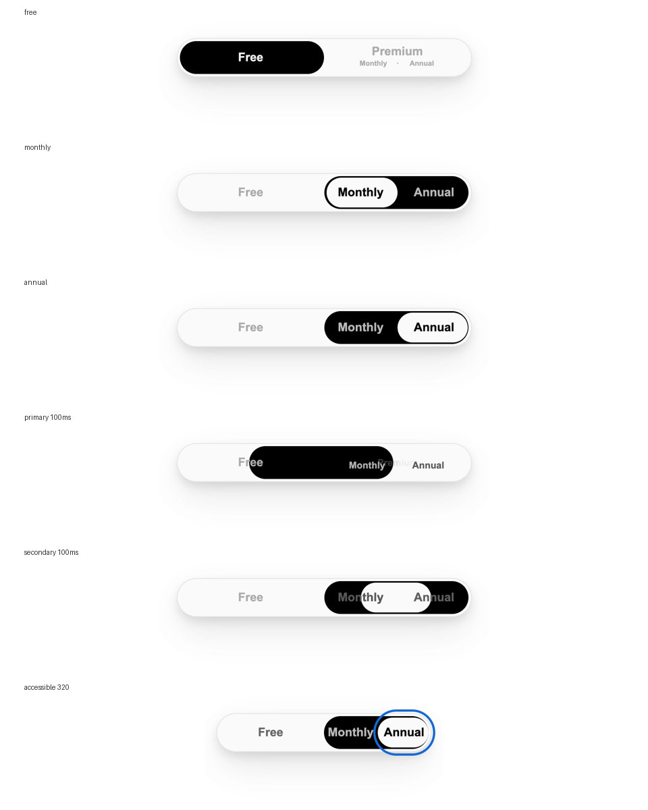

# Verification record

Verified 2026-09-21 (America/New_York) using an isolated headless Chrome 153.0.8010.53. The in-app browser connection failed at startup; the local files were tested with Playwright in a separate temporary browser profile. Both examples ran with page JavaScript **disabled**. Evaluation code in the test harness inspects geometry and CSS transitions; it is not shipped in either page.

## Passed checks

- Source review: sequential samples cover the supplied recording from beginning to end. The opening source scroll was inspected at 0.2-second intervals, and primary/secondary switching was inspected at 0.1-second intervals. HTML/state CSS and explanatory declarations were transcribed; unshown code is labeled in `styles.css` and catalogued in `README.md`.
- Initial Free/Monthly state; clicking the miniature subtitle area activates Premium through the covering label; Monthly/Annual selection and selected/unselected text colors; Premium label fades and dot collapses.
- Return to Free, retain Annual, reopen Premium with Annual still selected.
- Ten rapid Free/Premium round trips with 25ms intervals settle to the correct state and main-indicator endpoint. Hover alone does not change selection.
- Actual CSS transition samples at 0, 100, 250, and 490ms progress monotonically. Main indicator x-offsets: 0, 92.73, 169.08, 193.40 CSS px. Submenu scales: 0.6, 0.792, 0.950, 1.000. Secondary left offsets: 3.92, 49.13, 86.34, 98.19 CSS px. These verify interpolation of the reconstructed transitions; they are not measurements of the creator's hidden timing declarations.
- 280px, 395px and 560px track widths: main indicator moves by its own width; secondary indicator stays inside the main pill within rounding tolerance; text/indicator center differences remain below 3px. The reconstruction's symmetric 2% inset accounts for the small difference, as documented in `README.md`.
- Separate accessibility example: Tab focuses Free; ArrowRight selects Premium; Tab enters Billing; ArrowRight selects Annual; visible focus rings follow selection; Shift+Tab returns to Premium; ArrowLeft selects Free. Billing radios leave focus/layout while Free is selected.
- Accessible example fits a 320px viewport. Switching the emulated motion preference during an animation removes transitions and immediately presents final geometry.
- Follow-up review corrected the production Premium color selector's specificity so it overrides the nested canonical rule. Computed-color assertions verify `#666` for collapsed Premium/Billing and inactive Free; the source-fidelity stylesheet is unchanged.
- No page errors; no scripts in the canonical document; all visual states inspected as screenshots. Skill frontmatter/name validated using Codex's `quick_validate.py`; relative file links checked; no project-specific paths or application assumptions in the reusable instructions.



The screenshots show Free, Monthly, Annual, two 100ms transition samples, and the separate accessible example at 320px. The source recording's endpoint structure, shrinking/expanding submenu, main translation, and secondary left movement agree with this reproduction. Exact pixel identity is not claimed: source overlays/zoom, missing font/reset, omitted transition rules, and inferred offsets prevent that claim.

## Re-run

From the skill directory, with Playwright available to Node:

```sh
node scripts/verify.cjs /tmp/smooth-option-verification
```

Use `CHROME_BIN` for an existing Chromium executable if Playwright has no managed browser, and `NODE_PATH` if Playwright is installed outside normal Node resolution. The script writes screenshots and `report.json` only into its output directory. It does not install dependencies or change application code. Browser testing dependencies belong to the development environment; neither HTML example requires them.

## Reuse review and limits

The instructions were reviewed against three concrete adaptation requests: a two-option billing control, a three-plan selector, and the full nested plan/billing interaction. They route to the appropriate radio grouping, state that flat controls are adaptations, explain N-option geometry, require scoped IDs/names, and begin with project UI inspection. No separate target application was built as part of this review.

Keyboard/native checked-state behavior was exercised in Chrome; screen-reader behavior, other browser engines, forced colors, RTL layouts, long translations, and multiple-instance integration still require target-project testing. Headless transition samples demonstrate continuous interpolation and state correctness, not a real-device frame-rate benchmark. The canonical source deliberately keeps its `hidden` inputs, fixed sizing and low-contrast colors; use the separate production adaptation before shipping.
