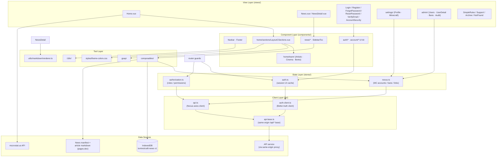
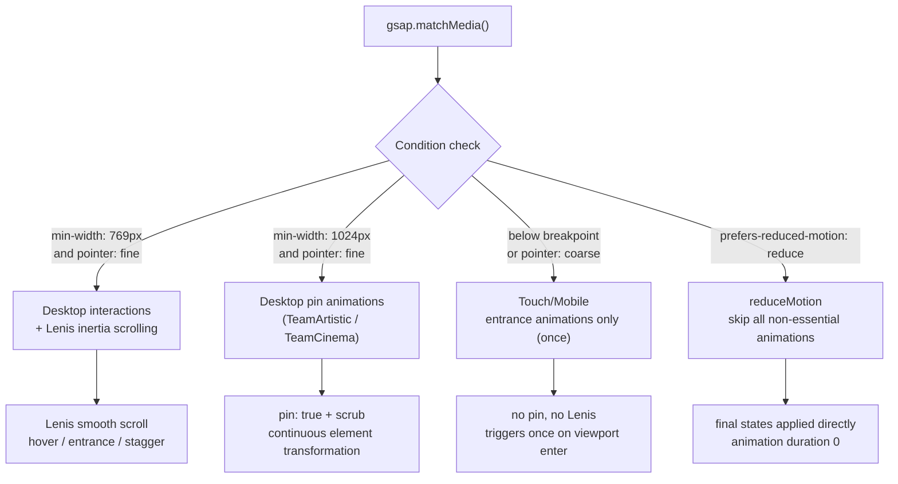
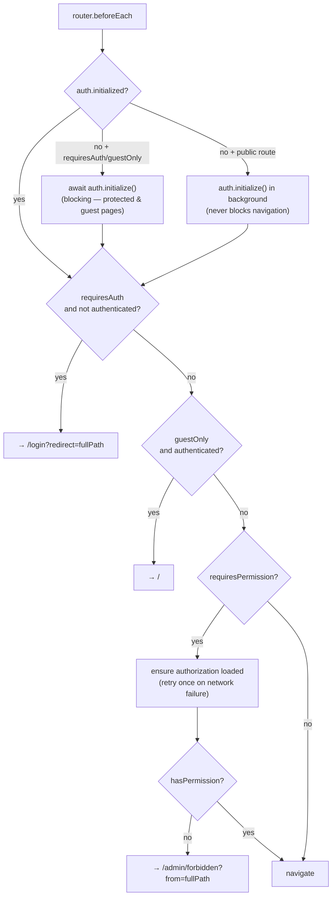
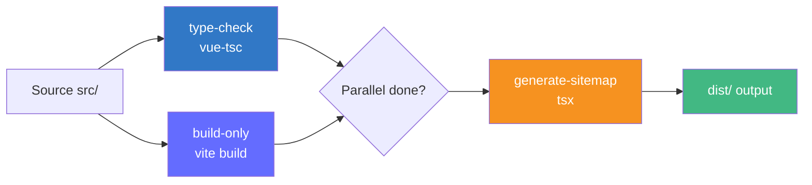

# LuminolCraft

<div align="center">


[English](README.en.md) | [简体中文](README.zh-CN.md)

</div>

---

LuminolCraft is the official website of the LuminolMC-affiliated Minecraft server, a modern Single Page Application (SPA) built with Vue 3. The website provides server status monitoring, news, server rules, and support information, and adds a full account system (email + OAuth registration/login, a user center, and an admin console) on top of the GSAP professional animation system, Lenis inertia scrolling, multi-language and dual-theme support, with deep responsive adaptation for desktop and mobile devices.

---

## Table of Contents

- [1. Project Overview](#1-project-overview)
- [2. Core Features](#2-core-features)
- [3. Technology Stack](#3-technology-stack)
- [4. Environment Configuration](#4-environment-configuration)
- [5. Quick Start](#5-quick-start)
- [6. Project Structure](#6-project-structure)
- [7. Core Module Introduction](#7-core-module-introduction)
  - [7.1 Homepage Layout System](#71-homepage-layout-system)
  - [7.2 GSAP Animation System](#72-gsap-animation-system)
  - [7.3 Internationalization (i18n)](#73-internationalization-i18n)
  - [7.4 Theme System](#74-theme-system)
  - [7.5 Routing & Navigation Guards](#75-routing--navigation-guards)
  - [7.6 Server Status Monitoring](#76-server-status-monitoring)
  - [7.7 News System](#77-news-system)
  - [7.8 Markdown Rendering Pipeline](#78-markdown-rendering-pipeline)
  - [7.9 SEO Optimization](#79-seo-optimization)
- [8. API Conventions (Frontend-Visible Behavior)](#8-api-conventions-frontend-visible-behavior)
- [9. Local Storage & Cookies](#9-local-storage--cookies)
- [10. Configuration Reference](#10-configuration-reference)
- [11. Development Guidelines](#11-development-guidelines)
- [12. Testing Strategy](#12-testing-strategy)
- [13. Build & Deployment](#13-build--deployment)
- [14. FAQ](#14-faq)
- [15. Maintenance Notes](#15-maintenance-notes)
- [16. Contributing Guide](#16-contributing-guide)
- [17. License](#17-license)
- [18. Acknowledgments](#18-acknowledgments)
- [19. Contact](#19-contact)

---

## 1. Project Overview

### 1.1 Introduction

LuminolCraft is the official website of the LuminolMC-affiliated Minecraft server. Built with Vue 3 + TypeScript + Vite, it is a fully-featured modern Single Page Application (SPA) that provides real-time server status monitoring, a self-healing news system, rule explanations, support channels, and — since the introduction of the Nexus account system — email/OAuth authentication, a user center (`/settings`), and an admin console (`/admin`).

### 1.2 Background

The LuminolCraft Minecraft server needed a modern, high-performance web platform for its player community: real-time server information, news updates, account and Minecraft-identity management, and support resources — with an emphasis on visual appeal and interactive experience.

### 1.3 Project Positioning

This project is a modern SPA that provides the following capabilities:

- Real-time server status monitoring (online players, running status)
- Dynamic news system (unified/remark/rehype rendering + KaTeX + syntax highlighting + IndexedDB offline cache)
- Account system: email/OAuth sign-in, email verification, password reset, session management, account linking
- User center: profile editing, Minecraft binding with in-game verification, personal ban records
- Admin console: user/role management, ban management with evidence, audit logs
- Server rules and support information display
- Multi-language (Chinese/English) and dual-theme (light/dark) support
- Deep responsive adaptation for desktop and mobile
- GSAP animations (Pin-Scrub storytelling, entrance animations, View Transitions theme toggle)
- SEO optimization (Open Graph tags, Sitemap generation, Canonical URLs)

### 1.4 Business Goals

- **Community Engagement**: Foster an active player community through real-time information and news
- **Server Transparency**: Provide visualization of server status and player counts
- **Identity & Moderation**: Let players bind their Minecraft identities and let staff manage bans with evidence
- **Donation Support**: Maintain server operations through a dedicated support page

### 1.5 Technical Goals

- **High Performance**: Code splitting, terser minification, CSS code splitting, IndexedDB-backed news cache (first paint never waits on the network when a cache exists)
- **Type Safety**: Complete TypeScript coverage with `vue-tsc` type checking
- **Responsive Design**: Separate CSS for desktop and mobile
- **Internationalization**: Built-in Chinese and English, `localStorage` persistence
- **Security Model**: No token ever stored in JavaScript; the session lives in an HttpOnly cookie; the login-state source of truth is always the server
- **SEO**: Per-route Open Graph tags, automatic Sitemap generation, Canonical URLs
- **Animation Experience**: GSAP Pin-Scrub storytelling + Lenis inertia scrolling, with touch/reduceMotion degradation

### 1.6 Target Audience

- LuminolCraft Minecraft server players
- Project maintainers and contributors
- Minecraft community members interested in server status
- Frontend developers looking to learn Vue 3 + GSAP animation architecture

---

## 2. Core Features

### 2.1 Server Status Monitoring

Real-time server online status and player count via the mcsrvstat.us API, displayed as a status card in the homepage Hero section with a real-time status indicator (online/offline). Details in [§7.6](#76-server-status-monitoring).

### 2.2 News System

Dynamic news list and detail pages with a full unified/remark/rehype rendering pipeline, KaTeX math formulas, syntax highlighting, an IndexedDB offline-first cache, tag filtering, full-text search, and a GSAP Flip image lightbox. Details in [§7.7](#77-news-system) and [§7.8](#78-markdown-rendering-pipeline).

### 2.3 Homepage Layout

The homepage is fixed to the **Bento layout** (`LayoutCSections.vue`): features Bento grid + servers auto-fit grid (CSS-counter numbering) + a team section whose style is configurable. The former `LayoutA`/`LayoutB` components have been removed.

The team section style is driven by `CURRENT_TEAM_STYLE` in `src/config/home-layout.ts`:

| Value       | Behavior                                                                       |
| ----------- | ------------------------------------------------------------------------------ |
| `'artistic'`| Z-shaped offset + organic rotated cards                                        |
| `'cinema'`  | Cinema-style asymmetric composition                                            |
| `'bento'`   | Classic Bento grid arrangement                                                 |
| `'random'`  | **Current default**: picks one of the three at random on each page load/refresh |

`resolveTeamStyle()` caches the random result at module level, so every consumer within one page session sees the same style; each reload re-rolls. Switching styles: edit `CURRENT_TEAM_STYLE` and refresh (Vite HMR auto-reloads).

### 2.4 Multi-language Support

Built-in Chinese (`zh`) and English (`en`) internationalization based on `vue-i18n` Composition API (`legacy: false`). Language choice persists to `localStorage` (key: `locale`), defaults to Chinese, falls back to English. The language toggle button in `TocToggles.vue` is currently hidden (`display: none`); the i18n logic is fully retained. Details in [§7.3](#73-internationalization-i18n).

### 2.5 Theme Switching

Light/dark dual themes. The dark-mode carrier is the `html[data-theme="dark"]` attribute; the theme toggle animation uses the **View Transitions API** with a pixelated circular mask driven by GSAP (with an overlay fade fallback). The choice persists in a `theme` cookie for 1 year. Details in [§7.4](#74-theme-system).

### 2.6 GSAP Animation System

The project integrates GSAP with 8 registered plugins, `gsap.matchMedia()` responsive degradation (dual breakpoints + reduce-motion branches), and Lenis inertia scrolling driven by a single shared ticker. Details in [§7.2](#72-gsap-animation-system).

### 2.7 SEO Optimization

- Per-route independent Open Graph tags (title/description/image/type/url)
- Twitter Card support
- Canonical URLs (query strings removed)
- Automatic Sitemap generation (runs `tsx src/utils/generate-sitemap.ts` after build)
- `robots: index, follow`

### 2.8 Responsive Design

Separate CSS files for desktop and mobile (`src/styles/desktop/` and `src/styles/mobile/`). Mobile simplifies animations and layout for a smooth touch experience. Animation degradation thresholds are `769px` (interactions & Lenis) and `1024px` (pin-type scroll animations) — see [§7.2.3](#723-matchmedia-degradation-strategy).

### 2.9 Analytics

Integrated Umami privacy-first analytics platform, injected via `@unhead/vue` in `main.ts`.

### 2.10 Authentication & Account Security

The site ships a complete account system (Nexus), built on Better Auth:

- **Email/password registration and login**, with structured error branching
- **Email verification gate**: unverified accounts cannot sign in; the login page offers a resend button with a **60-second cooldown**; registration shows an in-page success state that polls verification status and auto-signs-in once the email link is clicked (any browser, 15-minute window)
- **GitHub OAuth sign-in** (full-page redirect flow)
- **QQ OAuth sign-in is currently disabled** (greyed-out placeholder); only QQ *account linking* is retained
- **Remember me** (extended session lifetime)
- **Forgot/reset password** via email links (tokens never persisted client-side)
- **Session & device management**: list sessions, revoke individual sessions remotely, sign out everywhere; revoking the current session invalidates local state immediately
- **Account linking/unlinking** for QQ and GitHub (last login method cannot be unlinked)
- **OAuth "shell" account completion**: QQ-created accounts without a verified email can set/change their email and set a password
- **Account deletion** (self-service, irreversible) with multi-step confirmation; requires the account password or an explicit confirm depending on login method
- **Cross-tab login-state sync**: sign-in/out in one tab broadcasts a `localStorage` signal; other tabs revalidate the server session and correct their route
- **No tokens in JavaScript**: the session is an HttpOnly cookie managed by the server; the Pinia auth store is a UI cache only

### 2.11 User Center (`/settings`)

A sidebar-layout shell with three sub-routes (requires sign-in):

- **Profile**: edit username and email; the avatar is derived from the user's Minecraft skin (via mc-heads.net)
- **Minecraft binding** (Java Edition only):
  - Input only the in-game player name (3–16 chars, letters/digits/underscore, **case-sensitive** as submitted)
  - Two-step verification: submitting issues a **6-digit code**; the player runs `/v <code>` in the server lobby to confirm; valid for about **10 minutes**
  - Single-pending enforcement: a second submit while one is active shows a conflict guide; canceling is idempotent and allows immediate re-submit
  - The pending state is mirrored to `localStorage`, so other tabs/reloads restore the guide
  - **Main↔alt account linking** between two bound accounts is rate-limited to **once per 7 days**
- **Security**: the session/device list, linked login methods, and account deletion (see §2.10)

### 2.12 Admin Console (`/admin`)

An immersive console (independent layout shell, no site navigation) gated by `requiresAuth` + `requiresPermission('admin:access')`:

- **User management**: paginated user list (20/page) and user detail; grant/revoke roles — the **owner** role grant is only visible to owners
- **Minecraft administration**: force-unbind a user's Minecraft account
- **Ban management**: create, modify, and revoke bans (permanent or expiring), with **evidence upload (≤ 5 MiB per file, pre-checked client-side)** and in-session evidence preview/download
- **Audit log**: filterable record of sensitive operations; **owner-only archive trigger**
- **`/admin/forbidden`**: a dedicated 403 view for users without the admin permission

> The frontend permission check exists purely as a UI experience (entry visibility, route guard). **Real authorization is always enforced by the backend API.**

---

## 3. Technology Stack

### 3.1 Runtime Dependencies

| Library                                                      | Version  | Purpose                                                    |
| ------------------------------------------------------------ | -------- | ---------------------------------------------------------- |
| vue                                                          | ^3.5.25  | Progressive JavaScript framework                           |
| vue-router                                                   | ^4.6.3   | Official router for Vue.js                                 |
| pinia                                                        | ^3.0.4   | State management                                           |
| vue-i18n                                                     | ^9.14.4  | Internationalization                                       |
| @unhead/vue                                                  | ^1.9.5   | Head tag management (SEO/Umami)                            |
| @vueuse/core                                                 | ^14.4.0  | Vue composition utilities (e.g. `useMediaQuery`)           |
| better-auth                                                  | ^1.7.2   | Authentication client (email + OAuth)                      |
| axios                                                        | ^1.20.0  | Nexus business API client                                  |
| gsap                                                         | ^3.15.0  | Professional animation library                             |
| lenis                                                        | ^1.3.25  | Inertia scrolling library                                  |
| unified                                                      | ^11.0.5  | Markdown rendering pipeline core                           |
| remark-parse / -gfm / -math / -directive                     | ^11–^4   | Markdown parsing (GFM, math, directives)                   |
| remark-rehype                                                | ^11.1.2  | mdast → hast conversion                                    |
| rehype-slug / -autolink-headings                             | ^6–^7    | Heading ids + anchor links                                 |
| rehype-katex                                                 | ^7.0.1   | Math formula rendering (KaTeX ^0.16.27)                    |
| rehype-highlight                                             | ^7.0.2   | Syntax highlighting (via lowlight → highlight.js ^11.11.1) |
| rehype-sanitize                                              | ^6.0.0   | XSS whitelist sanitization                                 |
| rehype-stringify                                             | ^10.0.1  | hast → HTML string                                         |
| unist-util-visit                                             | ^5.1.0   | Tree traversal for custom rehype plugins                   |
| lodash                                                       | ^4.17.21 | Utility functions (e.g. debounce in the news manager)      |

Legacy / unused runtime dependencies (kept in `package.json` but not part of the active path):

| Library     | Version  | Status                                                                 |
| ----------- | -------- | ---------------------------------------------------------------------- |
| marked      | ^17.0.1  | Legacy: only referenced by the news manager's legacy renderer path     |
| chart.js    | ^4.5.1   | Legacy: only referenced by `MarkdownRenderer.vue`, which is not mounted|
| @unhead/ssr | ^2.0.19  | Unused (SSR utilities in a pure-SPA project)                           |
| hast        | ^1.0.0   | Unused (hast types come from `@types/hast`)                            |

### 3.2 Dev Dependencies

| Library                        | Version | Purpose                          |
| ------------------------------ | ------- | -------------------------------- |
| vite                           | ^7.2.4  | Build tool                       |
| @vitejs/plugin-vue             | ^6.0.2  | Vue SFC support                  |
| vite-plugin-vue-devtools       | ^8.0.5  | Developer tools                  |
| typescript                     | ~5.9.0  | Type checking                    |
| vue-tsc                        | ^3.2.1  | Vue type checking                |
| vitest                         | ^4.0.14 | Unit testing framework           |
| @vue/test-utils                | ^2.4.6  | Vue testing utilities            |
| jsdom                          | ^27.2.0 | Test DOM environment             |
| eslint                         | ^9.39.1 | Code linting                     |
| eslint-plugin-vue              | ~10.5.1 | Vue ESLint rules                 |
| @vitest/eslint-plugin          | ^1.5.0  | Vitest ESLint rules              |
| @vue/eslint-config-typescript  | ^14.6.0 | TS ESLint config                 |
| @vue/eslint-config-prettier    | ^10.2.0 | Prettier/ESLint integration      |
| prettier                       | 3.6.2   | Code formatting                  |
| terser                         | ^5.44.1 | JS minification                  |
| tsx                            | ^4.21.0 | TypeScript execution (sitemap)   |
| sitemap                        | ^9.0.0  | Sitemap generation               |
| npm-run-all2                   | ^8.0.4  | Parallel script runner           |
| unhead                         | 2.1.1   | Unhead peer/tooling              |
| jiti                           | ^2.6.1  | TS config loader                 |
| @tsconfig/node24 / @vue/tsconfig | —     | Shared TS configs                |
| @types/node / @types/hast / @types/jsdom | — | Type definitions      |

### 3.3 GSAP Plugins

The following plugins are registered in `src/gsap/plugin-setup.ts`:

| Plugin            | Purpose                              | Currently used by views?          |
| ----------------- | ------------------------------------ | --------------------------------- |
| ScrollTrigger     | Scroll-triggered animations (core)   | Yes                               |
| ScrollToPlugin    | Smooth scroll animations             | No (registered, reserved)         |
| SplitText         | Text splitting animations            | Yes                               |
| Flip              | Layout transition animations         | No (registered, reserved)         |
| CustomEase        | Custom easing curves                 | Yes                               |
| DrawSVGPlugin     | SVG drawing animations               | No (registered, reserved)         |
| MotionPathPlugin  | Path-based motion animations         | Yes                               |
| MorphSVGPlugin    | SVG morphing animations              | No (registered, reserved)         |

> `SplitText`, `CustomEase`, `DrawSVGPlugin`, and `MorphSVGPlugin` were formerly paid Club plugins; since GSAP 3.13 they ship free with the official npm package.

---

## 4. Environment Configuration

### 4.1 Prerequisites

| Requirement     | Version                                            | Notes                              |
| --------------- | -------------------------------------------------- | ---------------------------------- |
| Node.js         | `^20.19.0` or `>=22.12.0`                          | See `package.json` `engines` field |
| Package Manager | pnpm (recommended) or npm                          | pnpm is faster and uses less disk  |
| Git / Browser   | Any / modern evergreen browser                     | Version control; dev and testing   |

### 4.2 Development Environment Setup

```bash
# 1. Clone the repository
git clone <repository-url>
cd craft.luminolsuki.moe

# 2. Install dependencies (pnpm recommended)
pnpm install
```

### 4.3 Verify Environment

```bash
node -v    # Expected: v20.19.0 or higher
pnpm -v    # Expected: 9.x or higher (if installed)
```

---

## 5. Quick Start

### 5.1 Start Development Server

```bash
pnpm dev
```

**Expected output:**

```
  VITE v7.2.4  ready in 320 ms

  ➜  Local:   http://localhost:51640/
  ➜  Network: use --host to expose
  ➜  press h + enter to show help
```

> **Note**: The dev server port is **51640** (configured in `vite.config.ts` `server.port`); the browser opens automatically.

### 5.2 Complete Command Reference

| Command                 | Description                                       |
| ----------------------- | ------------------------------------------------- |
| `pnpm dev`              | Start dev server (port 51640, auto-opens browser) |
| `pnpm build`            | Type check + build + generate Sitemap             |
| `pnpm preview`          | Preview production build                          |
| `pnpm test:unit`        | Run unit tests (Vitest)                           |
| `pnpm type-check`       | TypeScript type checking (vue-tsc)                |
| `pnpm lint`             | ESLint check and auto-fix                         |
| `pnpm format`           | Prettier format `src/`                            |
| `pnpm generate-sitemap` | Generate Sitemap only                             |
| `pnpm build-only`       | Build only (no type check or Sitemap)             |

### 5.3 Build for Production

```bash
pnpm build
```

**Expected output (end):**

```
✓ built in 8.42s
Sitemap generated successfully!
```

Build flow: `type-check` and `build-only` run in parallel (`run-p`), then the Sitemap is generated.

### 5.4 Run Tests

```bash
# Run once
pnpm test:unit

# Watch mode
pnpm test:unit -- --watch

# Coverage report
pnpm test:unit -- --coverage
```

> The repository currently contains **no test files** — see [§12](#12-testing-strategy).

### 5.5 Lint and Format

```bash
# ESLint check and fix
pnpm lint

# Prettier format
pnpm format
```

---

## 6. Project Structure

### 6.1 Directory Tree

```
craft.luminolsuki.moe/
├── .netlify/functions/          # news.js (legacy, no consumer) · version.js (used by Footer)
├── public/                      # images/ (WebP/AVIF) · favicon.ico
├── src/
│   ├── components/
│   │   ├── auth/                # AuthSplitLayout · AuthField · AuthButton · LinkedAccounts · SessionListItem
│   │   ├── account/             # DangerZone (delete flow) · MergeGuideBanner
│   │   ├── settings/            # SettingsLayout.vue (user center shell)
│   │   ├── admin/               # AdminLayout.vue (admin console shell)
│   │   ├── home/
│   │   │   ├── sections/
│   │   │   │   └── LayoutCSections.vue   # Fixed homepage layout (bento)
│   │   │   └── team/            # TeamArtistic · TeamCinema · TeamBento
│   │   ├── news/                # NewsCard · NewsSearch · NewsPagination · NewsSkeleton · LayoutToggle
│   │   ├── Navbar.vue           # Navigation bar
│   │   ├── Footer.vue           # Footer (consumes version.js / __APP_VERSION__)
│   │   ├── SidebarToc.vue       # News detail table of contents
│   │   ├── TocToggles.vue       # Theme toggle (language button hidden)
│   │   ├── UserAvatar.vue       # Avatar rendering
│   │   ├── LastViewedPopup.vue  # Recently-viewed popup (consent-gated)
│   │   ├── CookieConsentBanner.vue
│   │   ├── ColorSchemeSwitcher.vue   # (legacy, unreferenced)
│   │   └── MarkdownRenderer.vue      # (legacy, unmounted — superseded by unified pipeline)
│   ├── composables/             # 16 composables (see 6.3)
│   ├── config/                  # app-config.ts · home-layout.ts (TeamStyle) · team-members.ts
│   ├── directives/
│   │   └── lenisScroll.ts       # v-lenis-scroll directive (per-container Lenis)
│   ├── gsap/
│   │   ├── config/              # durations.ts · easings.ts · staggers.ts
│   │   ├── defaults.ts          # Default animation config
│   │   ├── index.ts             # Module entry
│   │   ├── match-media.ts       # Global matchMedia registry
│   │   └── plugin-setup.ts      # Plugin registration (8 plugins)
│   ├── i18n/
│   │   ├── locales/             # zh.ts · en.ts (21 top-level modules)
│   │   └── index.ts             # i18n configuration
│   ├── lib/
│   │   ├── api-base.ts          # API base URL resolution (dev/prod fallback)
│   │   ├── api.ts               # Nexus axios client (envelope unwrap, AppError)
│   │   ├── auth-client.ts       # Better Auth client + error normalization
│   │   ├── email-domain.ts      # Registration email domain check
│   │   ├── minecraft.ts         # mc-heads.net skin avatar resolution
│   │   └── paged.ts             # Pagination response normalization
│   ├── router/
│   │   └── index.ts             # Vue Router config + auth/permission guards
│   ├── stores/
│   │   ├── auth.ts              # Session UI cache + cross-tab sync
│   │   ├── authorization.ts     # RBAC store (roles/permissions)
│   │   ├── nexus.ts             # User-domain data (MC accounts, bans, links)
│   │   └── counter.ts           # (legacy scaffold)
│   ├── styles/
│   │   ├── desktop/             # home / news / news-detail / navigation / monitoring / support / markdown-body
│   │   ├── mobile/              # home / news-detail / navigation / monitoring / notfound / support
│   │   ├── fonts.css · gsap-splittext.css · responsive.css
│   │   ├── theme-colors.css     # Theme color variables (3-layer system)
│   │   └── typography.css · vercel-design-system.css
│   ├── types/                   # auth.ts · news.ts · nexus.ts
│   ├── utils/
│   │   ├── generate-sitemap.ts · internalPath.ts · lenisInstances.ts
│   │   ├── news-helpers.ts · utils.ts
│   │   ├── markdown/            # renderer.ts (unified pipeline) · toc.ts (max 3 levels)
│   │   └── news/                # news-manager.ts · news-cache.ts (IndexedDB) · news-markdown.ts
│   ├── views/
│   │   ├── Home.vue             # Homepage (Hero + LayoutCSections)
│   │   ├── News.vue · NewsDetail.vue
│   │   ├── SimpleRules.vue      # Server rules (imports locale files directly)
│   │   ├── Support.vue · Archive.vue (placeholder shell) · NotFound.vue
│   │   ├── Login.vue · Register.vue · ForgotPassword.vue · ResetPassword.vue
│   │   ├── VerifyEmail.vue      # Email verification landing
│   │   ├── AccountSecurity.vue  # Sessions / linked accounts / danger zone
│   │   ├── auth/
│   │   │   └── LinkAccountError.vue   # OAuth link-failure landing (/auth/link-error)
│   │   ├── settings/
│   │   │   ├── ProfileView.vue · MinecraftView.vue
│   │   └── admin/
│   │       ├── UsersView.vue · UserDetail.vue · BansView.vue
│   │       ├── AuditView.vue · ForbiddenView.vue (403)
│   │       └── admin-shared.css
│   ├── App.vue                  # Root component (hideChrome, cross-tab sync listener)
│   └── main.ts                  # Application entry (Lenis, GSAP, SEO, Umami)
├── .editorconfig · .prettierrc.json · eslint.config.ts · index.html
├── netlify.toml · package.json · tsconfig.json · vite.config.ts · vitest.config.ts
```

### 6.2 Architecture Diagram



### 6.3 Key Directory Notes

| Directory                | Description                                                                      |
| ------------------------ | -------------------------------------------------------------------------------- |
| `src/lib/`               | Two API clients (Better Auth + Nexus axios), base URL resolution, helpers        |
| `src/stores/`            | `auth` (session UI cache), `authorization` (RBAC), `nexus` (user-domain data)    |
| `src/types/`             | Shared domain types (`auth`, `news`, `nexus`)                                    |
| `src/composables/`       | 16 composables: GSAP (`useGsap`, `useEntranceAnimation`, `useHoverAnimation`, `usePageTransition`, `useScrollTrigger`, `useSplitText`), news (`useNewsData`, `useNewsFilter`, `useNewsPagination`, `useNewsDetail`), UX (`useCookieConsent`, `useLastViewedCookie`, `useLightbox`, `useReadingProgress`, `useArticleAnimations`), i18n (`useI18n`) |
| `src/config/`            | Centralized config: team style, team data, app config                            |
| `src/gsap/`              | GSAP module: plugin registration, defaults, matchMedia                           |
| `src/utils/markdown/`    | The unified rendering pipeline and TOC builder                                   |
| `src/utils/news/`        | News manager (sync/filter/paginate) + IndexedDB cache layer                      |
| `src/styles/desktop/` & `mobile/` | Desktop/mobile separated styles                                         |
| `src/i18n/locales/`      | Chinese/English translation files (21 top-level modules)                         |

---

## 7. Core Module Introduction

### 7.1 Homepage Layout System

The homepage is fixed to the Bento layout; only the **team section style** is configurable.

#### 7.1.1 How It Works

`Home.vue` statically imports `LayoutCSections` so it renders in the same frame as the Navbar/Footer (eliminating the second-request blank flash that lazy loading caused):

```vue
<!-- src/views/Home.vue -->
<LayoutCSections :server-online="serverOnline" :online-players="onlinePlayers" />
```

`LayoutCSections` resolves the team style at module level:

```typescript
// src/components/home/sections/LayoutCSections.vue (simplified)
import { CURRENT_TEAM_STYLE, resolveTeamStyle } from '@/config/home-layout'

const TEAM_STYLE_COMPONENT_MAP = {
  artistic: TeamArtistic,
  cinema: TeamCinema,
  bento: TeamBento,
}
const _resolvedTeam = resolveTeamStyle(CURRENT_TEAM_STYLE)
const teamComponent = TEAM_STYLE_COMPONENT_MAP[_resolvedTeam]
```

#### 7.1.2 Configuration File

```typescript
// src/config/home-layout.ts
export type TeamStyle = 'artistic' | 'cinema' | 'bento' | 'random'
export type ResolvedTeamStyle = Exclude<TeamStyle, 'random'>
export const TEAM_STYLE_OPTIONS: readonly ResolvedTeamStyle[] = ['artistic', 'cinema', 'bento']
export const CURRENT_TEAM_STYLE: TeamStyle = 'random'

// Module-level cache: every consumer within one page session sees the same
// result; each reload re-rolls for 'random'.
export function resolveTeamStyle(input: TeamStyle = CURRENT_TEAM_STYLE): ResolvedTeamStyle
```

- `CURRENT_TEAM_STYLE`: controls the team section style; `'random'` re-rolls on each page load/refresh
- `resolveTeamStyle()`: module-level cache guarantees all consumers in one session see the same result
- There is **no** `CURRENT_LAYOUT` / `HomeLayout` export anymore — the overall layout is fixed to Bento

#### 7.1.3 Team Members Shared Data

Team member data is centralized in `src/config/team-members.ts` (fields: `name`, `avatar`, `roleKey` → `home.team.roles.<key>`, `githubHref`, `githubLabel`, `isOwner`, optional `extraLinks` of `qq`/`email`) for unified import by all team components:

```typescript
export const contributors: Contributor[] = [
    { name: 'MrHua269', roleKey: 'owner', isOwner: true },
    // ... 6 members total
]
```

#### 7.1.4 Server Numbering with CSS Counter

The servers section uses a CSS counter for auto-generated numbering. **Copy a `server-panel` node to add a server; numbering auto-increments** — the counter is configured on `.servers-grid` / `.server-panel` / `.server-index::before` (`counter-reset` / `counter-increment` / `content: counter(server-counter, decimal-leading-zero)`; the gradient text effect must be on `::before`, as `background-clip: text` is not inheritable):

```html
<!-- To add a server: copy the node below; number auto-increments to 03 -->
<div class="server-panel">
  <span class="server-index"></span>
  <!-- number generated by CSS -->
  <!-- server info -->
</div>
```

---

### 7.2 GSAP Animation System

The project deeply integrates GSAP, building a complete animation system with plugin registration, responsive degradation, inertia scrolling, and Pin-Scrub scroll storytelling.

#### 7.2.1 Plugin Registration

All GSAP plugins are registered centrally in `src/gsap/plugin-setup.ts`:

```typescript
// src/gsap/plugin-setup.ts
export function registerGsapPlugins(): void {
  gsap.registerPlugin(
    ScrollTrigger, ScrollToPlugin, SplitText, Flip,
    CustomEase, DrawSVGPlugin, MotionPathPlugin, MorphSVGPlugin,
  )
}
```

Called via `setupGsap()` in `main.ts`. Global defaults (`src/gsap/defaults.ts`):

```typescript
gsap.defaults({
  duration: 0.6,
  ease: 'power2.out',
  overwrite: 'auto',
})
```

#### 7.2.2 Lenis Inertia Scrolling

`main.ts` initializes the global (window) Lenis with `gsap.matchMedia()` degradation:

```typescript
// src/main.ts (simplified)
lenisMm.add(
  {
    isDesktop: '(min-width: 769px) and (pointer: fine)',
    reduceMotion: '(prefers-reduced-motion: reduce)',
  },
  (context) => {
    const { isDesktop, reduceMotion } = context.conditions!
    if (!isDesktop || reduceMotion) return // skip on touch or reduceMotion

    globalLenis = new Lenis({
      duration: 1.2,
      easing: (t: number) => Math.min(1, 1.001 - Math.pow(2, -10 * t)),
      smoothWheel: true,
      wheelMultiplier: 1.2,
      touchMultiplier: 1.5,
      // Key: the global Lenis never handles wheel events inside scrollable
      // containers — they keep native scroll (or their own Lenis instance)
      prevent: (node) => { /* walks up the DOM for overflow:auto|scroll containers */ },
    })

    globalLenis.on('scroll', ScrollTrigger.update)
    lenisInstances.push(globalLenis)

    // One shared gsap.ticker callback drives ALL Lenis instances
    // (global + per-container instances created by v-lenis-scroll)
    gsap.ticker.add((time) => {
      lenisInstances.forEach((instance) => instance.raf(time * 1000))
    })

    return () => { /* remove ticker, destroy global + directive instances */ }
  },
)
```

**Configuration:**

| Parameter         | Value                                            | Description                                      |
| ----------------- | ------------------------------------------------ | ------------------------------------------------ |
| `duration`        | `1.2`                                            | Scroll animation duration (seconds)              |
| `easing`          | `t => Math.min(1, 1.001 - Math.pow(2, -10 * t))` | Exponential easing, smoother reverse scrolling   |
| `smoothWheel`     | `true`                                           | Enable smooth mouse wheel                        |
| `wheelMultiplier` | `1.2`                                            | Wheel speed multiplier                           |
| `touchMultiplier` | `1.5`                                            | Touch speed multiplier                           |
| `prevent`         | callback                                         | Inner scrollable containers escape global Lenis  |

The `v-lenis-scroll` directive creates per-container Lenis instances (e.g. the news grid) and registers them in the shared `lenisInstances` registry so a single `gsap.ticker` drives everything.

#### 7.2.3 matchMedia Degradation Strategy

Two breakpoints coexist — interactions/Lenis at **769px**, pin-type scroll animations at **1024px** — and every branch has a reduce-motion fallback:



> Pin-Scrub exists only in `TeamArtistic` and `TeamCinema`; the features area has no pin.

#### 7.2.4 Pin-Scrub Design Principles

- **Continuous visual feedback**: elements transform continuously during pin (translate/rotate/fade), avoiding a "stuck" feeling
- GSAP rotation end values match CSS design values, preserving the layout after pin release; section offset uses `margin` (never `transform`, which would conflict with the pin), card offsets use `transform`

#### 7.2.5 Tuning Point Comment Convention

Code contains `微调点：` (tuning point) comments marking adjustable values — card rotation angles, Pin-Scrub scroll distances (`end: '+=N%'`), stagger intervals, etc. Search for `微调点：` to quickly locate all adjustable parameters.

---

### 7.3 Internationalization (i18n)

#### 7.3.1 Configuration

```typescript
// src/i18n/index.ts
const savedLocale = localStorage.getItem('locale')
const defaultLocale = savedLocale || 'zh'

const i18n = createI18n({
  legacy: false,          // use Composition API
  locale: defaultLocale,  // default Chinese
  fallbackLocale: 'en',   // fallback English
  messages: { zh, en },
})
```

#### 7.3.2 Language File Structure

```
src/i18n/locales/
├── zh.ts    # Chinese translations
└── en.ts    # English translations
```

Both locale files expose **21 top-level module keys**:

`404` · `auth` · `common` · `hero` · `status` · `features` · `servers` · `team` · `footer` · `colorScheme` · `notFound` · `language` · `rules` · `support` · `news` · `monitoring` · `cookieConsent` · `home` · `settings` · `minecraft` · `admin`

Components consume them via `t('module.key')`.

> **Exception**: `SimpleRules.vue` imports the locale objects **directly** (`import zh from '../i18n/locales/zh'`) instead of going through `t()`. New rules content must be added to *both* locale files or one language will silently miss it.

#### 7.3.3 Persistence and Switching

- Language choice stored in `localStorage` (key: `locale`)
- Switching logic lives in `TocToggles.vue` but its button is currently hidden via `display: none`; the i18n machinery remains fully wired

#### 7.3.4 Adding New i18n Keys Example

```typescript
// src/i18n/locales/zh.ts
home: {
  team: {
    roles: {
      owner: '服主',            // new
      survivalAdmin: '生存管理',
    },
  },
}

// src/i18n/locales/en.ts
home: {
  team: {
    roles: {
      owner: 'Owner',           // corresponding English
      survivalAdmin: 'Survival Admin',
    },
  },
}
```

---

### 7.4 Theme System

#### 7.4.1 Theme Color Variables

Theme-related CSS variables are centralized in `src/styles/theme-colors.css` as a **three-layer system**:

| Layer                        | Content                                                                     |
| ---------------------------- | --------------------------------------------------------------------------- |
| `--vercel-*`                 | Vercel/Geist neutral scale + accent colors (also duplicated in `vercel-design-system.css`) |
| `--bases-*` / `--bases-dark-*` | Project light palette (purple primary `#a78bfa`) and its dark counterparts |
| Semantic mapping             | `:root` maps light values onto semantic names (`--text-color`, `--background-color`, …); `html[data-theme="dark"]` remaps them to the `--bases-dark-*` values |

```css
:root {
  --text-color: var(--bases-text-color);      /* semantic light mapping */
  --background-color: var(--bases-bg);
}

html[data-theme='dark'] {
  --text-color: var(--bases-dark-text-color); /* remapped to dark palette */
  --background-color: var(--bases-dark-bg);
}
```

> The `data-vt` attribute is **not** a dark-mode carrier — it is set only for the duration of a View Transition to freeze CSS `transition`s while the theme swap is snapshotted. The dark-mode carrier is `data-theme`.

#### 7.4.2 Theme Toggle Animation

The toggle (in `TocToggles.vue`) uses the **View Transitions API** with a pixelated circular reveal:

1. A **32×32 pixelated SVG circle** is generated as the `mask-image` of `::view-transition-new(root)`
2. GSAP animates `--reveal-size` from `0` to `maxDist × 2` (farthest viewport corner distance) over **0.8 s**, expanding the mask from the click point
3. Clicking again mid-animation reverses the tween instead of double-flipping; `prefers-reduced-motion` switches instantly
4. **Fallback**: when the View Transitions API is unavailable, an overlay tinted with the old background fades out instead

The choice persists in a **`theme` cookie for 1 year** (`theme=light|dark; path=/; max-age=31536000`).

#### 7.4.3 What Does NOT Exist

- **No color-scheme switching feature**: `ColorSchemeSwitcher.vue` is unreferenced legacy and no `data-color-scheme` CSS rules exist
- The language toggle button is hidden (`display: none`) — see §7.3.3

---

### 7.5 Routing & Navigation Guards

#### 7.5.1 Route Table

| Route                    | Name             | Component                          | Meta                                            | Description                                                                       |
| ------------------------ | ---------------- | ---------------------------------- | ----------------------------------------------- | --------------------------------------------------------------------------------- |
| `/`                      | Home             | `Home.vue` (**static import**)     | `og`                                            | Homepage (Hero + LayoutCSections); static import keeps it in the same frame as Navbar/Footer, eliminating the lazy-load blank flash |
| `/SimpleRules`           | SimpleRules      | `SimpleRules.vue`                  | `og`                                            | Server rules                                                                      |
| `/Support`               | support          | `Support.vue`                      | `og`                                            | Support page                                                                      |
| `/News`                  | news             | `News.vue`                         | `og`                                            | News list                                                                         |
| `/NewsDetail`            | newsdetail       | `NewsDetail.vue`                   | `og`                                            | `props` receives `id` from `route.query.id`; aliases: `/news-detail`, `/news-detail.html`, `/NewsDetail.html` |
| `/Archive`               | Archive          | `Archive.vue`                      | `og`                                            | Placeholder shell (reserved for monitoring)                                       |
| `/login`                 | Login            | `Login.vue`                        | `hideChrome`, `guestOnly`                       | Email + GitHub sign-in                                                            |
| `/register`              | Register         | `Register.vue`                     | `hideChrome`, `guestOnly`                       | Email registration                                                                |
| `/forgot-password`       | ForgotPassword   | `ForgotPassword.vue`               | `hideChrome`, `guestOnly`                       | Password reset request                                                            |
| `/reset-password`        | ResetPassword    | `ResetPassword.vue`                | `hideChrome`, `guestOnly`                       | Password reset landing                                                            |
| `/verify-email`          | VerifyEmail      | `VerifyEmail.vue`                  | `hideChrome`                                    | Email verification landing                                                        |
| `/auth/link-error`       | AuthLinkError    | `auth/LinkAccountError.vue`        | `hideChrome`                                    | OAuth link-failure landing (QQ/GitHub)                                            |
| `/settings`              | —                | `settings/SettingsLayout.vue`      | `requiresAuth`                                  | User center shell; redirects to `profile`                                        |
| `/settings/profile`      | SettingsProfile  | `settings/ProfileView.vue`         | `requiresAuth`                                  | Profile editing                                                                   |
| `/settings/minecraft`    | SettingsMinecraft| `settings/MinecraftView.vue`       | `requiresAuth`                                  | Minecraft binding                                                                 |
| `/settings/security`     | AccountSecurity  | `AccountSecurity.vue`              | `requiresAuth`                                  | Sessions / linked accounts / danger zone                                          |
| `/admin`                 | —                | `admin/AdminLayout.vue`            | `requiresAuth`, `requiresPermission('admin:access')`, `hideChrome` | Admin console shell; redirects to `users`                                   |
| `/admin/users`           | AdminUsers       | `admin/UsersView.vue`              | as parent                                       | User list                                                                         |
| `/admin/users/:id`       | AdminUserDetail  | `admin/UserDetail.vue`             | as parent                                       | User detail                                                                       |
| `/admin/bans`            | AdminBans        | `admin/BansView.vue`               | as parent                                       | Ban management                                                                    |
| `/admin/audit`           | AdminAudit       | `admin/AuditView.vue`              | as parent                                       | Audit logs                                                                        |
| `/admin/forbidden`       | AdminForbidden   | `admin/ForbiddenView.vue`          | `requiresAuth`, `hideChrome`                    | 403 view — deliberately **without** `requiresPermission` to avoid a guard loop    |
| `/:pathMatch(.*)*`       | NotFound         | `NotFound.vue`                     | `title`                                         | 404 fallback                                                                      |

All pages except `/` are lazy-loaded via dynamic `import()` for code splitting.

#### 7.5.2 Guard Flow

The login-state **source of truth is the server-side Better Auth session** (an HttpOnly cookie); the Pinia store is only a UI cache.



- Public routes never wait for auth initialization (a slow network cannot blank the page); the Navbar updates automatically once the store is ready
- `guestOnly` pages await initialization so a signed-in user refreshing `/login` never sees the form flash
- **Open-redirect protection**: every `redirect` query param is validated by `resolveInternalPath()` — only a single leading `/`, no protocol, no `//`, no backslash, no whitespace, length ≤ 256; anything else falls back to `/`

#### 7.5.3 Scroll Behavior

`scrollBehavior` restores `savedPosition` when present, smooth-scrolls to `to.hash` anchors, and otherwise jumps to the top with `behavior: 'instant'` (resolved inside a `setTimeout(0)`).

#### 7.5.4 Cross-Tab Sync

`App.vue` listens for `storage` events on the `nexus-auth-event` key. When another tab signs in/out, this tab revalidates the server session and corrects its route (guest page + authenticated → `/`; protected page + unauthenticated → `/login?redirect=…`).

---

### 7.6 Server Status Monitoring

The homepage Hero section displays a server status card, fetching data via the mcsrvstat.us `/3` API for `craft.luminolsuki.moe`:

- **Online status**: green/red status dot + label
- **Player count**: `online/max`
- **Version**: hardcoded `"26.2"` in `Home.vue` (update manually when the server version changes)
- **Running status**: online/offline

- 8-second `AbortSignal.timeout`; on failure the card shows offline/`N/A`
- Polled every **30 seconds** via `setInterval`
- The first fetch is **non-blocking**: rendering and animation initialization never wait for the external API

Status data is passed to the layout component via props:

```vue
<LayoutCSections :server-online="serverOnline" :online-players="onlinePlayers" />
```

> The `/Archive` route is currently an **empty placeholder shell** (no charts). Chart.js is only referenced by the unmounted legacy `MarkdownRenderer.vue`.

---

### 7.7 News System

#### 7.7.1 News List (`/News`)

- **Pagination**: 6 items/page on desktop and mobile (configured in `app-config.ts`), max 5 displayed page buttons
- **List/grid layout toggle**, persisted in `localStorage` (`news_layout_mode`); desktop defaults to list, mobile to grid
- **Tag filtering**: multi-tag OR semantics; active tags sync to/from the URL query (`?tags=`), so filtered views are shareable
- **Full-text search**: case-insensitive substring match over title, summary, markdown content, tags, and localized date
- **Sorting**: pinned items first, then by date descending
- **Skeleton loading** while the cache/network resolves; page transitions scroll back to top smoothly

#### 7.7.2 Offline-First Caching (IndexedDB)

The news manager (`src/utils/news/news-manager.ts`) + cache layer (`news-cache.ts`) implement a stale-while-revalidate strategy:

| Aspect            | Behavior                                                                                                     |
| ----------------- | ------------------------------------------------------------------------------------------------------------ |
| Storage           | IndexedDB database **`luminolcraft-news` v1** — `articles` (one record per article) + `meta` stores           |
| First paint       | Restores the cached snapshot immediately — never waits on the network when a cache exists                     |
| Revalidation      | Syncs when stale; triggers: initial load, `visibilitychange`, `online`, `focus`, 10-minute background timer   |
| Rate limiting     | Minimum **10-minute** interval between normal syncs (`force` skips the check, never runs concurrently)        |
| Incremental sync  | Manifest diff detects added/updated/deleted articles; only changed articles re-fetched (concurrency 6)        |
| Content versioning| Re-fetch decision uses a 3-tier fallback: `contentVersion` → `updatedAt` → the content URL itself             |
| Failure handling  | **Network failures never clear the cache**; the error banner only appears when no usable cache exists         |
| Legacy migration  | Old `localStorage`/`sessionStorage` caches are auto-migrated into IndexedDB on first run                      |

#### 7.7.3 News Detail (`/NewsDetail`)

- Takes `id` from the query string (supports three legacy aliases)
- Renders Markdown through the unified pipeline (§7.8); the `v-html` target receives **only the sanitized output**
- Sidebar TOC (max 3 levels, `SidebarToc.vue`) with smooth anchor scrolling (120px offset)
- Reading progress bar, entrance animations
- Additional-image gallery with a **GSAP Flip lightbox** (prev/next/close)
- Tag chips navigate back to the filtered list
- Recently-viewed record written to the `last_viewed_news` cookie (30 days) — **only after cookie consent is accepted**

#### 7.7.4 Data Source

- Manifest: `https://luminolcraft-news.pages.dev/news.json` (public JSON index of articles); bodies: Markdown on the same domain (GitHub raw URLs in the manifest are rewritten to it); all requests carry a 15-second timeout via `AbortController`

#### 7.7.5 Netlify Functions (legacy)

`.netlify/functions/news.js` is a legacy news proxy with **no consumer** (news is fetched client-side). `.netlify/functions/version.js` is consumed by `Footer.vue` and falls back to the GitHub API (`commits/main`) when deploy env vars are missing.

---

### 7.8 Markdown Rendering Pipeline

News bodies are rendered by a **unified + remark + rehype** pipeline (`src/utils/markdown/renderer.ts`), replacing the legacy `marked` + regex approach:

```mermaid
flowchart LR
    A["Markdown source"] --> B["remark-parse"]
    B --> C["remark-gfm<br/>(tables / strikethrough / tasks)"]
    C --> D["remark-math<br/>(formula nodes)"]
    D --> E["remark-directive"]
    E --> F["remark-rehype<br/>allowDangerousHtml: false<br/>(raw HTML dropped)"]
    F --> G["rehype-slug<br/>(heading ids)"]
    G --> H["rehype-autolink-headings<br/>(# anchors)"]
    H --> I["rehype-katex"]
    I --> J["rehype-highlight<br/>(lowlight)"]
    J --> K["rehype-external-links<br/>(custom)"]
    K --> L["rehype-figure<br/>(custom)"]
    L --> M["rehype-sanitize<br/>(Git schema + KaTeX MathML)"]
    M --> N["rehype-stringify"]
    N --> O["HTML string"]
    M -.-> P["TOC extraction<br/>(h1–h6, pipeline end)"]
```



Key behaviors:

- **`allowDangerousHtml: false`** — raw HTML in Markdown is dropped at the remark-rehype boundary
- **Sanitization**: `rehype-sanitize` with the GitHub schema extended for KaTeX MathML elements/attributes, highlight.js classes, heading anchor classes, external-link SVG icons, and image attributes (`src`, `alt`, `title`, `loading`, `decoding`)
- **External links** (`http(s)` only, off-site) get `target="_blank"`, `rel="noopener noreferrer"`, an `external-link` class, and an injected SVG icon
- **Images with meaningful alt text** are wrapped in `<figure>` + `<figcaption>`; URL-like alt text produces no caption
- **TOC extraction** runs at the end of the pipeline (after slugs/anchors exist); `toc.ts` flattens it to at most **3 levels** relative to the shallowest heading
- The detail page injects the **sanitized** HTML via `v-html`
- The processor instance is cached and reused across renders

---

### 7.9 SEO Optimization

#### 7.9.1 Open Graph Tags

Each route configures independent Open Graph tags via `meta.og`, injected in `main.ts` `router.beforeEach`:

```typescript
router.beforeEach((to) => {
  const og = to.meta.og as any
  if (!og) return

  head.push({
    title: og.title,
    meta: [
      { name: 'description', content: og.description },
      { property: 'og:title', content: og.title },
      { property: 'og:description', content: og.description },
      { property: 'og:image', content: og.image.url },
      { property: 'og:image:width', content: og.image.width || 1200 },
      { property: 'og:image:height', content: og.image.height || 630 },
      { property: 'og:type', content: to.name === 'newsdetail' ? 'article' : 'website' },
      { name: 'twitter:card', content: 'summary_large_image' },
      // ... og:description, og:image:width/height, og:site_name, og:url, twitter:*
    ],
    link: [{ rel: 'canonical', href: currentUrl.split('?')[0] }],
  })
})
```

`App.vue` additionally pushes a fallback `title`/`description` (route `meta.title` or i18n hero copy) via `useHead`.

#### 7.9.2 Sitemap Generation

Automatically runs `src/utils/generate-sitemap.ts` after build, generating `dist/sitemap.xml` for the public routes (`/`, `/SimpleRules`, `/Support`, `/News`, `/Monitoring`). Note: `/Monitoring` is a legacy entry kept in the sitemap script (`generate-sitemap.ts`) and no longer matches the router's `/Archive` page — see the maintenance notes.

#### 7.9.3 Canonical URL

Each page sets a canonical URL (query strings removed) to avoid duplicate content.

---

## 8. API Conventions (Frontend-Visible Behavior)

The frontend talks to the backend through **two independent client layers**, both resolving their base URL via `src/lib/api-base.ts`. In production the base is the site's own origin — the browser only ever talks to `craft.luminolsuki.moe`, and `/api/*` is reverse-proxied to the API service (see [§13](#13-build--deployment)). No endpoint paths are listed here by design.

### 8.1 Two Client Layers

| Aspect         | Better Auth client (`src/lib/auth-client.ts`)             | Nexus axios client (`src/lib/api.ts`)                          |
| -------------- | --------------------------------------------------------- | --------------------------------------------------------------- |
| Scope          | Registration, sign-in/out, email verification, password reset, OAuth, account linking | Business data: profile, Minecraft accounts, bans, admin |
| Response format| Better Auth native format                                 | Unified envelope `{ success, data | error, requestId }`          |
| Credentials    | `credentials: 'include'`                                  | `withCredentials: true`                                          |
| Timeout        | —                                                         | 15 s                                                             |
| Error shape    | Normalized to `AppError` via `toAppError()`               | Interceptor unwraps the envelope / throws structured `AppError`  |

### 8.2 Error Model

Both layers surface the same `AppError` shape, so pages branch uniformly on `error.code`:

```typescript
interface AppError {
  code: string
  message?: string
  details?: unknown
  requestId?: string
}
```

- **Better Auth error normalization** (`toAppError`): native codes map to documented business codes — invalid credentials → `AUTH_INVALID_CREDENTIALS`, unverified email → `EMAIL_VERIFICATION_REQUIRED`, `USER_ALREADY_EXISTS` passes through (a native 422 "already exists" body maps there too)
- **Rate limiting**: a 429 from either layer becomes `RATE_LIMITED`; the Better Auth native `resetAt` (epoch ms) is carried in `details.resetAt`, readable via `errorToResetAt()` so pages can render a retry-at timestamp
- **Unauthenticated detection**: the 401-family codes (`AUTH_REQUIRED`, `UNAUTHORIZED`, `AUTH_SESSION_EXPIRED`, `AUTH_SESSION_REVOKED`) always clear local user state; other errors (e.g. network) never wipe the session cache
- No JSON response / network failure falls back to `{ code: 'NETWORK_ERROR' }`

### 8.3 Pagination Protocol

- Request: `page` + `limit` query params (admin list default `limit=20`)
- Response: `{ items, total, page, limit }`; `normalizePaged()` also tolerates **bare arrays** and common aliases (`list`, `rows`)
- `hasMore` falls back to "full page implies more" when `total` is absent

### 8.4 Session & Permission Boundary

- The session is an **HttpOnly cookie**; the frontend never reads, stores, or transmits tokens
- The auth store's `me`/permissions are **in-memory caches only** — never persisted to `localStorage`/`sessionStorage`
- `hasPermission()` (e.g. `admin:access`) gates UI and routes only; **the backend re-checks every privileged request**

---

## 9. Local Storage & Cookies

All client-side persistence used by the site:

| Key                              | Storage                                | Lifetime            | Purpose                                                                          |
| -------------------------------- | -------------------------------------- | ------------------- | -------------------------------------------------------------------------------- |
| `locale`                         | localStorage                           | persistent          | UI language (`zh` default, `en` fallback)                                        |
| `theme`                          | cookie                                 | 1 year              | Light/dark theme (`light` / `dark`)                                              |
| `cookie_consent`                 | localStorage (`accepted`) + sessionStorage (`declined`) | persistent / session | Cookie banner decision; "decline" intentionally survives only the session     |
| `nexus-auth-event`               | localStorage                           | timestamp           | Cross-tab login-state sync signal (written on sign-in/out; other tabs revalidate) |
| `oauth-provider-label`           | sessionStorage                         | session             | Label of the last OAuth provider (QQ/GitHub) for callback UX                     |
| `qq-merge-hint-dismissed:<uid>`  | localStorage                           | persistent          | Dismissal state of the QQ merge guide banner, per user id                        |
| `mc-pending-bind`                | localStorage                           | until expiry/cancel | Pending Minecraft bind guide (code + name), restores across tabs/reloads         |
| `last_viewed_news`               | cookie                                 | 30 days             | Recently-viewed news popup data; written only after cookie consent               |
| `news_layout_mode`               | localStorage                           | persistent          | News list/grid layout preference                                                 |

> The auth session, roles, and permissions are **never** persisted — they live only in Pinia memory and the HttpOnly session cookie.

---

## 10. Configuration Reference

### 10.1 home-layout.ts (Team Style Config)

See [§7.1.2](#712-configuration-file) for the full source. Reference:

| Config               | Type        | Options                                            | Default     | Description                                              |
| -------------------- | ----------- | -------------------------------------------------- | ----------- | -------------------------------------------------------- |
| `CURRENT_TEAM_STYLE` | `TeamStyle` | `'artistic'` / `'cinema'` / `'bento'` / `'random'` | `'random'`  | Team section style; `random` re-rolls on each full reload |

### 10.2 app-config.ts (Application Config)

```typescript
// src/config/app-config.ts
export const appConfig: AppConfig = {
  showTocToggles: true,
  navbarFixed: true,
  showFooterCopyright: true,
  newsPagination: {
    desktopItemsPerPage: 6,
    mobileItemsPerPage: 6,
    maxDisplayedPages: 5,
  },
};

export const newsLayoutConfig = {
  defaultMode: 'list',        // desktop default
  mobileDefaultMode: 'grid',  // mobile default
  coverPosition: 'right',
  grid: { columnWidth: 320, coverFullWidth: false },
};
```

### 10.3 team-members.ts (Team Members Data)

```typescript
// src/config/team-members.ts
export interface Contributor {
  name: string
  avatar: string
  roleKey: string
  githubHref: string
  githubLabel: string
  isOwner: boolean
  extraLinks?: Array<{ type: 'qq' | 'email'; href: string }>
}
export const contributors: Contributor[] = [
  /* 6 members */
]
```

### 10.4 vite.config.ts Key Config

```typescript
// vite.config.ts (key items)
export default defineConfig({
  define: {
    __APP_VERSION__: JSON.stringify(appVersion), // Git short hash
    __BUILD_TIME__: JSON.stringify(new Date().toISOString()),
  },
  resolve: {
    alias: { '@': fileURLToPath(new URL('./src', import.meta.url)) },
  },
  build: {
    minify: 'terser',
    rollupOptions: {
      output: {
        manualChunks: {
          'vue-vendor': ['vue', 'vue-router', 'vue-i18n', 'pinia'],
          'markdown': ['marked'],
          'highlight': ['highlight.js'],
        },
      },
    },
    cssCodeSplit: true,
    sourcemap: false,
  },
  server: {
    port: 51640, // dev server port
    open: true, // auto-open browser
  },
})
```

> The `highlight` chunk is populated by the `lowlight` dependency graph underneath `rehype-highlight` (not by direct `highlight.js` imports). The `markdown` chunk bundles `marked`, which now only serves the legacy renderer path.

### 10.5 Environment Variables

Build-time globals injected via Vite `define`:

| Variable          | Source                                                            | Description                                             |
| ----------------- | ----------------------------------------------------------------- | ------------------------------------------------------- |
| `__APP_VERSION__` | `COMMIT_REF` / `CF_PAGES_COMMIT_SHA` / `GIT_COMMIT` / git command | Git short hash (consumed by `Footer.vue`)               |
| `__BUILD_TIME__`  | `new Date().toISOString()`                                        | Build timestamp (**defined but currently not consumed**) |

**`VITE_API_BASE_URL`** (optional, configure in `.env.*` copied from `.env.example` or the Netlify dashboard): unset → dev falls back to `http://localhost:8787`; production build uses the **same origin** (recommended, and what `netlify.toml` sets). Never place backend secrets in env files. Netlify also sets `NODE_VERSION=22` (see `netlify.toml`).

---

## 11. Development Guidelines

### 11.1 Code Style

The project uses ESLint + Prettier for consistent code style:

```bash
# Check and fix
pnpm lint

# Format
pnpm format
```

- **ESLint config**: `eslint.config.ts`, integrating `eslint-plugin-vue` and `@vue/eslint-config-typescript`
- **Prettier config**: `.prettierrc.json`
- **Editor config**: `.editorconfig`

### 11.2 Naming Conventions

| Type             | Convention              | Example                                |
| ---------------- | ----------------------- | -------------------------------------- |
| Component files  | PascalCase.vue          | `Home.vue`, `Navbar.vue`               |
| Composables      | camelCase, use prefix   | `useGsap.ts`, `useNewsData.ts`         |
| Config files     | kebab-case.ts           | `home-layout.ts`, `app-config.ts`      |
| CSS classes      | kebab-case              | `.hero-section`, `.server-panel`       |
| TypeScript types | PascalCase              | `TeamStyle`, `Contributor`, `AppError` |
| Constants        | UPPER_SNAKE_CASE        | `CURRENT_TEAM_STYLE`, `ADMIN_ACCESS_PERMISSION` |
| Route names      | PascalCase or camelCase | `Home`, `newsdetail`                   |

### 11.3 Commit Convention

Recommended [Conventional Commits](https://www.conventionalcommits.org/) format:

```
<type>(<scope>): <subject>

<body>
```

| type       | Description                               |
| ---------- | ----------------------------------------- |
| `feat`     | New feature                               |
| `fix`      | Bug fix                                   |
| `docs`     | Documentation changes                     |
| `style`    | Code formatting (no functional change)    |
| `refactor` | Refactoring (neither new feature nor fix) |
| `perf`     | Performance improvement                   |
| `test`     | Test related                              |
| `chore`    | Build/tooling changes                     |

**Examples:**

```
feat(auth): add GitHub OAuth sign-in
fix(news): keep cached articles when manifest sync fails
docs(readme): rewrite README to match the auth-era architecture
```

### 11.4 GSAP Usage Guidelines

1. **Centralized plugin registration**: All plugins registered in `plugin-setup.ts`; do not register in components
2. **Use gsap.context() for isolation**: Wrap component animations via `useGsap`, call `revert()` on `onUnmounted`
3. **matchMedia degradation**: scroll animations use `gsap.matchMedia()`; pin-type animations at `(min-width: 1024px) and (pointer: fine)`, interactions/Lenis at `(min-width: 769px) and (pointer: fine)`; always add a reduce-motion branch
4. **Pin-Scrub principles**: continuous visual transformation during pin; GSAP rotation end values match CSS design values; section offset uses `margin`, card offset/rotation uses `transform`
5. **Lenis config is fixed**: `duration: 1.2` + exponential easing + `wheelMultiplier: 1.2`; register per-container instances through `v-lenis-scroll` so the shared ticker drives them

### 11.5 Tuning Point Comment Convention

Adjustable values are marked with `微调点：` (tuning point) comments — see [§7.2.5](#725-tuning-point-comment-convention) for examples. Search `微调点：` to iterate all adjustable parameters.

### 11.6 Directory Organization Principles

- **Centralized config** in `src/config/`; **client layer separation** in `src/lib/` (never mix the two response formats); **reusable logic** in `src/composables/`
- **Style separation**: desktop/mobile styles in `src/styles/desktop/` / `mobile/`; theme variables centralized in `theme-colors.css`; GSAP config/plugins/defaults centralized in `src/gsap/`

---

## 12. Testing Strategy

> **Current state**: the repository contains **no `*.spec` / `*.test` files yet**. The Vitest toolchain is fully scaffolded, so `pnpm test:unit` completes as an empty run. The guidance below describes how to add the first tests.

### 12.1 Unit Testing (Scaffold)

- **Framework**: Vitest 4.0.14 + jsdom 27 environment
- **Config**: `vitest.config.ts` (extends vite config, jsdom environment, excludes e2e)
- **Utilities**: `@vue/test-utils`

```bash
# Run tests
pnpm test:unit

# Watch mode
pnpm test:unit -- --watch

# Coverage
pnpm test:unit -- --coverage
```

To start testing, create a spec file — Vitest picks it up automatically:

```typescript
// src/utils/internalPath.spec.ts
import { describe, expect, it } from 'vitest'
import { resolveInternalPath } from './internalPath'

describe('resolveInternalPath', () => {
  it('rejects open redirects', () => {
    expect(resolveInternalPath('//evil')).toBe('/')
  })
})
```

Good first targets: pure utilities (`internalPath`, `paged`, `news-helpers`), the error normalization in `lib/auth-client.ts`, and store logic with mocked clients.

### 12.2 Type Checking

Uses `vue-tsc` for Vue + TypeScript type checking (`pnpm type-check`). It is part of the build flow and currently serves as the primary regression gate.

### 12.3 Build Verification

```bash
pnpm build   # full verification: type check + build + Sitemap
```

When build fails, check:

1. TypeScript type errors → `pnpm type-check` for details
2. Vite build errors → check import paths and syntax
3. Sitemap generation failure → check `src/utils/generate-sitemap.ts`

---

## 13. Build & Deployment

### 13.1 Build Flow

```bash
pnpm build
```



### 13.2 Build Output

```
dist/
├── index.html                 # HTML entry
├── sitemap.xml                # Sitemap
├── assets/
│   ├── vue-vendor-[hash].js   # Vue family (vue/router/i18n/pinia)
│   ├── markdown-[hash].js     # marked (legacy renderer path)
│   ├── highlight-[hash].js    # highlight.js family (via lowlight dependency graph)
│   ├── index-[hash].js        # Application code
│   └── *.css                  # Split CSS
├── images/ · favicon.ico      # Static assets
```

**Optimizations:** `terser` minification · `manualChunks` splitting (vue-vendor / markdown / highlight) · `cssCodeSplit: true` · `sourcemap: false` in production.

### 13.3 Deployment Platforms

#### Netlify

Config file: `netlify.toml`

```toml
[build]
  command = "pnpm run build"
  publish = "dist"

[build.environment]
  NODE_VERSION = "22"
  # Empty API base = same origin: the browser only talks to this site;
  # /api/* is reverse-proxied to the API service below (first-party cookies)
  VITE_API_BASE_URL = ""

# Cache headers: css/js → "public, max-age=0, must-revalidate";
# index.html → "no-cache, no-store, must-revalidate" (+ Pragma/Expires)

# API same-origin reverse proxy — must be declared BEFORE the SPA fallback
# (redirects apply first match in order; force=true wins over static files;
# status=200 proxies request/response incl. Set-Cookie, so all cookies stay
# first-party from the browser's perspective)
[[redirects]]
  from = "/api/*"
  to = "<same-origin /api/* proxy to the API service>"
  status = 200
  force = true

# SPA fallback
[[redirects]]
  from = "/*"
  to = "/index.html"
  status = 200
```

Key points:

- **Node version**: 22; **API base** `VITE_API_BASE_URL=""` → the client uses the site's own origin and `/api/*` is a same-origin proxy to the API service (never a cross-origin API domain, keeping session cookies first-party)
- **Redirect order matters**: `/api/*` must precede the `/*` SPA rewrite; **cache**: hashed `css`/`js` revalidate per request, `index.html` is never cached

#### Other Platforms

The build output is standard static files, deployable to any static hosting platform **provided an equivalent same-origin `/api/*` reverse proxy to the API service exists** (session cookies depend on it): run `pnpm build`, upload `dist/`, and configure the `/api/*` proxy before the SPA fallback.

### 13.4 Preview Build Locally

```bash
pnpm preview
```

---

## 14. FAQ

### Q1: The dev server port isn't 3000?

The dev server port is **51640** (configured in `vite.config.ts` `server.port`). Visit `http://localhost:51640/`.

### Q2: `pnpm install` fails with Node version incompatibility?

The project requires Node `^20.19.0` or `>=22.12.0` (see `package.json` `engines` field). Use `nvm` or `fnm` to switch Node versions:

```bash
nvm install 22
nvm use 22
```

### Q3: Build reports TypeScript type errors?

Run type checking separately for details:

```bash
pnpm type-check
```

Common causes:

- Wrong import path (confirm using `@/` alias pointing to `src/`)
- Missing type definitions (check `tsconfig.app.json` `include`)
- Vue SFC `<script setup lang="ts">` syntax errors

### Q4: GSAP animations not working?

Checklist:

1. Plugins are registered (`src/gsap/plugin-setup.ts`) and `setupGsap()` runs in `main.ts`
2. `gsap.context()` wraps the animation logic
3. The **correct breakpoint**: pin-type animations need `(min-width: 1024px) and (pointer: fine)`; interactions/Lenis need `(min-width: 769px) and (pointer: fine)`
4. The OS does not have "reduce motion" enabled
5. Element selectors are correct (check DOM rendering)

### Q5: Lenis inertia scrolling not working?

Lenis only activates on **desktop** (`min-width: 769px` and `pointer: fine`) and **non-reduceMotion**. Touch devices and systems with "reduce motion" enabled skip Lenis. Inner scrollable containers intentionally keep native scroll via the `prevent` callback.

### Q6: The homepage layout doesn't change?

The overall homepage layout is **fixed to Bento** (`LayoutCSections`). Only the **team section style** is configurable: change `CURRENT_TEAM_STYLE` in `src/config/home-layout.ts` and refresh. Note that `'random'` (the default) re-rolls on every full page reload — a different team style each refresh is expected, not a bug.

### Q7: New server-panel numbering doesn't increment?

Confirm CSS counter is correctly configured:

```css
.servers-grid {
  counter-reset: server-counter;
}
.server-panel {
  counter-increment: server-counter;
}
.server-index::before {
  content: counter(server-counter, decimal-leading-zero);
}
```

Note: Numbers are generated by CSS counter; the `.server-index` in HTML should be empty (`<span class="server-index"></span>`).

### Q8: Element flickers during theme toggle?

Known issue: `will-change: transform` and `contain: layout style paint` may cause flickering. Solutions:

- Remove `will-change: transform`
- Use `contain: layout style` (not `paint`, which acts like overflow:hidden and clips overflow)

### Q9: Pin-Scrub scrolling feels "stuck"?

Pin-Scrub requires **continuous visual transformation** during pin. If only pinning without transformation, users perceive a "stuck" feeling. Ensure the timeline has element translate/rotate/fade. (Pin-Scrub currently exists only in `TeamArtistic` / `TeamCinema`.)

### Q10: Sitemap not generated after build?

Sitemap runs separately as `tsx src/utils/generate-sitemap.ts` after build. If not generated:

1. Confirm `pnpm build` completed fully (including the last step)
2. Run `pnpm generate-sitemap` separately to check errors
3. Check `dist/` directory permissions

### Q11: Mobile animations laggy?

Mobile already degrades via `matchMedia`, keeping only essential animations. If still laggy:

1. Check if desktop styles are loaded (media query should be `max-width: 768px` for mobile CSS)
2. Reduce the number of simultaneously animated elements
3. Use `will-change` to hint the browser (use cautiously, may cause flickering)

### Q12: The page briefly shows logged-out UI on a public route?

Auth initialization on public routes is **deliberately non-blocking** (a slow network must never blank the page). The Navbar updates automatically once the session check completes. Protected (`requiresAuth`) and guest (`guestOnly`) routes **do** wait for initialization.

### Q13: A request failed with 429 / RATE_LIMITED — what does the UI do?

Both API layers normalize 429 responses to `RATE_LIMITED` with a `resetAt` timestamp in `details`. Affected pages (login resend, MC binding, admin actions) display a retry-at time derived from `errorToResetAt()` instead of a generic error.

### Q14: Are there tests?

Not yet. The Vitest + jsdom + `@vue/test-utils` toolchain is scaffolded and `pnpm test:unit` runs (empty), but the repo currently relies on `pnpm type-check` + `pnpm build` as its verification gate. See [§12](#12-testing-strategy) for how to add the first spec.

---

## 15. Maintenance Notes

### 15.1 Adding a New Server

The servers section in `LayoutCSections.vue` uses CSS counter for auto-numbering. **Just copy a `server-panel` node**:

```html
<!-- Copy the node below inside .servers-grid -->
<div class="server-panel">
  <span class="server-index"></span>
  <!-- number auto-increments -->
  <h3 class="server-name">New Server Name</h3>
  <p class="server-description">Description</p>
  <!-- other info -->
</div>
```

No CSS changes or manual numbering needed. New node's `nth-child` styles auto-apply (pre-reserved).

### 15.2 Adding a New Team Member

Edit `src/config/team-members.ts`, add a new object to the `contributors` array (fields: `name`, `avatar`, `roleKey` → `home.team.roles.<key>`, `githubHref`, `githubLabel`, `isOwner`, optional `extraLinks` of `qq`/`email`). Also add the corresponding `roleKey` translation in both `src/i18n/locales/zh.ts` and `en.ts` (if new role).

### 15.3 Adding a New Team Style

The homepage layout is fixed; new visual themes target the **team section**:

1. Create `src/components/home/team/TeamX.vue` (reference `TeamArtistic` / `TeamCinema` / `TeamBento`)
2. Add the new value to the `TeamStyle` literal and `TEAM_STYLE_OPTIONS` in `src/config/home-layout.ts`:
   ```typescript
   export type TeamStyle = 'artistic' | 'cinema' | 'bento' | 'random' | 'newStyle'
   ```
3. Add the component mapping in `LayoutCSections.vue`'s `TEAM_STYLE_COMPONENT_MAP` — TypeScript errors on the missing key until you do
4. Set `CURRENT_TEAM_STYLE` to the new value (or leave `'random'` — new styles automatically join the random pool)

### 15.4 Adding New i18n Keys

1. Add Chinese in `src/i18n/locales/zh.ts`
2. Add corresponding English in `src/i18n/locales/en.ts`
3. Call via `t('module.key')` in components
4. **Caveat**: `SimpleRules.vue` imports the locale objects directly (not via `t()`); rules content must be updated in *both* files
5. The locale trees currently have 21 top-level modules (see [§7.3.2](#732-language-file-structure)) — add new top-level modules to both files in sync

### 15.5 GSAP Tuning Point Modifications

Adjustable values are marked with `微调点：` comments — see [§7.2.5](#725-tuning-point-comment-convention). Search `微调点：` (editor global search) to locate all of them; each notes its purpose.

### 15.6 Dependency Updates

```bash
pnpm outdated      # check outdated dependencies
pnpm update        # update (cautiously, watch for breaking changes)
pnpm update vue    # update a single package
```

**GSAP upgrade notes:** check the [GSAP Changelog](https://gsap.com/docs/v3/AllPlugins/) for breaking changes; confirm plugin registration (`plugin-setup.ts`) and `matchMedia` API compatibility; run `pnpm type-check` and `pnpm build` to verify.

**unified/remark/rehype upgrade notes:** these packages move together (unified 11 / remark 15 / rehype 13 ecosystems) — upgrade as a set, and re-verify the sanitize schema afterwards (new default tags may be dropped or newly allowed).

### 15.7 Lenis Configuration Adjustment

Lenis config is in `src/main.ts`; adjust parameters:

| Parameter         | Current | Adjustment Tip                                             |
| ----------------- | ------- | ---------------------------------------------------------- |
| `duration`        | `1.2`   | Increase for slower/smoother, decrease for more responsive |
| `wheelMultiplier` | `1.2`   | Increase for faster scrolling                              |
| `touchMultiplier` | `1.5`   | Touch scroll speed                                         |

---

## 16. Contributing Guide

### 16.1 Development Workflow

1. **Fork** the repository to your GitHub account
2. **Clone** the fork locally and `cd craft.luminolsuki.moe`
3. **Install dependencies**: `pnpm install`
4. **Create a branch**: `git checkout -b feat/your-feature`
5. **Develop**: Start dev server `pnpm dev`
6. **Test**: `pnpm type-check && pnpm build`
7. **Commit** (follow Conventional Commits): `git commit -m "feat(home): add new feature description"`
8. **Push** and open a **Pull Request**

### 16.2 PR Guidelines

- PR title follows Conventional Commits
- Describe changes and purpose clearly
- Ensure `pnpm type-check` and `pnpm build` pass
- Attach screenshots for UI changes
- Never introduce backend secrets, API domains, or endpoint paths into the frontend code or docs

### 16.3 Code Review Standards

- Complete TypeScript types; follow ESLint + Prettier rules
- Animations include matchMedia degradation (touch/reduceMotion)
- Config centralized in `src/config/`; reusable logic in `src/composables/`
- Auth/session state only via the stores; no tokens in `localStorage`/`sessionStorage`
- Frontend permission checks never replace backend enforcement

---

## 17. License

This project is open-sourced under the [AGPL v3](https://www.gnu.org/licenses/agpl-3.0.html) license.

```
LuminolCraft - Official website of the LuminolMC-affiliated Minecraft server
Copyright (C) LuminolCraft Team

This program is free software: you can redistribute it and/or modify
it under the terms of the GNU Affero General Public License as published
by the Free Software Foundation, either version 3 of the License, or
(at your option) any later version.
```

---

## 18. Acknowledgments

- [Vue.js](https://vuejs.org/) · [Vite](https://vite.dev/) · [TypeScript](https://www.typescriptlang.org/) · [Vue Router](https://router.vuejs.org/) · [Pinia](https://pinia.vuejs.org/) · [vue-i18n](https://vue-i18n.intlify.dev/)
- [GSAP](https://gsap.com/) - Professional web animation platform
- [Lenis](https://lenis.darkroom.engineering/) - Smooth scrolling library
- [Better Auth](https://www.better-auth.com/) - Authentication framework
- [unified / remark / rehype](https://unifiedjs.com/) - Markdown rendering pipeline
- [KaTeX](https://katex.org/) · [highlight.js](https://highlightjs.org/) · [Umami](https://umami.is/) · [mc-heads.net](https://mc-heads.net/)
- [LuminolMC](https://github.com/LuminolMC) - Affiliated Minecraft server

---

## 19. Contact

- **Repository**: [craft.luminolsuki.moe](https://github.com/LuminolCraft/craft.luminolsuki.moe)
- **Team**: [LuminolCraft GitHub](https://github.com/LuminolCraft)
- **QQ Group**: [Join our adventure](https://qm.qq.com/q/M29Eyniu8S)
- **Owner**: MrHua269 - [GitHub](https://github.com/MrHua269)

---

<div align="center">

**LuminolCraft** · Built with Vue 3 + GSAP · AGPL v3

</div>
