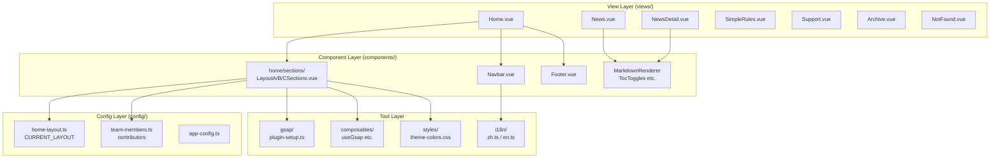
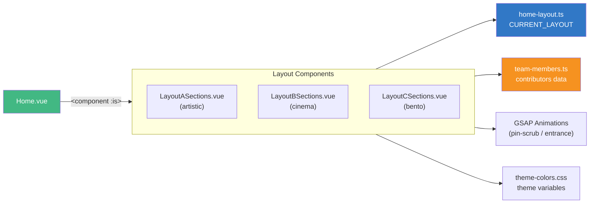
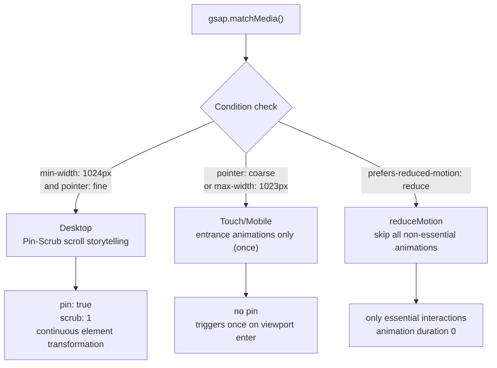
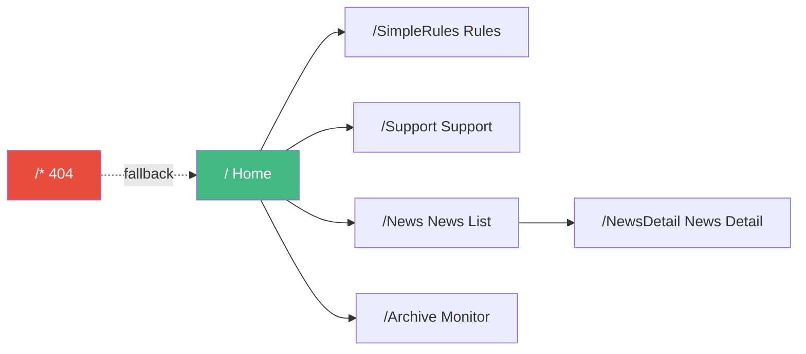
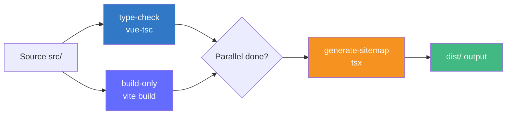

# LuminolCraft

<div align="center">


[English](README.md) | [简体中文](README.zh-CN.md)

</div>

---

LuminolCraft is the official website of the LuminolMC-affiliated Minecraft server, a modern Single Page Application (SPA) built with Vue 3. The website provides server status monitoring, news, server rules, support information, and more, integrating the GSAP professional animation system, Lenis inertia scrolling, multiple homepage layout switching, multi-language and multi-theme support, with deep responsive adaptation for desktop and mobile devices.

---

## Table of Contents

- [1. Project Overview](#1-project-overview)
- [2. Core Features](#2-core-features)
- [3. Technology Stack](#3-technology-stack)
- [4. Environment Configuration](#4-environment-configuration)
- [5. Quick Start](#5-quick-start)
- [6. Project Structure](#6-project-structure)
- [7. Core Module Introduction](#7-core-module-introduction)
  - [7.1 Homepage Layout System](#71-homepage-layout-system)
  - [7.2 GSAP Animation System](#72-gsap-animation-system)
  - [7.3 Internationalization (i18n)](#73-internationalization-i18n)
  - [7.4 Theme System](#74-theme-system)
  - [7.5 Routing Structure](#75-routing-structure)
  - [7.6 Server Status Monitoring](#76-server-status-monitoring)
  - [7.7 News System](#77-news-system)
  - [7.8 SEO Optimization](#78-seo-optimization)
- [8. Configuration Reference](#8-configuration-reference)
- [9. Development Guidelines](#9-development-guidelines)
- [10. Testing Strategy](#10-testing-strategy)
- [11. Build & Deployment](#11-build--deployment)
- [12. FAQ](#12-faq)
- [13. Maintenance Notes](#13-maintenance-notes)
- [14. Contributing Guide](#14-contributing-guide)
- [15. License](#15-license)
- [16. Acknowledgments](#16-acknowledgments)
- [17. Contact](#17-contact)

---

## 1. Project Overview

### 1.1 Introduction

LuminolCraft is the official website of the LuminolMC-affiliated Minecraft server. Built with Vue 3 + TypeScript + Vite, it is a fully-featured modern Single Page Application (SPA) that provides real-time status monitoring, news, rule explanations, and support channels for the server community.

### 1.2 Background

The LuminolCraft Minecraft server needed a modern, high-performance web platform to serve its player community. This project was created to provide real-time server information, news updates, and support resources while emphasizing visual appeal and interactive experience.

### 1.3 Project Positioning

This project is a modern SPA that provides the following capabilities:

- Real-time server status monitoring (online players, version, running status)
- Dynamic news and announcement system (Markdown rendering + KaTeX math formulas + syntax highlighting)
- Server rules and support information display
- Multi-language (Chinese/English) and multi-theme (light/dark + multiple color schemes) support
- Deep responsive adaptation for desktop and mobile
- GSAP professional-grade animations (Pin-Scrub scroll storytelling, entrance animations, theme toggle spherical diffusion, etc.)
- SEO optimization (Open Graph tags, Sitemap generation, Canonical URLs)

### 1.4 Business Goals

- **Community Engagement**: Foster an active player community through real-time information and news
- **Server Transparency**: Provide visualization of server status, player counts, and performance
- **Donation Support**: Maintain server operations through a dedicated support page

### 1.5 Technical Goals

- **High Performance**: Code splitting, lazy loading, terser minification, CSS code splitting
- **Type Safety**: Complete TypeScript coverage with `vue-tsc` type checking
- **Responsive Design**: Separate CSS for desktop and mobile, perfect adaptation
- **Internationalization**: Built-in Chinese and English, `localStorage` persistence
- **SEO Optimization**: Per-route Open Graph tags, automatic Sitemap generation, Canonical URLs
- **Animation Experience**: GSAP Pin-Scrub scroll storytelling + Lenis inertia scrolling, with touch/reduceMotion degradation

### 1.6 Target Audience

- LuminolCraft Minecraft server players
- Project maintainers and contributors
- Minecraft community members interested in server status
- Frontend developers looking to learn Vue 3 + GSAP animation architecture

---

## 2. Core Features

### 2.1 Server Status Monitoring

Real-time server online status, player count, version number, and running status via the mcsrvstat.us API. Displayed as a status card in the homepage Hero section with a real-time status indicator (green online / gray offline).

### 2.2 News System

Dynamic news list and detail pages with Markdown rendering, KaTeX math formulas, and highlight.js syntax highlighting. News list supports pagination (6 items/page on desktop, 2 items/page on mobile).

### 2.3 Homepage Layout System

The project's core feature — a **configuration-driven multi-layout switching system**. The homepage (`Home.vue`) renders via `<component :is="layoutComponent">` dynamic component, switchable between three layouts:

| Layout | Identifier | Style Description |
|--------|------------|-------------------|
| Artistic | `'artistic'` | Z-shaped diagonal flow + organic rotating cards + Pin-Scrub scroll storytelling |
| Cinema | `'cinema'` | Cinema-style asymmetric impact composition (full-screen color blocks + giant numbers + four-corner asymmetry) |
| Bento | `'bento'` | Classic Bento Grid (features 2×3 + servers auto-fit + team spherical avatars) |

Switching: Modify the `CURRENT_LAYOUT` constant in `src/config/home-layout.ts` and refresh (Vite HMR auto-reloads).

Additionally, the team section style can be independently configured via `CURRENT_TEAM_STYLE`, freely combinable with the overall layout (e.g., `bento` layout + `cinema` team style).

### 2.4 Multi-language Support

Built-in Chinese (`zh`) and English (`en`) internationalization based on `vue-i18n` Composition API (`legacy: false`). Language choice persists to `localStorage` (key: `locale`), defaults to Chinese, falls back to English.

### 2.5 Theme Switching

Light/dark dual themes + multiple color schemes. Theme toggle animation uses a **spherical diffusion effect** (no full-screen overlay), implemented with GSAP. Dark mode provides fallback styles via the `:root[data-vt]` attribute selector.

### 2.6 GSAP Animation System

The project integrates GSAP (GreenSock Animation Platform), including:

- **Pin-Scrub scroll storytelling**: Sections pin during scroll with continuous internal element transformation (translate/rotate/fade), avoiding a "stuck" feeling
- **Entrance animations**: Elements stagger in sequentially
- **MotionPath floating icons**: Movement along SVG paths
- **SplitText text animations**: Per-character/word splitting
- **Lenis inertia scrolling**: Smooth scrolling experience, synced with ScrollTrigger
- **matchMedia degradation**: Three branches — desktop/touch/reduceMotion; touch and reduceMotion skip non-essential animations

### 2.7 SEO Optimization

- Per-route independent Open Graph tags (title/description/image/type/url)
- Twitter Card support
- Canonical URLs (query strings removed)
- Automatic Sitemap generation (runs `tsx src/utils/generate-sitemap.ts` after build)
- `robots: index, follow`

### 2.8 Responsive Design

Separate CSS files for desktop and mobile (`src/styles/desktop/` and `src/styles/mobile/`), loaded via media queries. Mobile simplifies animations and layout for smooth touch experience.

### 2.9 Analytics

Integrated Umami privacy-first analytics platform, injected via `@unhead/vue` in `main.ts`.

---

## 3. Technology Stack

### 3.1 Runtime Dependencies

| Library | Version | Purpose | Docs |
|---------|---------|---------|------|
| vue | ^3.5.25 | Progressive JavaScript framework | [vuejs.org](https://vuejs.org/) |
| vue-router | ^4.6.3 | Official router for Vue.js | [router.vuejs.org](https://router.vuejs.org/) |
| pinia | ^3.0.4 | State management | [pinia.vuejs.org](https://pinia.vuejs.org/) |
| vue-i18n | ^9.14.4 | Internationalization | [vue-i18n.intlify.dev](https://vue-i18n.intlify.dev/) |
| @unhead/vue | ^1.9.5 | Head tag management (SEO) | [unhead.unjs.io](https://unhead.unjs.io/) |
| @unhead/ssr | ^2.0.19 | SSR head management utilities | [unhead.unjs.io](https://unhead.unjs.io/) |
| gsap | ^3.15.0 | Professional animation library | [gsap.com](https://gsap.com/) |
| lenis | ^1.3.25 | Inertia scrolling library | [lenis.darkroom.engineering](https://lenis.darkroom.engineering/) |
| chart.js | ^4.5.1 | Data visualization charts | [chartjs.org](https://www.chartjs.org/) |
| marked | ^17.0.1 | Markdown parser | [marked.js.org](https://marked.js.org/) |
| highlight.js | ^11.11.1 | Syntax highlighting | [highlightjs.org](https://highlightjs.org/) |
| katex | ^0.16.27 | Math formula rendering | [katex.org](https://katex.org/) |
| lodash | ^4.17.21 | Utility functions | [lodash.com](https://lodash.com/) |

### 3.2 Dev Dependencies

| Library | Version | Purpose |
|---------|---------|---------|
| vite | ^7.2.4 | Build tool |
| @vitejs/plugin-vue | ^6.0.2 | Vue SFC support |
| vite-plugin-vue-devtools | ^8.0.5 | Developer tools |
| typescript | ~5.9.0 | Type checking |
| vue-tsc | ^3.2.1 | Vue type checking |
| vitest | ^4.0.14 | Unit testing framework |
| @vue/test-utils | ^2.4.6 | Vue testing utilities |
| jsdom | ^27.2.0 | Test DOM environment |
| eslint | ^9.39.1 | Code linting |
| eslint-plugin-vue | ~10.5.1 | Vue ESLint rules |
| prettier | 3.6.2 | Code formatting |
| terser | ^5.44.1 | JS minification |
| tsx | ^4.21.0 | TypeScript execution |
| sitemap | ^9.0.0 | Sitemap generation |
| npm-run-all2 | ^8.0.4 | Parallel script runner |

### 3.3 GSAP Plugins

The following plugins are registered in `src/gsap/plugin-setup.ts`:

| Plugin | Purpose |
|--------|---------|
| ScrollTrigger | Scroll-triggered animations (core) |
| ScrollToPlugin | Smooth scroll animations |
| SplitText | Text splitting animations |
| Flip | Layout transition animations |
| CustomEase | Custom easing curves |
| DrawSVGPlugin | SVG drawing animations |
| MotionPathPlugin | Path-based motion animations |
| MorphSVGPlugin | SVG morphing animations |

---

## 4. Environment Configuration

### 4.1 Prerequisites

| Requirement | Version | Notes |
|-------------|---------|-------|
| Node.js | `^20.19.0` or `>=22.12.0` | See `package.json` `engines` field |
| Package Manager | pnpm (recommended) or npm | pnpm is faster and uses less disk |
| Git | Any version | Version control |
| Browser | Modern browser (latest Chrome/Firefox/Edge/Safari) | Development and testing |

### 4.2 Development Environment Setup

```bash
# 1. Clone the repository
git clone <repository-url>
cd craft.luminolsuki.moe

# 2. Install dependencies (pnpm recommended)
pnpm install
```

**Expected output (pnpm install):**

```
Packages: +420
+
Progress: resolved 420, reused 380, downloaded 40, added 420, done

dependencies:
+ vue 3.5.25
+ vue-router 4.6.3
+ gsap 3.15.0
+ lenis 1.3.25
...

Done in 12s
```

### 4.3 Verify Environment

```bash
# Check Node version
node -v
# Expected: v20.19.0 or higher

# Check pnpm version (if installed)
pnpm -v
# Expected: 9.x or higher
```

---

## 5. Quick Start

### 5.1 Start Development Server

```bash
pnpm dev
```

**Expected output:**

```
  VITE v7.2.4  ready in 320 ms

  ➜  Local:   http://localhost:51640/
  ➜  Network: use --host to expose
  ➜  press h + enter to show help
```

> **Note**: The dev server port is **51640** (configured in `vite.config.ts` `server.port`); the browser opens automatically.

### 5.2 Complete Command Reference

| Command | Description |
|---------|-------------|
| `pnpm dev` | Start dev server (port 51640, auto-opens browser) |
| `pnpm build` | Type check + build + generate Sitemap |
| `pnpm preview` | Preview production build |
| `pnpm test:unit` | Run unit tests (Vitest) |
| `pnpm type-check` | TypeScript type checking (vue-tsc) |
| `pnpm lint` | ESLint check and auto-fix |
| `pnpm format` | Prettier format `src/` |
| `pnpm generate-sitemap` | Generate Sitemap only |
| `pnpm build-only` | Build only (no type check or Sitemap) |

### 5.3 Build for Production

```bash
pnpm build
```

**Expected output (end):**

```
✓ built in 8.42s
✓ sitemap generated: dist/sitemap.xml
```

Build flow: `type-check` and `build-only` run in parallel (`run-p`), then `tsx src/utils/generate-sitemap.ts` generates the Sitemap.

### 5.4 Run Tests

```bash
# Run once
pnpm test:unit

# Watch mode
pnpm test:unit -- --watch

# Coverage report
pnpm test:unit -- --coverage
```

### 5.5 Lint and Format

```bash
# ESLint check and fix
pnpm lint

# Prettier format
pnpm format
```

---

## 6. Project Structure

### 6.1 Directory Tree

```
craft.luminolsuki.moe/
├── .netlify/
│   └── functions/                    # Netlify Serverless functions
│       ├── news.js                   # News data proxy
│       └── version.js                # Version info
├── .trae/
│   └── specs/                        # Project specifications
├── public/
│   ├── images/                       # Static images (WebP/AVIF)
│   └── favicon.ico                   # Site favicon
├── src/
│   ├── components/                   # Reusable components
│   │   ├── home/
│   │   │   └── sections/             # Homepage layout components
│   │   │       ├── LayoutASections.vue  # artistic layout
│   │   │       ├── LayoutBSections.vue  # cinema layout
│   │   │       └── LayoutCSections.vue  # bento layout
│   │   ├── Navbar.vue                # Navigation bar
│   │   ├── Footer.vue                # Footer
│   │   ├── MarkdownRenderer.vue       # Markdown renderer (KaTeX + highlight.js)
│   │   ├── ColorSchemeSwitcher.vue    # Color scheme switcher
│   │   ├── CookieConsentBanner.vue    # Cookie consent banner
│   │   ├── LastViewedPopup.vue        # Recently viewed popup
│   │   └── TocToggles.vue             # Theme and language toggle
│   ├── composables/                  # Composables
│   │   ├── useCookieConsent.ts        # Cookie consent state
│   │   ├── useEntranceAnimation.ts    # Entrance animations
│   │   ├── useGsap.ts                 # GSAP utilities
│   │   ├── useHoverAnimation.ts       # Hover animations
│   │   ├── useI18n.ts                 # i18n helpers
│   │   ├── useLastViewedCookie.ts     # Recently viewed cookie
│   │   ├── usePageTransition.ts       # Page transitions
│   │   ├── useScrollTrigger.ts        # Scroll-triggered animations
│   │   └── useSplitText.ts            # Text splitting
│   ├── config/                       # Configuration files
│   │   ├── app-config.ts              # Application config
│   │   ├── home-layout.ts             # Homepage layout switching config
│   │   └── team-members.ts            # Team members shared data
│   ├── gsap/                         # GSAP animation module
│   │   ├── config/
│   │   │   ├── durations.ts           # Animation durations
│   │   │   ├── easings.ts             # Easing curves
│   │   │   └── staggers.ts            # Stagger configs
│   │   ├── defaults.ts               # Default animation config
│   │   ├── index.ts                   # Module entry
│   │   ├── match-media.ts             # Responsive animation matching
│   │   └── plugin-setup.ts            # Plugin registration
│   ├── i18n/                         # Internationalization
│   │   ├── locales/
│   │   │   ├── zh.ts                  # Chinese translations
│   │   │   └── en.ts                  # English translations
│   │   └── index.ts                   # i18n configuration
│   ├── router/
│   │   └── index.ts                   # Vue Router configuration
│   ├── stores/                       # Pinia state management
│   ├── styles/                       # CSS styles
│   │   ├── desktop/                   # Desktop styles
│   │   ├── mobile/                    # Mobile styles
│   │   ├── fonts.css                  # Font definitions
│   │   ├── gsap-splittext.css         # GSAP SplitText styles
│   │   ├── responsive.css             # Responsive styles
│   │   ├── theme-colors.css           # Theme color variables
│   │   ├── typography.css             # Typography
│   │   └── vercel-design-system.css   # Vercel design system
│   ├── utils/                        # Utility functions
│   │   ├── generate-sitemap.ts        # Sitemap generation
│   │   └── utils.ts                   # Common utilities (debounce/throttle)
│   ├── views/                        # Page components
│   │   ├── Home.vue                  # Homepage
│   │   ├── News.vue                  # News list
│   │   ├── NewsDetail.vue            # News detail
│   │   ├── SimpleRules.vue           # Server rules
│   │   ├── Support.vue               # Support page
│   │   ├── Archive.vue               # Server monitoring
│   │   └── NotFound.vue              # 404 page
│   ├── App.vue                       # Root component
│   └── main.ts                       # Application entry (with Lenis init)
├── .editorconfig                     # Editor configuration
├── .prettierrc.json                  # Prettier configuration
├── eslint.config.ts                  # ESLint configuration
├── index.html                        # HTML template
├── netlify.toml                      # Netlify deployment config
├── package.json                      # Project dependencies
├── tsconfig.json                     # TypeScript config
├── vite.config.ts                    # Vite configuration
└── vitest.config.ts                  # Vitest configuration
```

### 6.2 Architecture Diagram



### 6.3 Key Directory Notes

| Directory | Description |
|-----------|-------------|
| `src/components/home/sections/` | Three homepage layout components, switched by `CURRENT_LAYOUT` |
| `src/config/` | Centralized config: layout switching, team data, app config |
| `src/gsap/` | GSAP module: plugin registration, defaults, matchMedia |
| `src/composables/` | Vue composables, reusable logic |
| `src/styles/desktop/` & `mobile/` | Desktop/mobile separated styles |
| `src/i18n/locales/` | Chinese/English translation files |

---

## 7. Core Module Introduction

### 7.1 Homepage Layout System

The homepage layout system is the project's core architectural feature, using a **configuration-driven + dynamic component** pattern for flexible layout switching and combination.

#### 7.1.1 How It Works

`Home.vue` uses Vue's `<component :is>` dynamic component to render the corresponding layout based on `CURRENT_LAYOUT`:

```vue
<!-- src/views/Home.vue -->
<component
    :is="layoutComponent"
    :server-online="serverOnline"
    :online-players="onlinePlayers"
/>
```

Layout components are lazy-loaded via `shallowRef` + dynamic `import()`:

```typescript
// Home.vue internal logic (simplified)
const layoutComponent = shallowRef()
watchEffect(async () => {
    const modules = {
        artistic: () => import('@/components/home/sections/LayoutASections.vue'),
        cinema: () => import('@/components/home/sections/LayoutBSections.vue'),
        bento: () => import('@/components/home/sections/LayoutCSections.vue'),
    }
    const mod = await modules[CURRENT_LAYOUT]()
    layoutComponent.value = mod.default
})
```

#### 7.1.2 Three Layouts

| Layout | Component | Visual Characteristics |
|--------|-----------|------------------------|
| **Artistic** | `LayoutASections.vue` | Z-shaped diagonal flow (features/team offset -3% left, servers right) + organic rotating cards (-2°/3°/-1°) + GSAP Pin-Scrub scroll storytelling (pin + scrub: 1) |
| **Cinema** | `LayoutBSections.vue` | Cinema-style asymmetric impact: full-screen color blocks + giant numbers + four-corner asymmetry + servers horizontal strip + cinematic pin parallax |
| **Bento** | `LayoutCSections.vue` | Classic Bento Grid: features 2×3 grid + servers auto-fit grid + team spherical avatars (random positions + cursor repulsion + safe zone) |

#### 7.1.3 Configuration File

Layout switching is done by modifying `src/config/home-layout.ts`:

```typescript
// src/config/home-layout.ts
export type HomeLayout = 'artistic' | 'cinema' | 'bento'
export const CURRENT_LAYOUT: HomeLayout = 'bento'

export type TeamStyle = 'artistic' | 'cinema' | 'bento'
export const CURRENT_TEAM_STYLE: TeamStyle = 'artistic'
```

- `CURRENT_LAYOUT`: Controls the overall homepage layout
- `CURRENT_TEAM_STYLE`: Controls the team section style (decoupled from layout, freely combinable)

#### 7.1.4 Component Relationship Diagram



#### 7.1.5 Layout Switching Example

```bash
# Edit src/config/home-layout.ts
# Change CURRENT_LAYOUT to 'cinema'
```

```typescript
export const CURRENT_LAYOUT: HomeLayout = 'cinema'  // from 'bento' to 'cinema'
```

Vite HMR auto-reloads on save; the homepage switches to cinema layout without restarting the server.

#### 7.1.6 Team Members Shared Data

Team member data is centralized in `src/config/team-members.ts` for unified import by layout components:

```typescript
// src/config/team-members.ts
export interface Contributor {
    name: string
    avatar: string
    roleKey: string          // corresponds to i18n home.team.roles.<key>
    githubHref: string
    githubLabel: string
    isOwner: boolean
    extraLinks?: Array<{
        type: 'qq' | 'email'
        href: string
    }>
}

export const contributors: Contributor[] = [
    { name: 'MrHua269', avatar: '...', roleKey: 'owner', ... isOwner: true },
    // ... 6 members total
]
```

#### 7.1.7 Server Numbering with CSS Counter

All three layouts' servers-section use CSS counter for auto-generated numbering. **Copy a `server-panel` node to add a server; numbering auto-increments**:

```css
/* Layout component CSS */
.servers-grid { counter-reset: server-counter; }
.server-panel { counter-increment: server-counter; }
.server-index::before {
    content: counter(server-counter, decimal-leading-zero);
    /* number styles (gradient text effect must be on ::before, as background-clip:text is not inheritable) */
}
```

```html
<!-- To add a server: copy the node below; number auto-increments to 03 -->
<div class="server-panel">
    <span class="server-index"></span>  <!-- number generated by CSS -->
    <!-- server info -->
</div>
```

---

### 7.2 GSAP Animation System

The project deeply integrates GSAP, building a complete animation system with plugin registration, responsive degradation, inertia scrolling, and Pin-Scrub scroll storytelling.

#### 7.2.1 Plugin Registration

All GSAP plugins are registered centrally in `src/gsap/plugin-setup.ts`:

```typescript
// src/gsap/plugin-setup.ts
import gsap from 'gsap'
import { ScrollTrigger } from 'gsap/ScrollTrigger'
// ... other plugin imports

export function registerGsapPlugins(): void {
  gsap.registerPlugin(
    ScrollTrigger, ScrollToPlugin, SplitText, Flip,
    CustomEase, DrawSVGPlugin, MotionPathPlugin, MorphSVGPlugin,
  )
}
```

Called via `setupGsap()` in `main.ts`.

#### 7.2.2 Lenis Inertia Scrolling

`main.ts` initializes Lenis inertia scrolling with `gsap.matchMedia()` responsive degradation:

```typescript
// src/main.ts
const lenisMm = gsap.matchMedia()
let lenisInstance: Lenis | null = null

lenisMm.add(
    {
        isDesktop: '(min-width: 769px) and (pointer: fine)',
        reduceMotion: '(prefers-reduced-motion: reduce)',
    },
    (context) => {
        const { isDesktop, reduceMotion } = context.conditions!
        if (!isDesktop || reduceMotion) return  // skip on touch or reduceMotion

        lenisInstance = new Lenis({
            duration: 1.2,
            easing: (t: number) => Math.min(1, 1.001 - Math.pow(2, -10 * t)),
            smoothWheel: true,
            wheelMultiplier: 1.2,
            touchMultiplier: 1.5,
        })

        // Sync Lenis scroll events to ScrollTrigger
        lenisInstance.on('scroll', ScrollTrigger.update)

        // Drive lenis.raf() with gsap.ticker
        gsap.ticker.add((time) => {
            lenisInstance?.raf(time * 1000)
        })

        return () => { lenisInstance?.destroy(); lenisInstance = null }
    },
)
```

**Configuration:**

| Parameter | Value | Description |
|-----------|-------|-------------|
| `duration` | `1.2` | Scroll animation duration (seconds) |
| `easing` | `t => Math.min(1, 1.001 - Math.pow(2, -10 * t))` | Exponential easing, smoother reverse scrolling |
| `smoothWheel` | `true` | Enable smooth mouse wheel |
| `wheelMultiplier` | `1.2` | Wheel speed multiplier |
| `touchMultiplier` | `1.5` | Touch speed multiplier |

#### 7.2.3 matchMedia Degradation Strategy

All animations use `gsap.matchMedia()` for three-branch degradation:



**Example (Artistic layout Pin-Scrub):**

```typescript
gsap.matchMedia().add(
    '(min-width: 1024px) and (pointer: fine)',
    () => {
        // Desktop: Pin-Scrub scroll storytelling
        gsap.timeline({
            scrollTrigger: {
                trigger: '.features-section',
                start: 'top top',
                end: '+=300%',
                pin: true,
                scrub: 1,
            },
        })
        .to('.feature-card-1', { rotation: -2, y: -50 })
        .to('.feature-card-2', { rotation: 3, y: 30 }, '-=0.5')
    }
)
```

#### 7.2.4 Pin-Scrub Design Principles

- **Continuous visual feedback**: Elements transform continuously during pin (translate/rotate/fade), avoiding a "stuck" feeling
- **GSAP rotation end values match CSS design values**: e.g., card CSS design -2°, GSAP `rotation` end value also -2°, preserving artistic layout after pin release
- **Section offset uses margin** (not transform, to avoid conflict with ScrollTrigger pin)
- **Card offset/rotation uses transform**

#### 7.2.5 Tuning Point Comment Convention

Code contains `微调点：` (tuning point) comments marking adjustable values:

```css
/* 微调点：0 - card rotation angle (artistic layout) */
.feature-card:nth-child(1) { transform: rotate(-2deg); }

/* 微调点：1 - Pin-Scrub scroll distance */
/* 微调点：2 - stagger interval */
```

Search for `微调点：` to quickly locate all adjustable parameters.

---

### 7.3 Internationalization (i18n)

#### 7.3.1 Configuration

```typescript
// src/i18n/index.ts
import { createI18n } from 'vue-i18n'
import zh from './locales/zh'
import en from './locales/en'

const savedLocale = localStorage.getItem('locale')
const defaultLocale = savedLocale || 'zh'

const i18n = createI18n({
  legacy: false,           // use Composition API
  locale: defaultLocale,   // default Chinese
  fallbackLocale: 'en',    // fallback English
  messages: { zh, en }
})
```

#### 7.3.2 Language File Structure

```
src/i18n/locales/
├── zh.ts    # Chinese translations
└── en.ts    # English translations
```

Translation files are organized by module (e.g., `home`, `news`, `common`), called in components via `t('home.hero.title')`.

#### 7.3.3 Persistence and Switching

- Language choice stored in `localStorage` (key: `locale`)
- Switching via `TocToggles.vue` component
- Persists across refreshes

#### 7.3.4 Adding New i18n Keys Example

```typescript
// src/i18n/locales/zh.ts
export default {
  home: {
    team: {
      roles: {
        owner: '服主',           // new
        survivalAdmin: '生存管理',
      }
    }
  }
}
```

```typescript
// src/i18n/locales/en.ts
export default {
  home: {
    team: {
      roles: {
        owner: 'Owner',           // corresponding English
        survivalAdmin: 'Survival Admin',
      }
    }
  }
}
```

---

### 7.4 Theme System

#### 7.4.1 Theme Color Variables

Theme-related CSS variables are centralized in `src/styles/theme-colors.css`:

```css
:root {
    --color-bg: #ffffff;
    --color-text: #1a1a1a;
    /* ... other variables */
}

:root[data-vt] {
    /* dark mode fallback (triggered by data-vt attribute) */
    --color-bg: #0a0a0a;
    --color-text: #f5f5f5;
}
```

#### 7.4.2 Theme Toggle Animation

Theme toggle uses a **spherical diffusion effect** (no full-screen overlay), implemented with GSAP:

- CSS variable `--reveal-size` controls diffusion radius
- GSAP animates `--reveal-size` from 0 to 100%
- Touch and reduceMotion skip animation, switching directly

#### 7.4.3 Color Schemes

`ColorSchemeSwitcher.vue` provides multiple color scheme switching; theme variables managed in `theme-colors.css`.

---

### 7.5 Routing Structure

#### 7.5.1 Route Table

| Route | Name | Component | Description |
|-------|------|-----------|-------------|
| `/` | Home | Home.vue | Homepage (Hero + layout component) |
| `/SimpleRules` | SimpleRules | SimpleRules.vue | Server rules |
| `/Support` | support | Support.vue | Support page |
| `/News` | news | News.vue | News list |
| `/NewsDetail` | newsdetail | NewsDetail.vue | News detail (aliases: `/news-detail`, `/news-detail.html`, `/NewsDetail.html`) |
| `/Archive` | Archive | Archive.vue | Server monitoring |
| `/:pathMatch(.*)*` | NotFound | NotFound.vue | 404 fallback |

#### 7.5.2 Route Diagram



#### 7.5.3 Lazy Loading

All route components use dynamic `import()` for lazy loading and code splitting:

```typescript
component: () => import('../views/News.vue')
```

#### 7.5.4 Scroll Behavior

```typescript
scrollBehavior(to, from, savedPosition) {
  return new Promise((resolve) => {
    setTimeout(() => {
      if (savedPosition) resolve(savedPosition)
      else if (to.hash) resolve({ el: to.hash, behavior: 'smooth' })
      else resolve({ left: 0, top: 0, behavior: 'instant' })
    }, 0)
  })
}
```

---

### 7.6 Server Status Monitoring

The homepage Hero section displays a server status card, fetching data via the mcsrvstat.us API:

- **Online status**: Status indicator (green online / gray offline)
- **Player count**: Real-time player number
- **Version**: `1.21.11`
- **Server type**: Displayed via i18n
- **Running status**: Online/offline

Status data is passed to layout components via props:

```vue
<component
    :is="layoutComponent"
    :server-online="serverOnline"
    :online-players="onlinePlayers"
/>
```

The `/Archive` page uses Chart.js for server status history and visualization.

---

### 7.7 News System

#### 7.7.1 News List (`/News`)

- Paginated: 6 items/page on desktop, 2 items/page on mobile (configured in `app-config.ts`)
- Max displayed page numbers: 5

#### 7.7.2 News Detail (`/NewsDetail`)

Renders Markdown content via `MarkdownRenderer.vue`, supporting:

- **KaTeX math formulas**: Inline `$...$` and block `$$...$$`
- **highlight.js syntax highlighting**: Multi-language code blocks
- **marked parsing**: Markdown to HTML

#### 7.7.3 Netlify Functions

News data is proxied via Netlify Serverless functions:

```
.netlify/functions/
├── news.js     # news data proxy
└── version.js  # version info
```

---

### 7.8 SEO Optimization

#### 7.8.1 Open Graph Tags

Each route configures independent Open Graph tags via `meta.og`, injected in `main.ts` `router.beforeEach`:

```typescript
router.beforeEach((to) => {
    const og = to.meta.og as any
    if (!og) return

    head.push({
        title: og.title,
        meta: [
            { name: 'description', content: og.description },
            { property: 'og:title', content: og.title },
            { property: 'og:description', content: og.description },
            { property: 'og:image', content: og.image.url },
            { property: 'og:image:width', content: og.image.width || 1200 },
            { property: 'og:image:height', content: og.image.height || 630 },
            { property: 'og:type', content: to.name === 'newsdetail' ? 'article' : 'website' },
            { name: 'twitter:card', content: 'summary_large_image' },
            // ...
        ],
        link: [{ rel: 'canonical', href: currentUrl.split('?')[0] }]
    })
})
```

#### 7.8.2 Sitemap Generation

Automatically runs `src/utils/generate-sitemap.ts` after build, generating `dist/sitemap.xml`.

#### 7.8.3 Canonical URL

Each page sets a canonical URL (query strings removed) to avoid duplicate content.

---

## 8. Configuration Reference

### 8.1 home-layout.ts (Homepage Layout Config)

```typescript
// src/config/home-layout.ts
export type HomeLayout = 'artistic' | 'cinema' | 'bento'
export const CURRENT_LAYOUT: HomeLayout = 'bento'

export type TeamStyle = 'artistic' | 'cinema' | 'bento'
export const CURRENT_TEAM_STYLE: TeamStyle = 'artistic'
```

| Config | Type | Options | Default | Description |
|--------|------|---------|---------|-------------|
| `CURRENT_LAYOUT` | `HomeLayout` | `'artistic'` / `'cinema'` / `'bento'` | `'bento'` | Overall homepage layout |
| `CURRENT_TEAM_STYLE` | `TeamStyle` | `'artistic'` / `'cinema'` / `'bento'` | `'artistic'` | Team section style (decoupled from layout) |

### 8.2 app-config.ts (Application Config)

```typescript
// src/config/app-config.ts
export interface AppConfig {
  showTocToggles: boolean          // theme/language toggle visibility
  navbarFixed: boolean             // navbar fixed
  showFooterCopyright: boolean     // footer copyright visibility
  newsPagination: {
    desktopItemsPerPage: number    // desktop items per page
    mobileItemsPerPage: number     // mobile items per page
    maxDisplayedPages: number      // max displayed page numbers
  }
}

export const appConfig: AppConfig = {
  showTocToggles: true,
  navbarFixed: true,
  showFooterCopyright: true,
  newsPagination: {
    desktopItemsPerPage: 6,
    mobileItemsPerPage: 2,
    maxDisplayedPages: 5
  }
}
```

### 8.3 team-members.ts (Team Members Data)

```typescript
// src/config/team-members.ts
export interface Contributor {
    name: string
    avatar: string
    roleKey: string
    githubHref: string
    githubLabel: string
    isOwner: boolean
    extraLinks?: Array<{ type: 'qq' | 'email'; href: string }>
}
export const contributors: Contributor[] = [ /* 6 members */ ]
```

### 8.4 vite.config.ts Key Config

```typescript
// vite.config.ts (key items)
export default defineConfig({
  define: {
    __APP_VERSION__: JSON.stringify(appVersion),  // Git commit hash
    __BUILD_TIME__: JSON.stringify(new Date().toISOString()),
  },
  resolve: {
    alias: { '@': fileURLToPath(new URL('./src', import.meta.url)) }
  },
  build: {
    minify: 'terser',
    rollupOptions: {
      output: {
        manualChunks: {
          'vue-vendor': ['vue', 'vue-router', 'vue-i18n', 'pinia'],
          'markdown': ['marked'],
          'highlight': ['highlight.js'],
        },
      },
    },
    cssCodeSplit: true,
    sourcemap: false,
  },
  server: {
    port: 51640,    // dev server port
    open: true,     // auto-open browser
  },
})
```

### 8.5 Environment Variables

Global variables injected at build time (via Vite `define`):

| Variable | Source | Description |
|----------|--------|-------------|
| `__APP_VERSION__` | `COMMIT_REF` / `CF_PAGES_COMMIT_SHA` / `GIT_COMMIT` / git command | Git commit hash |
| `__BUILD_TIME__` | `new Date().toISOString()` | Build timestamp |

Deployment platform environment variables:

| Platform | Variable | Value |
|----------|----------|-------|
| Netlify | `NODE_VERSION` | `22` (see `netlify.toml`) |

---

## 9. Development Guidelines

### 9.1 Code Style

The project uses ESLint + Prettier for consistent code style:

```bash
# Check and fix
pnpm lint

# Format
pnpm format
```

- **ESLint config**: `eslint.config.ts`, integrating `eslint-plugin-vue` and `@vue/eslint-config-typescript`
- **Prettier config**: `.prettierrc.json`
- **Editor config**: `.editorconfig`

### 9.2 Naming Conventions

| Type | Convention | Example |
|------|-----------|---------|
| Component files | PascalCase.vue | `Home.vue`, `Navbar.vue` |
| Composables | camelCase, use prefix | `useGsap.ts`, `useScrollTrigger.ts` |
| Config files | kebab-case.ts | `home-layout.ts`, `app-config.ts` |
| CSS classes | kebab-case | `.hero-section`, `.server-panel` |
| TypeScript types | PascalCase | `HomeLayout`, `Contributor` |
| Constants | UPPER_SNAKE_CASE | `CURRENT_LAYOUT`, `CURRENT_TEAM_STYLE` |
| Route names | PascalCase or camelCase | `Home`, `news` |

### 9.3 Commit Convention

Recommended [Conventional Commits](https://www.conventionalcommits.org/) format:

```
<type>(<scope>): <subject>

<body>
```

| type | Description |
|------|-------------|
| `feat` | New feature |
| `fix` | Bug fix |
| `docs` | Documentation changes |
| `style` | Code formatting (no functional change) |
| `refactor` | Refactoring (neither new feature nor fix) |
| `perf` | Performance improvement |
| `test` | Test related |
| `chore` | Build/tooling changes |

**Examples:**

```
feat(home): add cinema layout Pin-Scrub scroll storytelling
fix(gsap): fix Lenis not properly destroyed on touch devices
docs(readme): rewrite README to enterprise-grade standard
```

### 9.4 GSAP Usage Guidelines

1. **Centralized plugin registration**: All plugins registered in `plugin-setup.ts`; do not register in components
2. **Use gsap.context() for isolation**: Wrap component animations in `gsap.context()`, call `revert()` on `onUnmounted`
3. **matchMedia degradation**: All scroll animations use `gsap.matchMedia()` for three-branch degradation
4. **Pin-Scrub principles**:
   - Must have continuous visual transformation during pin (avoid "stuck" feeling)
   - GSAP rotation end values match CSS design values
   - Section offset uses `margin` (not `transform`)
   - Card offset/rotation uses `transform`
5. **Lenis config is fixed**: `duration: 1.2` + exponential easing + `wheelMultiplier: 1.2`

### 9.5 Tuning Point Comment Convention

Adjustable values are marked with `微调点：` (tuning point) comments for quick location:

```css
/* 微调点：0 - card rotation angle */
/* 微调点：1 - Pin-Scrub scroll distance (end: '+=N%') */
/* 微调点：2 - stagger interval */
```

Search `微调点：` to iterate all adjustable parameters.

### 9.6 Directory Organization Principles

- **Centralized config**: All configurable items in `src/config/`
- **Composables**: Reusable logic extracted to `src/composables/`
- **Style separation**: Desktop/mobile styles in separate directories (`desktop/` / `mobile/`)
- **Centralized theme variables**: Theme color variables in `theme-colors.css`
- **Modular animations**: GSAP config/plugins/defaults centralized in `src/gsap/`

---

## 10. Testing Strategy

### 10.1 Unit Testing

- **Framework**: Vitest 4.0.14 + jsdom 27 environment
- **Config**: `vitest.config.ts` (extends vite.config, jsdom environment, excludes e2e)
- **Utilities**: `@vue/test-utils`

```bash
# Run tests
pnpm test:unit

# Watch mode
pnpm test:unit -- --watch

# Coverage
pnpm test:unit -- --coverage
```

### 10.2 Type Checking

Uses `vue-tsc` for Vue + TypeScript type checking:

```bash
pnpm type-check
```

Type checking is part of the build flow (`pnpm build` runs `type-check` first).

### 10.3 Build Verification

```bash
# Full verification: type check + build + Sitemap
pnpm build
```

When build fails, check:
1. TypeScript type errors → `pnpm type-check` for details
2. Vite build errors → check import paths and syntax
3. Sitemap generation failure → check `src/utils/generate-sitemap.ts`

---

## 11. Build & Deployment

### 11.1 Build Flow

```bash
pnpm build
```



### 11.2 Build Output

```
dist/
├── index.html               # HTML entry
├── sitemap.xml              # Sitemap
├── assets/
│   ├── vue-vendor-[hash].js # Vue family (vue/router/i18n/pinia)
│   ├── markdown-[hash].js   # marked
│   ├── highlight-[hash].js  # highlight.js
│   ├── index-[hash].js      # Application code
│   └── *.css                # Split CSS
├── images/                  # Static images
└── favicon.ico              # Site favicon
```

**Optimizations:**

- `terser` JS minification
- `manualChunks` code splitting (vue-vendor / markdown / highlight)
- `cssCodeSplit: true` CSS code splitting
- `sourcemap: false` no sourcemap in production

### 11.3 Deployment Platforms

#### Netlify

Config file: `netlify.toml`

```toml
[build]
  command = "pnpm run build"
  publish = "dist"

[build.environment]
  NODE_VERSION = "22"

[[headers]]
  for = "/*.css"
  [headers.values]
    Cache-Control = "public, max-age=0, must-revalidate"

[[redirects]]
  from = "/*"
  to = "/index.html"
  status = 200
```

- **Build command**: `pnpm run build`
- **Publish directory**: `dist`
- **Node version**: 22
- **SPA redirect**: All paths rewrite to `/index.html` (status 200)

#### Other Platforms

The build output is standard static files, deployable to any static hosting platform (Vercel, Cloudflare Pages, GitHub Pages, etc.):

1. Run `pnpm build`
2. Upload `dist/` contents to the hosting platform

### 11.4 Preview Build Locally

```bash
pnpm preview
```

---

## 12. FAQ

### Q1: The dev server port isn't 3000?

The dev server port is **51640** (configured in `vite.config.ts` `server.port`). Visit `http://localhost:51640/`.

### Q2: `pnpm install` fails with Node version incompatibility?

The project requires Node `^20.19.0` or `>=22.12.0` (see `package.json` `engines` field). Use `nvm` or `fnm` to switch Node versions:

```bash
nvm install 20.19.0
nvm use 20.19.0
```

### Q3: Build reports TypeScript type errors?

Run type checking separately for details:

```bash
pnpm type-check
```

Common causes:
- Wrong import path (confirm using `@/` alias pointing to `src/`)
- Missing type definitions (check `tsconfig.app.json` `include`)
- Vue SFC `<script setup lang="ts">` syntax errors

### Q4: GSAP animations not working?

Checklist:
1. Confirm plugins are registered (`src/gsap/plugin-setup.ts`)
2. Confirm `setupGsap()` is called in `main.ts`
3. Confirm `gsap.context()` wraps animation logic
4. Confirm `matchMedia` conditions match (desktop requires `min-width: 1024px` and `pointer: fine`)
5. Confirm element selectors are correct (check DOM rendering)

### Q5: Lenis inertia scrolling not working?

Lenis only activates on **desktop** (`min-width: 769px` and `pointer: fine`) and **non-reduceMotion**. Touch devices and systems with "reduce motion" enabled skip Lenis.

### Q6: Homepage layout doesn't change after switching?

After modifying `CURRENT_LAYOUT` in `src/config/home-layout.ts`, Vite HMR should auto-reload. If not:
1. Confirm the file was saved
2. Confirm the value is one of `'artistic'` / `'cinema'` / `'bento'`
3. Manually refresh the browser

### Q7: New server-panel numbering doesn't increment?

Confirm CSS counter is correctly configured:

```css
.servers-grid { counter-reset: server-counter; }
.server-panel { counter-increment: server-counter; }
.server-index::before { content: counter(server-counter, decimal-leading-zero); }
```

Note: Numbers are generated by CSS counter; the `.server-index` in HTML should be empty (`<span class="server-index"></span>`).

### Q8: Element flickers during theme toggle?

Known issue: `will-change: transform` and `contain: layout style paint` may cause flickering. Solutions:
- Remove `will-change: transform`
- Use `contain: layout style` (not `paint`, which acts like overflow:hidden and clips overflow)

### Q9: Pin-Scrub scrolling feels "stuck"?

Pin-Scrub requires **continuous visual transformation** during pin. If only pinning without transformation, users perceive a "stuck" feeling. Ensure the timeline has element translate/rotate/fade.

### Q10: Sitemap not generated after build?

Sitemap runs separately as `tsx src/utils/generate-sitemap.ts` after build. If not generated:
1. Confirm `pnpm build` completed fully (including the last step)
2. Run `pnpm generate-sitemap` separately to check errors
3. Check `dist/` directory permissions

### Q11: Mobile animations laggy?

Mobile already degrades via `matchMedia`, keeping only essential animations. If still laggy:
1. Check if desktop styles are loaded (media query should be `max-width: 1023px`)
2. Reduce the number of simultaneously animated elements
3. Use `will-change` to hint the browser (use cautiously, may cause flickering)

---

## 13. Maintenance Notes

### 13.1 Adding a New Server

The servers-section uses CSS counter for auto-numbering. **Just copy a `server-panel` node**:

```html
<!-- Copy the node below inside .servers-grid -->
<div class="server-panel">
    <span class="server-index"></span>  <!-- number auto-increments -->
    <h3 class="server-name">New Server Name</h3>
    <p class="server-description">Description</p>
    <!-- other info -->
</div>
```

No CSS changes or manual numbering needed. New node's `nth-child` styles auto-apply (pre-reserved).

### 13.2 Adding a New Team Member

Edit `src/config/team-members.ts`, add a new object to the `contributors` array:

```typescript
export const contributors: Contributor[] = [
    // ... existing members
    {
        name: 'New Member',
        avatar: 'https://q1.qlogo.cn/g?b=qq&nk=QQ_NUMBER&s=0',
        roleKey: 'admin',           // corresponds to i18n home.team.roles.admin
        githubHref: 'https://github.com/username',
        githubLabel: 'username',
        isOwner: false,
        extraLinks: [
            { type: 'qq', href: 'https://qm.qq.com/q/xxx' },
            { type: 'email', href: 'mailto:email@example.com' },
        ],
    },
]
```

Also add the corresponding `roleKey` translation in `src/i18n/locales/zh.ts` and `en.ts` (if new role).

### 13.3 Adding a New Homepage Layout

1. Create `src/components/home/sections/LayoutXSections.vue` (reference existing LayoutA/B/C)
2. Add the new value to `HomeLayout` type in `src/config/home-layout.ts`:
   ```typescript
   export type HomeLayout = 'artistic' | 'cinema' | 'bento' | 'newLayout'
   ```
3. Add to the lazy-load mapping in `Home.vue`:
   ```typescript
   const modules = {
       // ...
       newLayout: () => import('@/components/home/sections/LayoutXSections.vue'),
   }
   ```
4. Change `CURRENT_LAYOUT` to the new value to test

### 13.4 Adding New i18n Keys

1. Add Chinese in `src/i18n/locales/zh.ts`
2. Add corresponding English in `src/i18n/locales/en.ts`
3. Call via `t('module.key')` in components

### 13.5 GSAP Tuning Point Modifications

Search `微调点：` to locate all adjustable parameters:

```bash
# Search all tuning points (use editor global search)
微调点：
```

Each tuning point notes its purpose; modify the corresponding value to adjust animation effects.

### 13.6 Dependency Updates

```bash
# Check outdated dependencies
pnpm outdated

# Update dependencies (cautiously, watch for breaking changes)
pnpm update

# Update a single package
pnpm update vue
```

**GSAP upgrade notes:**
- Check the [GSAP Changelog](https://gsap.com/docs/v3/AllPlugins/) for breaking changes
- Confirm plugin registration method unchanged (`plugin-setup.ts`)
- Confirm `matchMedia` API compatibility
- Run `pnpm type-check` and `pnpm build` to verify

### 13.7 Lenis Configuration Adjustment

Lenis config is in `src/main.ts`; adjust parameters:

| Parameter | Current | Adjustment Tip |
|-----------|---------|----------------|
| `duration` | `1.2` | Increase for slower/smoother, decrease for more responsive |
| `wheelMultiplier` | `1.2` | Increase for faster scrolling |
| `touchMultiplier` | `1.5` | Touch scroll speed |

---

## 14. Contributing Guide

### 14.1 Development Workflow

1. **Fork** the repository to your GitHub account
2. **Clone** the fork locally:
   ```bash
   git clone https://github.com/<your-username>/craft.luminolsuki.moe.git
   cd craft.luminolsuki.moe
   ```
3. **Install dependencies**:
   ```bash
   pnpm install
   ```
4. **Create a branch**:
   ```bash
   git checkout -b feat/your-feature
   ```
5. **Develop**: Start dev server `pnpm dev`
6. **Test**:
   ```bash
   pnpm type-check
   pnpm test:unit
   pnpm build
   ```
7. **Commit** (follow Conventional Commits):
   ```bash
   git commit -m "feat(home): add new feature description"
   ```
8. **Push** and open a **Pull Request**

### 14.2 PR Guidelines

- PR title follows Conventional Commits
- Describe changes and purpose clearly
- Ensure `pnpm type-check` and `pnpm build` pass
- Attach screenshots for UI changes

### 14.3 Code Review Standards

- Complete TypeScript types
- Follow ESLint + Prettier rules
- Animations include matchMedia degradation (touch/reduceMotion)
- Config centralized in `src/config/`
- Reusable logic extracted to `src/composables/`

---

## 15. License

This project is open-sourced under the [AGPL v3](https://www.gnu.org/licenses/agpl-3.0.html) license.

```
LuminolCraft - Official website of the LuminolMC-affiliated Minecraft server
Copyright (C) LuminolCraft Team

This program is free software: you can redistribute it and/or modify
it under the terms of the GNU Affero General Public License as published
by the Free Software Foundation, either version 3 of the License, or
(at your option) any later version.
```

---

## 16. Acknowledgments

- [Vue.js](https://vuejs.org/) - Progressive JavaScript framework
- [Vite](https://vite.dev/) - Next-generation frontend build tool
- [GSAP](https://gsap.com/) - Professional web animation platform
- [Lenis](https://lenis.darkroom.engineering/) - Smooth scrolling library
- [TypeScript](https://www.typescriptlang.org/) - JavaScript superset
- [Vue Router](https://router.vuejs.org/) - Official Vue.js router
- [Pinia](https://pinia.vuejs.org/) - Vue state management
- [vue-i18n](https://vue-i18n.intlify.dev/) - Vue internationalization
- [Chart.js](https://www.chartjs.org/) - Data visualization
- [marked](https://marked.js.org/) - Markdown parsing
- [highlight.js](https://highlightjs.org/) - Syntax highlighting
- [KaTeX](https://katex.org/) - Math formula rendering
- [LuminolMC](https://github.com/LuminolMC) - Affiliated Minecraft server

---

## 17. Contact

- **Repository**: [craft.luminolsuki.moe](https://github.com/LuminolCraft/craft.luminolsuki.moe)
- **Team**: [LuminolCraft GitHub](https://github.com/LuminolCraft)
- **QQ Group**: [Join our adventure](https://qm.qq.com/q/M29Eyniu8S)
- **Owner**: MrHua269 - [GitHub](https://github.com/MrHua269)

---

<div align="center">

**LuminolCraft** · Built with Vue 3 + GSAP · AGPL v3

</div>
