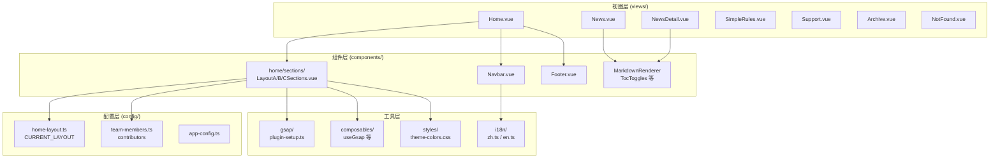
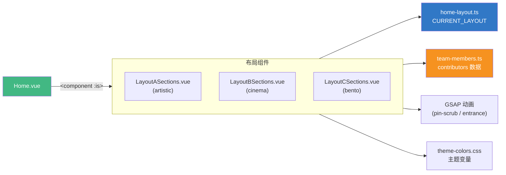
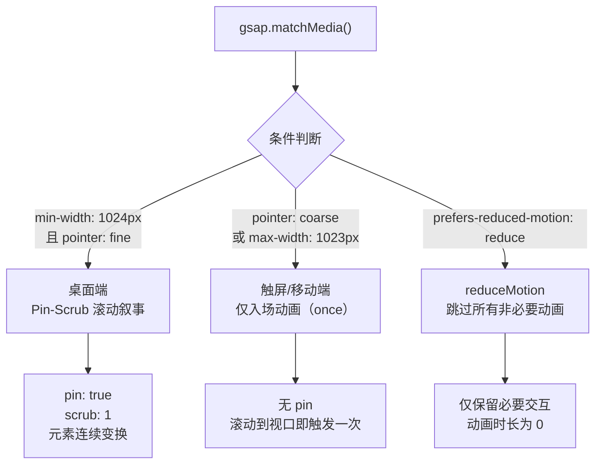
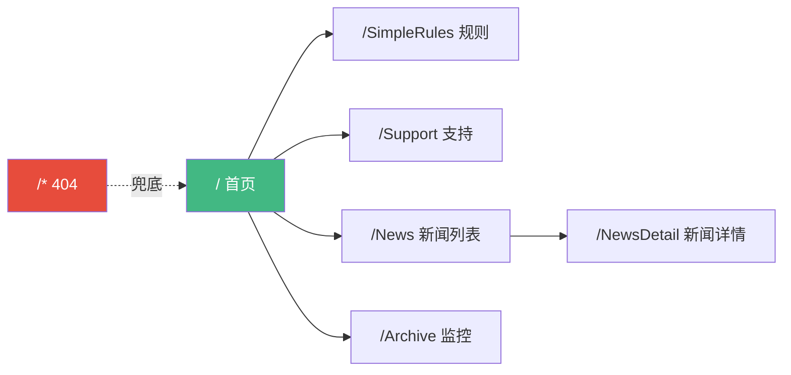
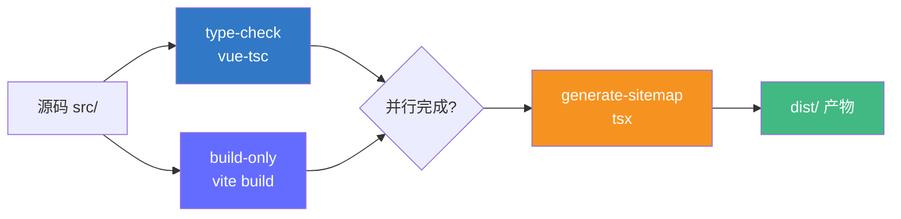

# LuminolCraft

<div align="center">


[English](README.md) | [简体中文](README.zh-CN.md)

</div>

---

LuminolCraft 是 LuminolMC 附属的 Minecraft 服务器官方网站，基于 Vue 3 构建的现代化单页应用（SPA）。网站提供服务器状态监控、新闻资讯、服务器规则、支持信息等功能，集成 GSAP 专业动画系统、Lenis 惯性滚动、多套首页布局切换、多语言与多主题支持，并针对桌面/移动端进行了深度响应式适配。

---

## 目录

- [1. 项目概述](#1-项目概述)
- [2. 核心功能](#2-核心功能)
- [3. 技术栈](#3-技术栈)
- [4. 环境配置](#4-环境配置)
- [5. 快速开始](#5-快速开始)
- [6. 项目结构](#6-项目结构)
- [7. 核心模块解析](#7-核心模块解析)
  - [7.1 首页布局系统](#71-首页布局系统)
  - [7.2 GSAP 动画系统](#72-gsap-动画系统)
  - [7.3 国际化 i18n](#73-国际化-i18n)
  - [7.4 主题系统](#74-主题系统)
  - [7.5 路由结构](#75-路由结构)
  - [7.6 服务器状态监控](#76-服务器状态监控)
  - [7.7 新闻系统](#77-新闻系统)
  - [7.8 SEO 优化](#78-seo-优化)
- [8. 配置参考](#8-配置参考)
- [9. 开发规范](#9-开发规范)
- [10. 测试策略](#10-测试策略)
- [11. 构建与部署](#11-构建与部署)
- [12. 常见问题（FAQ）](#12-常见问题faq)
- [13. 维护注意事项](#13-维护注意事项)
- [14. 贡献指南](#14-贡献指南)
- [15. 许可证](#15-许可证)
- [16. 致谢](#16-致谢)
- [17. 联系方式](#17-联系方式)

---

## 1. 项目概述

### 1.1 简介

LuminolCraft 是 LuminolMC 附属的 Minecraft 服务器官方网站。项目采用 Vue 3 + TypeScript + Vite 技术栈，是一个功能完整的现代化单页应用（SPA），为服务器社区提供实时状态监控、新闻资讯、规则说明与支持渠道。

### 1.2 背景

LuminolCraft Minecraft 服务器需要一个现代化、高性能的 Web 平台来服务玩家社区。本项目应运而生，提供实时服务器信息、新闻更新和支持资源，同时注重视觉表现力与交互体验。

### 1.3 项目定位

本项目是一个现代化单页应用（SPA），提供以下能力：

- 实时服务器状态监控（在线人数、版本、运行状态）
- 动态新闻与公告系统（Markdown 渲染 + KaTeX 数学公式 + 语法高亮）
- 服务器规则与支持信息展示
- 多语言（中文/英文）与多主题（浅色/深色 + 多配色方案）支持
- 桌面与移动端深度响应式适配
- GSAP 专业级动画（Pin-Scrub 滚动叙事、入场动画、主题切换球面扩散等）
- SEO 优化（Open Graph 标签、Sitemap 生成、Canonical URL）

### 1.4 业务目标

- **社区活跃**：通过实时信息与新闻资讯培养活跃的玩家社区
- **服务器透明度**：提供服务器状态、在线人数与性能的可视化展示
- **赞助支持**：通过专门的支持页面维持服务器运营

### 1.5 技术目标

- **高性能**：代码分割、懒加载、terser 压缩、CSS 代码分割
- **类型安全**：完整 TypeScript 覆盖，`vue-tsc` 类型检查
- **响应式设计**：桌面端与移动端分离的 CSS，完美适配
- **国际化**：内置中英双语，`localStorage` 持久化
- **SEO 优化**：每路由 Open Graph 标签、自动 Sitemap 生成、Canonical URL
- **动画体验**：GSAP Pin-Scrub 滚动叙事 + Lenis 惯性滚动，含触屏/reduceMotion 降级

### 1.6 目标受众

- LuminolCraft Minecraft 服务器玩家
- 项目维护者与贡献者
- 对服务器状态感兴趣的 Minecraft 社区成员
- 希望学习 Vue 3 + GSAP 动画架构的前端开发者

---

## 2. 核心功能

### 2.1 服务器状态监控

通过 mcsrvstat.us API 实时获取服务器在线状态、在线人数、版本号与运行状态，首页 Hero 区域以状态卡片展示，状态指示灯实时反映在线/离线。

### 2.2 新闻系统

动态新闻列表与详情页，支持 Markdown 渲染、KaTeX 数学公式、highlight.js 语法高亮。新闻列表支持分页（桌面端 6 条/页，移动端 2 条/页）。

### 2.3 首页布局系统

项目核心特色 —— **配置驱动的多布局切换系统**。首页（`Home.vue`）通过 `<component :is="layoutComponent">` 动态组件渲染，可在三套布局间切换：

| 布局 | 标识 | 风格描述 |
|------|------|----------|
| Artistic | `'artistic'` | Z 形偏移 + 有机旋转卡片 + Pin-Scrub 滚动叙事 |
| Cinema | `'cinema'` | 影院式非对称冲击构图（全屏色块 + 巨型编号 + 四角非对称） |
| Bento | `'bento'` | 经典 Bento Grid（features 2×3 + servers auto-fit + team 球状头像） |

切换方式：修改 `src/config/home-layout.ts` 中 `CURRENT_LAYOUT` 常量值，刷新即可生效（Vite HMR 自动重载）。

此外，team 区域样式可通过 `CURRENT_TEAM_STYLE` 独立配置，与整体布局自由组合（如 `bento` 布局 + `cinema` team 样式）。

### 2.4 多语言支持

内置中文（`zh`）与英文（`en`）国际化，基于 `vue-i18n` 组合式 API（`legacy: false`）。语言选择持久化到 `localStorage`（key: `locale`），默认中文，回退英文。

### 2.5 主题切换

浅色/深色双主题 + 多配色方案。主题切换动画采用**球面扩散效果**（不使用全屏遮罩），基于 GSAP 实现。深色模式通过 `:root[data-vt]` 属性选择器提供兜底样式。

### 2.6 GSAP 动画系统

项目集成 GSAP（GreenSock Animation Platform）专业动画库，包含：

- **Pin-Scrub 滚动叙事**：sections 在滚动过程中固定，内部元素连续变换（位移/旋转/淡入淡出），避免"卡住"感
- **入场动画**：元素 stagger 依次进入
- **MotionPath 浮动图标**：沿 SVG 路径运动
- **SplitText 文字动画**：逐字/逐词拆分动画
- **Lenis 惯性滚动**：平滑滚动体验，与 ScrollTrigger 同步
- **matchMedia 降级**：桌面/触屏/reduceMotion 三分支，触屏与 reduceMotion 跳过非必要动画

### 2.7 SEO 优化

- 每路由独立 Open Graph 标签（title/description/image/type/url）
- Twitter Card 支持
- Canonical URL（去除 query string）
- 自动 Sitemap 生成（构建后执行 `tsx src/utils/generate-sitemap.ts`）
- `robots: index, follow`

### 2.8 响应式设计

桌面端与移动端分离的 CSS 文件（`src/styles/desktop/` 与 `src/styles/mobile/`），通过媒体查询加载对应样式。移动端精简动画与布局，确保触屏体验流畅。

### 2.9 分析统计

集成 Umami 隐私优先的分析平台，在 `main.ts` 中通过 `@unhead/vue` 注入脚本。

---

## 3. 技术栈

### 3.1 运行时依赖

| 库 | 版本 | 用途 | 文档 |
|----|------|------|------|
| vue | ^3.5.25 | 渐进式 JavaScript 框架 | [vuejs.org](https://vuejs.org/) |
| vue-router | ^4.6.3 | Vue.js 官方路由 | [router.vuejs.org](https://router.vuejs.org/) |
| pinia | ^3.0.4 | 状态管理 | [pinia.vuejs.org](https://pinia.vuejs.org/) |
| vue-i18n | ^9.14.4 | 国际化 | [vue-i18n.intlify.dev](https://vue-i18n.intlify.dev/) |
| @unhead/vue | ^1.9.5 | Head 标签管理（SEO） | [unhead.unjs.io](https://unhead.unjs.io/) |
| @unhead/ssr | ^2.0.19 | SSR head 管理工具 | [unhead.unjs.io](https://unhead.unjs.io/) |
| gsap | ^3.15.0 | 专业动画库 | [gsap.com](https://gsap.com/) |
| lenis | ^1.3.25 | 惯性滚动库 | [lenis.darkroom.engineering](https://lenis.darkroom.engineering/) |
| chart.js | ^4.5.1 | 数据可视化图表 | [chartjs.org](https://www.chartjs.org/) |
| marked | ^17.0.1 | Markdown 解析器 | [marked.js.org](https://marked.js.org/) |
| highlight.js | ^11.11.1 | 语法高亮 | [highlightjs.org](https://highlightjs.org/) |
| katex | ^0.16.27 | 数学公式渲染 | [katex.org](https://katex.org/) |
| lodash | ^4.17.21 | 工具函数 | [lodash.com](https://lodash.com/) |

### 3.2 开发依赖

| 库 | 版本 | 用途 |
|----|------|------|
| vite | ^7.2.4 | 构建工具 |
| @vitejs/plugin-vue | ^6.0.2 | Vue SFC 支持 |
| vite-plugin-vue-devtools | ^8.0.5 | 开发者工具 |
| typescript | ~5.9.0 | 类型检查 |
| vue-tsc | ^3.2.1 | Vue 类型检查 |
| vitest | ^4.0.14 | 单元测试框架 |
| @vue/test-utils | ^2.4.6 | Vue 测试工具 |
| jsdom | ^27.2.0 | 测试 DOM 环境 |
| eslint | ^9.39.1 | 代码检查 |
| eslint-plugin-vue | ~10.5.1 | Vue ESLint 规则 |
| prettier | 3.6.2 | 代码格式化 |
| terser | ^5.44.1 | JS 压缩 |
| tsx | ^4.21.0 | TypeScript 执行 |
| sitemap | ^9.0.0 | Sitemap 生成 |
| npm-run-all2 | ^8.0.4 | 并行脚本运行器 |

### 3.3 GSAP 插件

以下插件在 `src/gsap/plugin-setup.ts` 中注册：

| 插件 | 用途 |
|------|------|
| ScrollTrigger | 滚动触发动画（核心） |
| ScrollToPlugin | 平滑滚动动画 |
| SplitText | 文字拆分动画 |
| Flip | 布局过渡动画 |
| CustomEase | 自定义缓动曲线 |
| DrawSVGPlugin | SVG 描边动画 |
| MotionPathPlugin | 路径运动动画 |
| MorphSVGPlugin | SVG 变形动画 |

---

## 4. 环境配置

### 4.1 前置条件

| 条件 | 要求 | 说明 |
|------|------|------|
| Node.js | `^20.19.0` 或 `>=22.12.0` | 见 `package.json` 的 `engines` 字段 |
| 包管理器 | pnpm（推荐）或 npm | pnpm 更快、磁盘占用更小 |
| Git | 任意版本 | 版本控制 |
| 浏览器 | 现代浏览器（Chrome/Firefox/Edge/Safari 最新版） | 开发与测试 |

### 4.2 开发环境搭建

```bash
# 1. 克隆仓库
git clone <repository-url>
cd craft.luminolsuki.moe

# 2. 安装依赖（推荐 pnpm）
pnpm install
```

**预期输出（pnpm install）：**

```
Packages: +420
+
Progress: resolved 420, reused 380, downloaded 40, added 420, done

dependencies:
+ vue 3.5.25
+ vue-router 4.6.3
+ gsap 3.15.0
+ lenis 1.3.25
...

Done in 12s
```

### 4.3 验证环境

```bash
# 确认 Node 版本
node -v
# 预期：v20.19.0 或更高

# 确认 pnpm 版本（如已安装）
pnpm -v
# 预期：9.x 或更高
```

---

## 5. 快速开始

### 5.1 启动开发服务器

```bash
pnpm dev
```

**预期输出：**

```
  VITE v7.2.4  ready in 320 ms

  ➜  Local:   http://localhost:51640/
  ➜  Network: use --host to expose
  ➜  press h + enter to show help
```

> **注意**：开发服务器端口为 **51640**（配置于 `vite.config.ts` 的 `server.port`），浏览器会自动打开。

### 5.2 完整命令一览

| 命令 | 说明 |
|------|------|
| `pnpm dev` | 启动开发服务器（端口 51640，自动打开浏览器） |
| `pnpm build` | 类型检查 + 构建 + 生成 Sitemap |
| `pnpm preview` | 预览生产构建产物 |
| `pnpm test:unit` | 运行单元测试（Vitest） |
| `pnpm type-check` | TypeScript 类型检查（vue-tsc） |
| `pnpm lint` | ESLint 检查并自动修复 |
| `pnpm format` | Prettier 格式化 `src/` |
| `pnpm generate-sitemap` | 单独生成 Sitemap |
| `pnpm build-only` | 仅构建（不含类型检查与 Sitemap） |

### 5.3 构建生产版本

```bash
pnpm build
```

**预期输出（末尾）：**

```
✓ built in 8.42s
✓ sitemap generated: dist/sitemap.xml
```

构建流程：`type-check` 与 `build-only` 并行执行（`run-p`），完成后执行 `tsx src/utils/generate-sitemap.ts` 生成 Sitemap。

### 5.4 运行测试

```bash
# 运行一次
pnpm test:unit

# 监听模式
pnpm test:unit -- --watch

# 覆盖率报告
pnpm test:unit -- --coverage
```

### 5.5 代码检查与格式化

```bash
# ESLint 检查并修复
pnpm lint

# Prettier 格式化
pnpm format
```

---

## 6. 项目结构

### 6.1 目录树

```
craft.luminolsuki.moe/
├── .netlify/
│   └── functions/                    # Netlify Serverless 函数
│       ├── news.js                   # 新闻数据代理
│       └── version.js                # 版本信息
├── .trae/
│   └── specs/                        # 项目规格文档
├── public/
│   ├── images/                       # 静态图片（WebP/AVIF）
│   └── favicon.ico                   # 站点图标
├── src/
│   ├── components/                   # 可复用组件
│   │   ├── home/
│   │   │   └── sections/             # 首页布局组件
│   │   │       ├── LayoutASections.vue  # artistic 布局
│   │   │       ├── LayoutBSections.vue  # cinema 布局
│   │   │       └── LayoutCSections.vue  # bento 布局
│   │   ├── Navbar.vue                # 导航栏
│   │   ├── Footer.vue                # 页脚
│   │   ├── MarkdownRenderer.vue       # Markdown 渲染器（KaTeX + highlight.js）
│   │   ├── ColorSchemeSwitcher.vue    # 配色方案切换器
│   │   ├── CookieConsentBanner.vue    # Cookie 同意横幅
│   │   ├── LastViewedPopup.vue        # 最近浏览弹窗
│   │   └── TocToggles.vue             # 主题与语言切换
│   ├── composables/                  # 组合式函数
│   │   ├── useCookieConsent.ts        # Cookie 同意状态
│   │   ├── useEntranceAnimation.ts    # 入场动画
│   │   ├── useGsap.ts                 # GSAP 工具
│   │   ├── useHoverAnimation.ts       # 悬停动画
│   │   ├── useI18n.ts                 # i18n 辅助
│   │   ├── useLastViewedCookie.ts     # 最近浏览 Cookie
│   │   ├── usePageTransition.ts       # 页面过渡
│   │   ├── useScrollTrigger.ts        # 滚动触发动画
│   │   └── useSplitText.ts            # 文字拆分
│   ├── config/                       # 配置文件
│   │   ├── app-config.ts              # 应用配置
│   │   ├── home-layout.ts             # 首页布局切换配置
│   │   └── team-members.ts            # 团队成员共享数据
│   ├── gsap/                         # GSAP 动画模块
│   │   ├── config/
│   │   │   ├── durations.ts           # 动画时长
│   │   │   ├── easings.ts             # 缓动曲线
│   │   │   └── staggers.ts            # stagger 配置
│   │   ├── defaults.ts               # 默认动画配置
│   │   ├── index.ts                   # 模块入口
│   │   ├── match-media.ts             # 响应式动画匹配
│   │   └── plugin-setup.ts            # 插件注册
│   ├── i18n/                         # 国际化
│   │   ├── locales/
│   │   │   ├── zh.ts                  # 中文翻译
│   │   │   └── en.ts                  # 英文翻译
│   │   └── index.ts                   # i18n 配置
│   ├── router/
│   │   └── index.ts                   # Vue Router 配置
│   ├── stores/                       # Pinia 状态管理
│   ├── styles/                       # CSS 样式
│   │   ├── desktop/                   # 桌面端样式
│   │   ├── mobile/                    # 移动端样式
│   │   ├── fonts.css                  # 字体定义
│   │   ├── gsap-splittext.css         # GSAP SplitText 样式
│   │   ├── responsive.css             # 响应式样式
│   │   ├── theme-colors.css           # 主题颜色变量
│   │   ├── typography.css             # 排版
│   │   └── vercel-design-system.css   # Vercel 设计系统
│   ├── utils/                        # 工具函数
│   │   ├── generate-sitemap.ts        # Sitemap 生成
│   │   └── utils.ts                   # 通用工具（debounce/throttle）
│   ├── views/                        # 页面组件
│   │   ├── Home.vue                  # 首页
│   │   ├── News.vue                  # 新闻列表
│   │   ├── NewsDetail.vue            # 新闻详情
│   │   ├── SimpleRules.vue           # 服务器规则
│   │   ├── Support.vue               # 支持页面
│   │   ├── Archive.vue               # 服务器监控
│   │   └── NotFound.vue              # 404 页面
│   ├── App.vue                       # 根组件
│   └── main.ts                       # 应用入口（含 Lenis 初始化）
├── .editorconfig                     # 编辑器配置
├── .prettierrc.json                  # Prettier 配置
├── eslint.config.ts                  # ESLint 配置
├── index.html                        # HTML 模板
├── netlify.toml                      # Netlify 部署配置
├── package.json                      # 项目依赖
├── tsconfig.json                     # TypeScript 配置
├── vite.config.ts                    # Vite 配置
└── vitest.config.ts                  # Vitest 配置
```

### 6.2 架构分层图



### 6.3 关键目录说明

| 目录 | 说明 |
|------|------|
| `src/components/home/sections/` | 首页三套布局组件，由 `CURRENT_LAYOUT` 切换 |
| `src/config/` | 集中配置：布局切换、团队成员数据、应用配置 |
| `src/gsap/` | GSAP 动画模块：插件注册、默认配置、matchMedia |
| `src/composables/` | Vue 组合式函数，封装可复用逻辑 |
| `src/styles/desktop/` 与 `mobile/` | 桌面/移动端分离样式 |
| `src/i18n/locales/` | 中英文翻译文件 |

---

## 7. 核心模块解析

### 7.1 首页布局系统

首页布局系统是项目的核心架构特色，采用**配置驱动 + 动态组件**模式，实现布局的灵活切换与组合。

#### 7.1.1 工作原理

`Home.vue` 使用 Vue 的 `<component :is>` 动态组件，根据 `CURRENT_LAYOUT` 配置渲染对应布局组件：

```vue
<!-- src/views/Home.vue -->
<component
    :is="layoutComponent"
    :server-online="serverOnline"
    :online-players="onlinePlayers"
/>
```

布局组件通过 `shallowRef` + 动态 `import()` 懒加载：

```typescript
// Home.vue 内部逻辑（简化）
const layoutComponent = shallowRef()
watchEffect(async () => {
    const modules = {
        artistic: () => import('@/components/home/sections/LayoutASections.vue'),
        cinema: () => import('@/components/home/sections/LayoutBSections.vue'),
        bento: () => import('@/components/home/sections/LayoutCSections.vue'),
    }
    const mod = await modules[CURRENT_LAYOUT]()
    layoutComponent.value = mod.default
})
```

#### 7.1.2 三套布局说明

| 布局 | 组件 | 视觉特征 |
|------|------|----------|
| **Artistic** | `LayoutASections.vue` | Z 形对角流（features/team 左偏 -3%，servers 右偏）+ 有机旋转卡片（-2°/3°/-1°）+ GSAP Pin-Scrub 滚动叙事（pin + scrub: 1） |
| **Cinema** | `LayoutBSections.vue` | 影院式非对称冲击构图：全屏色块 + 巨型编号 + 四角非对称 + servers 横向条带 + cinematic pin 视差 |
| **Bento** | `LayoutCSections.vue` | 经典 Bento Grid：features 2×3 网格 + servers auto-fit 网格 + team 球状头像（随机位置 + 光标排斥 + 安全区） |

#### 7.1.3 配置文件

布局切换通过修改 `src/config/home-layout.ts` 实现：

```typescript
// src/config/home-layout.ts
export type HomeLayout = 'artistic' | 'cinema' | 'bento'
export const CURRENT_LAYOUT: HomeLayout = 'bento'

export type TeamStyle = 'artistic' | 'cinema' | 'bento'
export const CURRENT_TEAM_STYLE: TeamStyle = 'artistic'
```

- `CURRENT_LAYOUT`：控制整体首页布局
- `CURRENT_TEAM_STYLE`：控制 team 区域样式（与整体布局解耦，可自由组合）

#### 7.1.4 组件关系图



#### 7.1.5 切换布局示例

```bash
# 编辑 src/config/home-layout.ts
# 将 CURRENT_LAYOUT 改为 'cinema'
```

```typescript
export const CURRENT_LAYOUT: HomeLayout = 'cinema'  // 从 'bento' 改为 'cinema'
```

保存后 Vite HMR 自动重载，首页即切换为影院式布局，无需重启服务器。

#### 7.1.6 团队成员共享数据

团队成员数据集中存储在 `src/config/team-members.ts`，供布局组件统一引用：

```typescript
// src/config/team-members.ts
export interface Contributor {
    name: string
    avatar: string
    roleKey: string          // 对应 i18n 的 home.team.roles.<key>
    githubHref: string
    githubLabel: string
    isOwner: boolean
    extraLinks?: Array<{
        type: 'qq' | 'email'
        href: string
    }>
}

export const contributors: Contributor[] = [
    { name: 'MrHua269', avatar: '...', roleKey: 'owner', ... isOwner: true },
    // ... 共 6 名成员
]
```

#### 7.1.7 服务器编号 CSS counter

三套布局的 servers-section 均使用 CSS counter 自动生成编号，**复制 `server-panel` 节点即可新增服务器，编号自动递增**：

```css
/* 布局组件内 CSS */
.servers-grid { counter-reset: server-counter; }
.server-panel { counter-increment: server-counter; }
.server-index::before {
    content: counter(server-counter, decimal-leading-zero);
    /* 编号样式（gradient 文字效果需在 ::before 上，因 background-clip:text 不可继承） */
}
```

```html
<!-- 新增服务器：复制下方节点即可，编号自动为 03 -->
<div class="server-panel">
    <span class="server-index"></span>  <!-- 编号由 CSS 生成 -->
    <!-- 服务器信息 -->
</div>
```

---

### 7.2 GSAP 动画系统

项目深度集成 GSAP，构建了完整的动画体系，包含插件注册、响应式降级、惯性滚动与 Pin-Scrub 滚动叙事。

#### 7.2.1 插件注册

所有 GSAP 插件在 `src/gsap/plugin-setup.ts` 集中注册：

```typescript
// src/gsap/plugin-setup.ts
import gsap from 'gsap'
import { ScrollTrigger } from 'gsap/ScrollTrigger'
// ... 其他插件导入

export function registerGsapPlugins(): void {
  gsap.registerPlugin(
    ScrollTrigger, ScrollToPlugin, SplitText, Flip,
    CustomEase, DrawSVGPlugin, MotionPathPlugin, MorphSVGPlugin,
  )
}
```

在 `main.ts` 中通过 `setupGsap()` 调用。

#### 7.2.2 Lenis 惯性滚动

`main.ts` 中初始化 Lenis 惯性滚动，并通过 `gsap.matchMedia()` 实现响应式降级：

```typescript
// src/main.ts
const lenisMm = gsap.matchMedia()
let lenisInstance: Lenis | null = null

lenisMm.add(
    {
        isDesktop: '(min-width: 769px) and (pointer: fine)',
        reduceMotion: '(prefers-reduced-motion: reduce)',
    },
    (context) => {
        const { isDesktop, reduceMotion } = context.conditions!
        if (!isDesktop || reduceMotion) return  // 触屏或 reduceMotion 跳过

        lenisInstance = new Lenis({
            duration: 1.2,
            easing: (t: number) => Math.min(1, 1.001 - Math.pow(2, -10 * t)),
            smoothWheel: true,
            wheelMultiplier: 1.2,
            touchMultiplier: 1.5,
        })

        // Lenis scroll 事件同步到 ScrollTrigger
        lenisInstance.on('scroll', ScrollTrigger.update)

        // 用 gsap.ticker 驱动 lenis.raf()
        gsap.ticker.add((time) => {
            lenisInstance?.raf(time * 1000)
        })

        return () => { lenisInstance?.destroy(); lenisInstance = null }
    },
)
```

**配置说明：**

| 参数 | 值 | 说明 |
|------|----|------|
| `duration` | `1.2` | 滚动动画时长（秒） |
| `easing` | `t => Math.min(1, 1.001 - Math.pow(2, -10 * t))` | 指数缓动，反向滚动更顺滑 |
| `smoothWheel` | `true` | 启用鼠标滚轮平滑 |
| `wheelMultiplier` | `1.2` | 滚轮速度倍数 |
| `touchMultiplier` | `1.5` | 触摸速度倍数 |

#### 7.2.3 matchMedia 降级策略

所有动画均通过 `gsap.matchMedia()` 实现三分支降级：



**示例（Artistic 布局 Pin-Scrub）：**

```typescript
gsap.matchMedia().add(
    '(min-width: 1024px) and (pointer: fine)',
    () => {
        // 桌面端：Pin-Scrub 滚动叙事
        gsap.timeline({
            scrollTrigger: {
                trigger: '.features-section',
                start: 'top top',
                end: '+=300%',
                pin: true,
                scrub: 1,
            },
        })
        .to('.feature-card-1', { rotation: -2, y: -50 })
        .to('.feature-card-2', { rotation: 3, y: 30 }, '-=0.5')
    }
)
```

#### 7.2.4 Pin-Scrub 设计原则

- **连续视觉反馈**：pin 期间内部元素持续变换（位移/旋转/淡入淡出），避免用户感知"卡住"
- **GSAP 旋转终值匹配 CSS 设计值**：如卡片 CSS 设计 -2°，GSAP `rotation` 终值也为 -2°，pin 释放后保留艺术布局
- **section 整体偏移用 margin**（不用 transform，避免与 ScrollTrigger pin 冲突）
- **卡片错位/旋转用 transform**

#### 7.2.5 微调点注释规范

代码中包含 `微调点：` 注释，标注可调整的数值：

```css
/* 微调点：0 - 卡片旋转角度（artistic 布局） */
.feature-card:nth-child(1) { transform: rotate(-2deg); }

/* 微调点：1 - Pin-Scrub 滚动距离 */
/* 微调点：2 - stagger 间隔 */
```

开发者可通过搜索 `微调点：` 快速定位所有可调参数。

---

### 7.3 国际化 i18n

#### 7.3.1 配置

```typescript
// src/i18n/index.ts
import { createI18n } from 'vue-i18n'
import zh from './locales/zh'
import en from './locales/en'

const savedLocale = localStorage.getItem('locale')
const defaultLocale = savedLocale || 'zh'

const i18n = createI18n({
  legacy: false,           // 使用组合式 API
  locale: defaultLocale,   // 默认中文
  fallbackLocale: 'en',    // 回退英文
  messages: { zh, en }
})
```

#### 7.3.2 语言文件结构

```
src/i18n/locales/
├── zh.ts    # 中文翻译
└── en.ts    # 英文翻译
```

翻译文件按模块组织（如 `home`、`news`、`common` 等），组件中通过 `t('home.hero.title')` 调用。

#### 7.3.3 持久化与切换

- 语言选择存储在 `localStorage`（key: `locale`）
- 切换通过 `TocToggles.vue` 组件
- 刷新后保持上次选择

#### 7.3.4 添加新 i18n key 示例

```typescript
// src/i18n/locales/zh.ts
export default {
  home: {
    team: {
      roles: {
        owner: '服主',           // 新增
        survivalAdmin: '生存管理',
      }
    }
  }
}
```

```typescript
// src/i18n/locales/en.ts
export default {
  home: {
    team: {
      roles: {
        owner: 'Owner',           // 对应英文
        survivalAdmin: 'Survival Admin',
      }
    }
  }
}
```

---

### 7.4 主题系统

#### 7.4.1 主题颜色变量

主题相关 CSS 变量集中在 `src/styles/theme-colors.css`：

```css
:root {
    --color-bg: #ffffff;
    --color-text: #1a1a1a;
    /* ... 其他变量 */
}

:root[data-vt] {
    /* 深色模式兜底（data-vt 属性触发） */
    --color-bg: #0a0a0a;
    --color-text: #f5f5f5;
}
```

#### 7.4.2 主题切换动画

主题切换采用**球面扩散效果**（不使用全屏遮罩），基于 GSAP 实现：

- 通过 CSS 变量 `--reveal-size` 控制扩散半径
- GSAP 动画 `--reveal-size` 从 0 到 100%
- 触屏与 reduceMotion 跳过动画，直接切换

#### 7.4.3 配色方案

`ColorSchemeSwitcher.vue` 组件提供多配色方案切换，主题变量统一在 `theme-colors.css` 管理。

---

### 7.5 路由结构

#### 7.5.1 路由表

| 路由 | 名称 | 组件 | 说明 |
|------|------|------|------|
| `/` | Home | Home.vue | 首页（Hero + 布局组件） |
| `/SimpleRules` | SimpleRules | SimpleRules.vue | 服务器规则 |
| `/Support` | support | Support.vue | 支持页面 |
| `/News` | news | News.vue | 新闻列表 |
| `/NewsDetail` | newsdetail | NewsDetail.vue | 新闻详情（别名：`/news-detail`, `/news-detail.html`, `/NewsDetail.html`） |
| `/Archive` | Archive | Archive.vue | 服务器监控 |
| `/:pathMatch(.*)*` | NotFound | NotFound.vue | 404 兜底 |

#### 7.5.2 路由图



#### 7.5.3 懒加载

所有路由组件均使用动态 `import()` 懒加载，实现代码分割：

```typescript
component: () => import('../views/News.vue')
```

#### 7.5.4 滚动行为

```typescript
scrollBehavior(to, from, savedPosition) {
  return new Promise((resolve) => {
    setTimeout(() => {
      if (savedPosition) resolve(savedPosition)
      else if (to.hash) resolve({ el: to.hash, behavior: 'smooth' })
      else resolve({ left: 0, top: 0, behavior: 'instant' })
    }, 0)
  })
}
```

---

### 7.6 服务器状态监控

首页 Hero 区域展示服务器状态卡片，通过 mcsrvstat.us API 获取数据：

- **在线状态**：状态指示灯（绿色在线/灰色离线）
- **在线人数**：实时玩家数
- **版本号**：`1.21.11`
- **服务器类型**：通过 i18n 显示
- **运行状态**：在线/离线

状态数据通过 props 传入布局组件：

```vue
<component
    :is="layoutComponent"
    :server-online="serverOnline"
    :online-players="onlinePlayers"
/>
```

`/Archive` 页面使用 Chart.js 展示服务器状态历史与可视化。

---

### 7.7 新闻系统

#### 7.7.1 新闻列表（`/News`）

- 分页展示：桌面端 6 条/页，移动端 2 条/页（配置于 `app-config.ts`）
- 最大显示页码数：5

#### 7.7.2 新闻详情（`/NewsDetail`）

通过 `MarkdownRenderer.vue` 渲染 Markdown 内容，支持：

- **KaTeX 数学公式**：行内 `$...$` 与块级 `$$...$$`
- **highlight.js 语法高亮**：多语言代码块
- **marked 解析**：Markdown 转 HTML

#### 7.7.3 Netlify Functions

新闻数据通过 Netlify Serverless 函数代理：

```
.netlify/functions/
├── news.js     # 新闻数据代理
└── version.js  # 版本信息
```

---

### 7.8 SEO 优化

#### 7.8.1 Open Graph 标签

每路由通过 `meta.og` 配置独立的 Open Graph 标签，在 `main.ts` 的 `router.beforeEach` 中注入：

```typescript
router.beforeEach((to) => {
    const og = to.meta.og as any
    if (!og) return

    head.push({
        title: og.title,
        meta: [
            { name: 'description', content: og.description },
            { property: 'og:title', content: og.title },
            { property: 'og:description', content: og.description },
            { property: 'og:image', content: og.image.url },
            { property: 'og:image:width', content: og.image.width || 1200 },
            { property: 'og:image:height', content: og.image.height || 630 },
            { property: 'og:type', content: to.name === 'newsdetail' ? 'article' : 'website' },
            { name: 'twitter:card', content: 'summary_large_image' },
            // ...
        ],
        link: [{ rel: 'canonical', href: currentUrl.split('?')[0] }]
    })
})
```

#### 7.8.2 Sitemap 生成

构建后自动执行 `src/utils/generate-sitemap.ts`，生成 `dist/sitemap.xml`。

#### 7.8.3 Canonical URL

每页设置 canonical URL（去除 query string），避免重复内容。

---

## 8. 配置参考

### 8.1 home-layout.ts（首页布局配置）

```typescript
// src/config/home-layout.ts
export type HomeLayout = 'artistic' | 'cinema' | 'bento'
export const CURRENT_LAYOUT: HomeLayout = 'bento'

export type TeamStyle = 'artistic' | 'cinema' | 'bento'
export const CURRENT_TEAM_STYLE: TeamStyle = 'artistic'
```

| 配置项 | 类型 | 可选值 | 默认值 | 说明 |
|--------|------|--------|--------|------|
| `CURRENT_LAYOUT` | `HomeLayout` | `'artistic'` / `'cinema'` / `'bento'` | `'bento'` | 整体首页布局 |
| `CURRENT_TEAM_STYLE` | `TeamStyle` | `'artistic'` / `'cinema'` / `'bento'` | `'artistic'` | team 区域样式（与布局解耦） |

### 8.2 app-config.ts（应用配置）

```typescript
// src/config/app-config.ts
export interface AppConfig {
  showTocToggles: boolean          // 主题/语言切换组件显示
  navbarFixed: boolean             // 导航栏固定
  showFooterCopyright: boolean     // 页脚版权显示
  newsPagination: {
    desktopItemsPerPage: number    // 桌面端每页新闻数
    mobileItemsPerPage: number     // 移动端每页新闻数
    maxDisplayedPages: number      // 最大显示页码数
  }
}

export const appConfig: AppConfig = {
  showTocToggles: true,
  navbarFixed: true,
  showFooterCopyright: true,
  newsPagination: {
    desktopItemsPerPage: 6,
    mobileItemsPerPage: 2,
    maxDisplayedPages: 5
  }
}
```

### 8.3 team-members.ts（团队成员数据）

```typescript
// src/config/team-members.ts
export interface Contributor {
    name: string
    avatar: string
    roleKey: string
    githubHref: string
    githubLabel: string
    isOwner: boolean
    extraLinks?: Array<{ type: 'qq' | 'email'; href: string }>
}
export const contributors: Contributor[] = [ /* 6 名成员 */ ]
```

### 8.4 vite.config.ts 关键配置

```typescript
// vite.config.ts（关键项）
export default defineConfig({
  define: {
    __APP_VERSION__: JSON.stringify(appVersion),  // Git commit hash
    __BUILD_TIME__: JSON.stringify(new Date().toISOString()),
  },
  resolve: {
    alias: { '@': fileURLToPath(new URL('./src', import.meta.url)) }
  },
  build: {
    minify: 'terser',
    rollupOptions: {
      output: {
        manualChunks: {
          'vue-vendor': ['vue', 'vue-router', 'vue-i18n', 'pinia'],
          'markdown': ['marked'],
          'highlight': ['highlight.js'],
        },
      },
    },
    cssCodeSplit: true,
    sourcemap: false,
  },
  server: {
    port: 51640,    // 开发服务器端口
    open: true,     // 自动打开浏览器
  },
})
```

### 8.5 环境变量

构建时注入的全局变量（通过 Vite `define`）：

| 变量 | 来源 | 说明 |
|------|------|------|
| `__APP_VERSION__` | `COMMIT_REF` / `CF_PAGES_COMMIT_SHA` / `GIT_COMMIT` / git 命令 | Git commit hash |
| `__BUILD_TIME__` | `new Date().toISOString()` | 构建时间戳 |

部署平台环境变量：

| 平台 | 变量 | 值 |
|------|------|----|
| Netlify | `NODE_VERSION` | `22`（见 `netlify.toml`） |

---

## 9. 开发规范

### 9.1 代码风格

项目使用 ESLint + Prettier 保证代码风格一致：

```bash
# 检查并修复
pnpm lint

# 格式化
pnpm format
```

- **ESLint 配置**：`eslint.config.ts`，集成 `eslint-plugin-vue` 与 `@vue/eslint-config-typescript`
- **Prettier 配置**：`.prettierrc.json`
- **编辑器配置**：`.editorconfig`

### 9.2 命名约定

| 类型 | 约定 | 示例 |
|------|------|------|
| 组件文件 | PascalCase.vue | `Home.vue`、`Navbar.vue` |
| 组合式函数 | camelCase，use 前缀 | `useGsap.ts`、`useScrollTrigger.ts` |
| 配置文件 | kebab-case.ts | `home-layout.ts`、`app-config.ts` |
| CSS 类 | kebab-case | `.hero-section`、`.server-panel` |
| TypeScript 类型 | PascalCase | `HomeLayout`、`Contributor` |
| 常量 | UPPER_SNAKE_CASE | `CURRENT_LAYOUT`、`CURRENT_TEAM_STYLE` |
| 路由 name | PascalCase 或 camelCase | `Home`、`news` |

### 9.3 提交规范

推荐使用 [Conventional Commits](https://www.conventionalcommits.org/) 规范：

```
<type>(<scope>): <subject>

<body>
```

| type | 说明 |
|------|------|
| `feat` | 新功能 |
| `fix` | Bug 修复 |
| `docs` | 文档变更 |
| `style` | 代码格式（不影响功能） |
| `refactor` | 重构（既不是新功能也不是修复） |
| `perf` | 性能优化 |
| `test` | 测试相关 |
| `chore` | 构建/工具变更 |

**示例：**

```
feat(home): 新增 cinema 布局的 Pin-Scrub 滚动叙事
fix(gsap): 修复触屏环境下 Lenis 未正确销毁的问题
docs(readme): 重写 README 达到企业级标准
```

### 9.4 GSAP 使用规范

1. **插件注册集中化**：所有插件在 `plugin-setup.ts` 注册，不要在组件内单独注册
2. **使用 gsap.context() 隔离**：组件内动画使用 `gsap.context()` 包裹，`onUnmounted` 时 `revert()`
3. **matchMedia 降级**：所有滚动动画通过 `gsap.matchMedia()` 实现三分支降级
4. **Pin-Scrub 原则**：
   - pin 期间必须有连续视觉变换（避免"卡住"感）
   - GSAP 旋转终值匹配 CSS 设计值
   - section 整体偏移用 `margin`（不用 `transform`）
   - 卡片错位/旋转用 `transform`
5. **Lenis 配置固定**：`duration: 1.2` + 指数 easing + `wheelMultiplier: 1.2`

### 9.5 微调点注释规范

可调整的数值用 `微调点：` 注释标注，便于快速定位：

```css
/* 微调点：0 - 卡片旋转角度 */
/* 微调点：1 - Pin-Scrub 滚动距离（end: '+=N%'） */
/* 微调点：2 - stagger 间隔 */
```

搜索 `微调点：` 即可遍历所有可调参数。

### 9.6 目录组织原则

- **配置集中**：所有可配置项放 `src/config/`
- **组合式函数**：可复用逻辑提取到 `src/composables/`
- **样式分离**：桌面/移动端样式分目录（`desktop/` / `mobile/`）
- **主题变量集中**：主题颜色变量统一在 `theme-colors.css`
- **动画模块化**：GSAP 配置/插件/默认值集中在 `src/gsap/`

---

## 10. 测试策略

### 10.1 单元测试

- **框架**：Vitest 4.0.14 + jsdom 27 环境
- **配置**：`vitest.config.ts`（继承 vite.config，jsdom 环境，排除 e2e）
- **工具**：`@vue/test-utils`

```bash
# 运行测试
pnpm test:unit

# 监听模式
pnpm test:unit -- --watch

# 覆盖率
pnpm test:unit -- --coverage
```

### 10.2 类型检查

使用 `vue-tsc` 进行 Vue + TypeScript 类型检查：

```bash
pnpm type-check
```

类型检查是构建流程的一部分（`pnpm build` 会先执行 `type-check`）。

### 10.3 构建验证

```bash
# 完整验证：类型检查 + 构建 + Sitemap
pnpm build
```

构建失败时检查：
1. TypeScript 类型错误 → `pnpm type-check` 查看详情
2. Vite 构建错误 → 检查导入路径与语法
3. Sitemap 生成失败 → 检查 `src/utils/generate-sitemap.ts`

---

## 11. 构建与部署

### 11.1 构建流程

```bash
pnpm build
```



### 11.2 构建产物

```
dist/
├── index.html               # HTML 入口
├── sitemap.xml              # Sitemap
├── assets/
│   ├── vue-vendor-[hash].js # Vue 全家桶（vue/router/i18n/pinia）
│   ├── markdown-[hash].js   # marked
│   ├── highlight-[hash].js  # highlight.js
│   ├── index-[hash].js      # 应用代码
│   └── *.css                # 分割的 CSS
├── images/                  # 静态图片
└── favicon.ico              # 站点图标
```

**优化措施：**

- `terser` 压缩 JS
- `manualChunks` 代码分割（vue-vendor / markdown / highlight）
- `cssCodeSplit: true` CSS 代码分割
- `sourcemap: false` 生产环境不生成 sourcemap

### 11.3 部署平台

#### Netlify

配置文件：`netlify.toml`

```toml
[build]
  command = "pnpm run build"
  publish = "dist"

[build.environment]
  NODE_VERSION = "22"

[[headers]]
  for = "/*.css"
  [headers.values]
    Cache-Control = "public, max-age=0, must-revalidate"

[[redirects]]
  from = "/*"
  to = "/index.html"
  status = 200
```

- **构建命令**：`pnpm run build`
- **发布目录**：`dist`
- **Node 版本**：22
- **SPA 重定向**：所有路径重写到 `/index.html`（status 200）

#### 其他平台

构建产物为标准静态文件，可部署到任意静态托管平台（Vercel、Cloudflare Pages、GitHub Pages 等）：

1. 运行 `pnpm build`
2. 将 `dist/` 目录内容上传到托管平台

### 11.4 本地预览构建产物

```bash
pnpm preview
```

---

## 12. 常见问题（FAQ）

### Q1: 开发服务器启动后端口不是 3000？

开发服务器端口为 **51640**（配置于 `vite.config.ts` 的 `server.port`）。访问 `http://localhost:51640/`。

### Q2: `pnpm install` 失败，提示 Node 版本不兼容？

项目要求 Node `^20.19.0` 或 `>=22.12.0`（见 `package.json` 的 `engines` 字段）。使用 `nvm` 或 `fnm` 切换 Node 版本：

```bash
nvm install 20.19.0
nvm use 20.19.0
```

### Q3: 构建报 TypeScript 类型错误？

单独运行类型检查查看详情：

```bash
pnpm type-check
```

常见原因：
- 导入路径错误（确认使用 `@/` 别名指向 `src/`）
- 类型定义缺失（检查 `tsconfig.app.json` 的 `include`）
- Vue SFC 的 `<script setup lang="ts">` 语法错误

### Q4: GSAP 动画不生效？

检查清单：
1. 确认插件已注册（`src/gsap/plugin-setup.ts`）
2. 确认在 `main.ts` 中调用了 `setupGsap()`
3. 确认 `gsap.context()` 已包裹动画逻辑
4. 确认 `matchMedia` 条件匹配（桌面端需 `min-width: 1024px` 且 `pointer: fine`）
5. 确认元素选择器正确（检查 DOM 是否渲染）

### Q5: Lenis 惯性滚动不工作？

Lenis 仅在**桌面端**（`min-width: 769px` 且 `pointer: fine`）且**非 reduceMotion** 时启用。触屏设备与开启"减少动态效果"的系统会跳过 Lenis。

### Q6: 首页布局切换后没有变化？

修改 `src/config/home-layout.ts` 的 `CURRENT_LAYOUT` 后，Vite HMR 应自动重载。若未生效：
1. 确认保存了文件
2. 确认值为 `'artistic'` / `'cinema'` / `'bento'` 之一
3. 手动刷新浏览器

### Q7: 新增 server-panel 后编号不递增？

确认 CSS counter 已正确配置：

```css
.servers-grid { counter-reset: server-counter; }
.server-panel { counter-increment: server-counter; }
.server-index::before { content: counter(server-counter, decimal-leading-zero); }
```

注意：编号由 CSS counter 生成，HTML 中 `.server-index` 应为空（`<span class="server-index"></span>`）。

### Q8: 主题切换时元素闪烁？

已知问题：`will-change: transform` 与 `contain: layout style paint` 可能导致闪烁。解决方案：
- 移除 `will-change: transform`
- `contain` 使用 `layout style`（不要 `paint`，等效 overflow:hidden 会裁剪溢出）

### Q9: Pin-Scrub 滚动时感觉"卡住"？

Pin-Scrub 要求 pin 期间有**连续视觉变换**。若仅 pin 无变换，用户会感知"卡住"。确保 timeline 内有元素位移/旋转/淡入淡出。

### Q10: 构建后 Sitemap 未生成？

Sitemap 在构建完成后单独执行 `tsx src/utils/generate-sitemap.ts`。若未生成：
1. 确认 `pnpm build` 完整执行（含最后一步）
2. 单独运行 `pnpm generate-sitemap` 检查错误
3. 检查 `dist/` 目录权限

### Q11: 移动端动画卡顿？

移动端已通过 `matchMedia` 降级，仅保留必要动画。若仍卡顿：
1. 检查是否加载了桌面端样式（媒体查询应为 `max-width: 1023px`）
2. 减少同时动画的元素数量
3. 使用 `will-change` 提示浏览器优化（谨慎使用，可能引起闪烁）

---

## 13. 维护注意事项

### 13.1 添加新服务器

servers-section 使用 CSS counter 自动编号，**只需复制 `server-panel` 节点**：

```html
<!-- 在 .servers-grid 内复制下方节点 -->
<div class="server-panel">
    <span class="server-index"></span>  <!-- 编号自动递增 -->
    <h3 class="server-name">新服务器名称</h3>
    <p class="server-description">描述</p>
    <!-- 其他信息 -->
</div>
```

无需修改任何 CSS 或其他节点的编号。新增节点的 `nth-child` 样式会自动生效（已预留）。

### 13.2 添加新团队成员

编辑 `src/config/team-members.ts`，在 `contributors` 数组添加新对象：

```typescript
export const contributors: Contributor[] = [
    // ... 现有成员
    {
        name: '新成员',
        avatar: 'https://q1.qlogo.cn/g?b=qq&nk=QQ号&s=0',
        roleKey: 'admin',           // 对应 i18n 的 home.team.roles.admin
        githubHref: 'https://github.com/用户名',
        githubLabel: '用户名',
        isOwner: false,
        extraLinks: [
            { type: 'qq', href: 'https://qm.qq.com/q/xxx' },
            { type: 'email', href: 'mailto:email@example.com' },
        ],
    },
]
```

同步在 `src/i18n/locales/zh.ts` 与 `en.ts` 添加对应的 `roleKey` 翻译（如新角色）。

### 13.3 添加新首页布局

1. 创建 `src/components/home/sections/LayoutXSections.vue`（参考现有 LayoutA/B/C）
2. 在 `src/config/home-layout.ts` 的 `HomeLayout` 类型添加新值：
   ```typescript
   export type HomeLayout = 'artistic' | 'cinema' | 'bento' | 'newLayout'
   ```
3. 在 `Home.vue` 的懒加载映射中添加：
   ```typescript
   const modules = {
       // ...
       newLayout: () => import('@/components/home/sections/LayoutXSections.vue'),
   }
   ```
4. 修改 `CURRENT_LAYOUT` 为新值测试

### 13.4 添加新 i18n key

1. 在 `src/i18n/locales/zh.ts` 添加中文
2. 在 `src/i18n/locales/en.ts` 添加对应英文
3. 组件中通过 `t('module.key')` 调用

### 13.5 GSAP 微调点修改

搜索 `微调点：` 定位所有可调参数：

```bash
# 搜索所有微调点（使用编辑器全局搜索）
微调点：
```

每个微调点标注了用途，修改对应数值即可调整动画效果。

### 13.6 依赖更新

```bash
# 检查可更新依赖
pnpm outdated

# 更新依赖（谨慎，注意 breaking changes）
pnpm update

# 更新单个包
pnpm update vue
```

**GSAP 升级注意事项：**
- 检查 [GSAP Changelog](https://gsap.com/docs/v3/AllPlugins/) 的 breaking changes
- 确认插件注册方式未变（`plugin-setup.ts`）
- 确认 `matchMedia` API 兼容
- 运行 `pnpm type-check` 与 `pnpm build` 验证

### 13.7 Lenis 配置调整

Lenis 配置在 `src/main.ts`，调整参数：

| 参数 | 当前值 | 调整建议 |
|------|--------|----------|
| `duration` | `1.2` | 增大更慢更顺滑，减小更跟手 |
| `wheelMultiplier` | `1.2` | 增大滚动更快 |
| `touchMultiplier` | `1.5` | 触屏滚动速度 |

---

## 14. 贡献指南

### 14.1 开发流程

1. **Fork** 仓库到个人 GitHub 账号
2. **Clone** Fork 到本地：
   ```bash
   git clone https://github.com/<你的用户名>/craft.luminolsuki.moe.git
   cd craft.luminolsuki.moe
   ```
3. **安装依赖**：
   ```bash
   pnpm install
   ```
4. **创建分支**：
   ```bash
   git checkout -b feat/your-feature
   ```
5. **开发**：启动开发服务器 `pnpm dev`
6. **测试**：
   ```bash
   pnpm type-check
   pnpm test:unit
   pnpm build
   ```
7. **提交**（遵循 Conventional Commits）：
   ```bash
   git commit -m "feat(home): 添加新功能描述"
   ```
8. **推送** 并发起 **Pull Request**

### 14.2 PR 规范

- PR 标题遵循 Conventional Commits
- 描述清楚改动内容与目的
- 确保 `pnpm type-check` 与 `pnpm build` 通过
- 如有 UI 变更，附截图说明

### 14.3 代码审查标准

- TypeScript 类型完整
- 遵循 ESLint + Prettier 规范
- 动画含 matchMedia 降级（触屏/reduceMotion）
- 配置项集中到 `src/config/`
- 可复用逻辑提取到 `src/composables/`

---

## 15. 许可证

本项目基于 [AGPL v3](https://www.gnu.org/licenses/agpl-3.0.html) 许可证开源。

```
LuminolCraft - LuminolMC 附属 Minecraft 服务器官方网站
Copyright (C) LuminolCraft Team

This program is free software: you can redistribute it and/or modify
it under the terms of the GNU Affero General Public License as published
by the Free Software Foundation, either version 3 of the License, or
(at your option) any later version.
```

---

## 16. 致谢

- [Vue.js](https://vuejs.org/) - 渐进式 JavaScript 框架
- [Vite](https://vite.dev/) - 下一代前端构建工具
- [GSAP](https://gsap.com/) - 专业 Web 动画平台
- [Lenis](https://lenis.darkroom.engineering/) - 平滑滚动库
- [TypeScript](https://www.typescriptlang.org/) - JavaScript 的超集
- [Vue Router](https://router.vuejs.org/) - Vue.js 官方路由
- [Pinia](https://pinia.vuejs.org/) - Vue 状态管理
- [vue-i18n](https://vue-i18n.intlify.dev/) - Vue 国际化
- [Chart.js](https://www.chartjs.org/) - 数据可视化
- [marked](https://marked.js.org/) - Markdown 解析
- [highlight.js](https://highlightjs.org/) - 语法高亮
- [KaTeX](https://katex.org/) - 数学公式渲染
- [LuminolMC](https://github.com/LuminolMC) - 附属 Minecraft 服务端

---

## 17. 联系方式

- **项目仓库**：[craft.luminolsuki.moe](https://github.com/LuminolCraft/craft.luminolsuki.moe)
- **团队主页**：[LuminolCraft GitHub](https://github.com/LuminolCraft)
- **QQ 群**：[加入我们的冒险](https://qm.qq.com/q/M29Eyniu8S)
- **服主**：MrHua269 - [GitHub](https://github.com/MrHua269)

---

<div align="center">

**LuminolCraft** · 基于 Vue 3 + GSAP 构建 · AGPL v3

</div>
