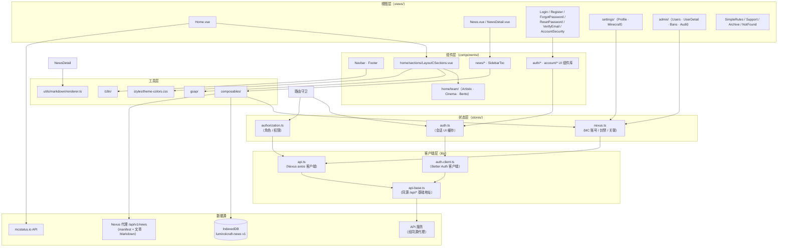
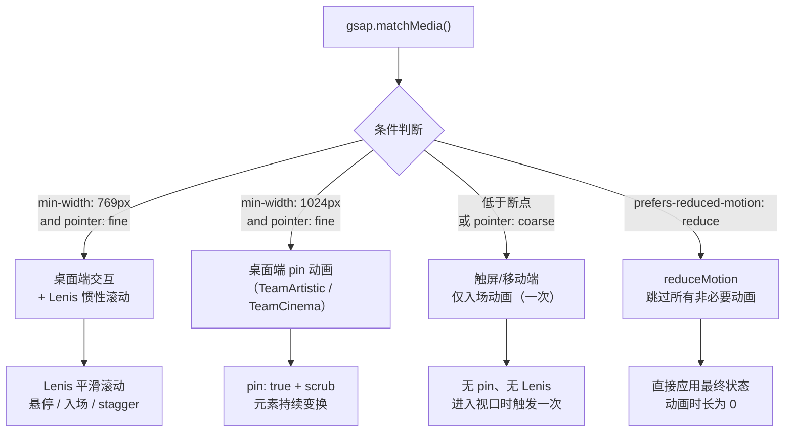
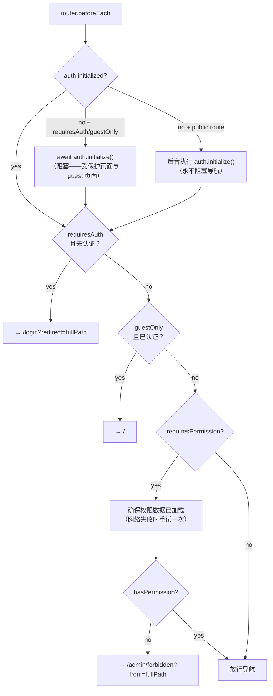
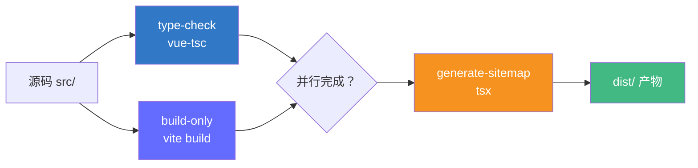

# LuminolCraft

<div align="center">


[English](README.md) | [简体中文](README.zh-CN.md)

</div>

---

LuminolCraft 是 LuminolMC 附属的 Minecraft 服务器官方网站，是一个基于 Vue 3 构建的现代化单页应用（SPA）。网站提供服务器状态监控、新闻资讯、服务器规则与支持信息，并在 GSAP 专业动画系统、Lenis 惯性滚动、多语言与双主题支持之上构建了完整的账号系统（邮箱 + OAuth 注册/登录、用户中心与管理后台），同时针对桌面与移动设备进行了深度响应式适配。

---

## 目录

- [1. 项目概述](#1-项目概述)
- [2. 核心功能](#2-核心功能)
- [3. 技术栈](#3-技术栈)
- [4. 环境配置](#4-环境配置)
- [5. 快速开始](#5-快速开始)
- [6. 项目结构](#6-项目结构)
- [7. 核心模块解析](#7-核心模块解析)
  - [7.1 首页布局系统](#71-首页布局系统)
  - [7.2 GSAP 动画系统](#72-gsap-动画系统)
  - [7.3 国际化（i18n）](#73-国际化i18n)
  - [7.4 主题系统](#74-主题系统)
  - [7.5 路由与导航守卫](#75-路由与导航守卫)
  - [7.6 服务器状态监控](#76-服务器状态监控)
  - [7.7 新闻系统](#77-新闻系统)
  - [7.8 Markdown 渲染管线](#78-markdown-渲染管线)
  - [7.9 SEO 优化](#79-seo-优化)
- [8. API 约定（前端可见行为）](#8-api-约定前端可见行为)
- [9. 本地存储与 Cookie](#9-本地存储与-cookie)
- [10. 配置参考](#10-配置参考)
- [11. 开发规范](#11-开发规范)
- [12. 测试策略](#12-测试策略)
- [13. 构建与部署](#13-构建与部署)
- [14. 常见问题（FAQ）](#14-常见问题faq)
- [15. 维护注意事项](#15-维护注意事项)
- [16. 贡献指南](#16-贡献指南)
- [17. 许可证](#17-许可证)
- [18. 致谢](#18-致谢)
- [19. 联系方式](#19-联系方式)

---

## 1. 项目概述

### 1.1 简介

LuminolCraft 是 LuminolMC 附属的 Minecraft 服务器官方网站。项目基于 Vue 3 + TypeScript + Vite 构建，是一个功能完整的现代化单页应用（SPA），提供实时服务器状态监控、自愈式新闻系统、规则说明与支持渠道；自 Nexus 账号系统引入以来，还提供邮箱/OAuth 认证、用户中心（`/settings`）与管理后台（`/admin`）。

### 1.2 背景

LuminolCraft Minecraft 服务器需要一个现代化、高性能的 Web 平台来服务玩家社区：实时服务器信息、新闻更新、账号与 Minecraft 身份管理以及支持资源——同时注重视觉表现力与交互体验。

### 1.3 项目定位

本项目是一个现代化单页应用（SPA），提供以下能力：

- 实时服务器状态监控（在线人数、运行状态）
- 动态新闻系统（unified/remark/rehype 渲染 + KaTeX + 语法高亮 + IndexedDB 离线缓存）
- 账号系统：邮箱/OAuth 登录、邮箱验证、密码重置、会话管理、账号关联
- 用户中心：资料编辑、含游戏内核验的 Minecraft 绑定、个人封禁记录
- 管理后台：用户/角色管理、含证据的封禁管理、审计日志
- 服务器规则与支持信息展示
- 多语言（中文/英文）与双主题（浅色/深色）支持
- 桌面与移动端深度响应式适配
- GSAP 动画（Pin-Scrub 滚动叙事、入场动画、View Transitions 主题切换）
- SEO 优化（Open Graph 标签、Sitemap 生成、Canonical URL）

### 1.4 业务目标

- **社区活跃**：通过实时信息与新闻资讯培养活跃的玩家社区
- **服务器透明度**：提供服务器状态与在线人数的可视化展示
- **身份与治理**：让玩家绑定自己的 Minecraft 身份，让管理人员基于证据管理封禁
- **赞助支持**：通过专门的支持页面维持服务器运营

### 1.5 技术目标

- **高性能**：代码分割、terser 压缩、CSS 代码分割、基于 IndexedDB 的新闻缓存（存在缓存时，首屏渲染绝不等待网络）
- **类型安全**：完整 TypeScript 覆盖，配合 `vue-tsc` 类型检查
- **响应式设计**：桌面端与移动端分离的 CSS
- **国际化**：内置中英双语，`localStorage` 持久化
- **安全模型**：任何 token 都不存入 JavaScript；会话存于 HttpOnly Cookie；登录状态的唯一事实来源始终是服务器
- **SEO**：每路由独立 Open Graph 标签、自动 Sitemap 生成、Canonical URL
- **动画体验**：GSAP Pin-Scrub 滚动叙事 + Lenis 惯性滚动，含触屏/reduceMotion 降级

### 1.6 目标受众

- LuminolCraft Minecraft 服务器玩家
- 项目维护者与贡献者
- 对服务器状态感兴趣的 Minecraft 社区成员
- 希望学习 Vue 3 + GSAP 动画架构的前端开发者

---

## 2. 核心功能

### 2.1 服务器状态监控

通过 mcstatus.io API 实时获取服务器在线状态与在线人数，在首页 Hero 区域以状态卡片展示，并带实时状态指示（在线/离线）。详见 [§7.6](#76-服务器状态监控)。

### 2.2 新闻系统

动态新闻列表与详情页，具备完整的 unified/remark/rehype 渲染管线、KaTeX 数学公式、语法高亮、IndexedDB 离线优先缓存、标签过滤、全文搜索以及 GSAP Flip 图片灯箱。详见 [§7.7](#77-新闻系统) 与 [§7.8](#78-markdown-渲染管线)。

### 2.3 首页布局

首页固定为 **Bento 布局**（`LayoutCSections.vue`）：由 features Bento 网格 + servers 自适应网格（CSS counter 编号）+ 团队样式可配置的 team 区域构成。原 `LayoutA`/`LayoutB` 组件已移除。

team 区域样式由 `src/config/home-layout.ts` 中的 `CURRENT_TEAM_STYLE` 驱动：

| 值          | 行为                                                             |
| ----------- | ---------------------------------------------------------------- |
| `'artistic'`| Z 形偏移 + 有机旋转卡片                                          |
| `'cinema'`  | 影院式非对称构图                                                 |
| `'bento'`   | 经典 Bento 网格排布                                              |
| `'random'`  | **当前默认**：每次页面加载/刷新时随机选择三者之一                |

`resolveTeamStyle()` 在模块级缓存随机结果，因此同一页面会话内的所有消费者看到相同的样式；每次刷新重新随机。切换样式：修改 `CURRENT_TEAM_STYLE` 后刷新即可（Vite HMR 自动重载）。

### 2.4 多语言支持

基于 `vue-i18n` Composition API（`legacy: false`）内置中文（`zh`）与英文（`en`）国际化。语言选择持久化到 `localStorage`（键：`locale`），默认中文，回退英文。`TocToggles.vue` 中的语言切换按钮当前被隐藏（`display: none`），i18n 逻辑完整保留。详见 [§7.3](#73-国际化i18n)。

### 2.5 主题切换

浅色/深色双主题。深色模式载体是 `html[data-theme="dark"]` 属性；主题切换动画使用 **View Transitions API**，由 GSAP 驱动像素化圆形遮罩（含遮罩淡出回退方案）。选择持久化在 `theme` Cookie 中，有效期 1 年。详见 [§7.4](#74-主题系统)。

### 2.6 GSAP 动画系统

项目集成 GSAP 并注册 8 个插件，具备 `gsap.matchMedia()` 响应式降级（双断点 + reduce-motion 分支），以及由单一共享 ticker 驱动的 Lenis 惯性滚动。详见 [§7.2](#72-gsap-动画系统)。

### 2.7 SEO 优化

- 每路由独立 Open Graph 标签（title/description/image/type/url）
- Twitter Card 支持
- Canonical URL（移除查询字符串）
- 自动 Sitemap 生成（构建后运行 `tsx src/utils/generate-sitemap.ts`）
- `robots: index, follow`

### 2.8 响应式设计

桌面端与移动端 CSS 分离（`src/styles/desktop/` 与 `src/styles/mobile/`）。移动端简化动画与布局，以获得流畅的触屏体验。动画降级阈值为 `769px`（交互与 Lenis）和 `1024px`（pin 类滚动动画）——见 [§7.2.3](#723-matchmedia-降级策略)。

### 2.9 数据统计

集成 Umami 隐私优先统计平台，经 `@unhead/vue` 在 `main.ts` 中注入。

### 2.10 认证与账号安全

网站内置完整的账号系统（Nexus），基于 Better Auth 构建：

- **邮箱/密码注册与登录**，具备结构化错误分支
- **邮箱验证门禁**：未验证账号无法登录；登录页提供带 **60 秒重发冷却** 的重发按钮；注册页展示页内成功态并轮询验证状态，一旦邮件链接被点击（任意浏览器，15 分钟窗口）即自动登录
- **GitHub OAuth 登录**（整页跳转流程）
- **QQ OAuth 登录当前已禁用**（灰置占位）；仅保留 QQ *账号关联*
- **记住我**（延长会话有效期）
- **忘记/重置密码**，经邮件链接完成（令牌绝不持久化到客户端）
- **会话与设备管理**：列出会话、远程吊销单个会话、处处登出；吊销当前会话会立即失效本地状态
- QQ 与 GitHub 的**账号关联/解绑**（最后登录方式不可解绑）
- **OAuth 空壳账号补全**：QQ 创建的未验证邮箱账号可设置/修改邮箱并设置密码
- **账号注销**（自助、不可逆），含多步确认；视登录方式需要账号密码或显式确认
- **跨标签页登录状态同步**：一个标签页登录/登出会广播 `localStorage` 信号；其他标签页重新校验服务器会话并纠正自身路由
- **JavaScript 中无 token**：会话是由服务器管理的 HttpOnly Cookie；Pinia auth store 仅是 UI 缓存

### 2.11 用户中心（`/settings`）

侧边栏布局外壳，含三个子路由（需登录）：

- **资料**：编辑用户名与邮箱；头像派生自用户的 Minecraft 皮肤（经 mc-heads.net）
- **Minecraft 绑定**（仅 Java 版）：
  - 仅输入游戏内玩家名（3–16 字符，字母/数字/下划线，提交时**区分大小写**）
  - 两步核验：提交后签发 **6 位数字码**；玩家在服务器大厅执行 `/v <code>` 确认；有效期约 **10 分钟**
  - 单一待核验（pending）强制：已有一个进行中时再次提交会显示冲突指引；取消操作幂等，可立即重新提交
  - 待核验状态镜像到 `localStorage`，其他标签页/刷新可恢复指引
  - 两个已绑定账号之间的**主号↔小号关联**限速为**每 7 天一次**
- **安全**：会话/设备列表、已关联登录方式与账号注销（见 §2.10）

### 2.12 管理后台（`/admin`）

沉浸式控制台（独立布局外壳，无站点导航），由 `requiresAuth` + `requiresPermission('admin:access')` 把关：

- **用户管理**：分页用户列表（20/页）与用户详情；授予/撤销角色——**owner** 角色的授予入口仅对 owner 可见
- **Minecraft 管理**：强制解绑用户的 Minecraft 账号
- **封禁管理**：创建、修改、撤销封禁（永久或限期），支持**证据上传（单文件 ≤ 5 MiB，客户端预检）**与会话内证据预览/下载
- **审计日志**：可过滤的敏感操作记录；**仅 owner 可触发的归档**
- **`/admin/forbidden`**：无管理权限用户的专属 403 视图

> 前端权限检查纯粹是 UI 体验（入口可见性、路由守卫）。**真正的鉴权始终由后端 API 强制执行。**

---

## 3. 技术栈

### 3.1 运行时依赖

| 库                                                           | 版本     | 用途                                                       |
| ------------------------------------------------------------ | -------- | ---------------------------------------------------------- |
| vue                                                          | ^3.5.25  | 渐进式 JavaScript 框架                                     |
| vue-router                                                   | ^4.6.3   | Vue.js 官方路由                                            |
| pinia                                                        | ^3.0.4   | 状态管理                                                   |
| vue-i18n                                                     | ^9.14.4  | 国际化                                                     |
| @unhead/vue                                                  | ^1.9.5   | Head 标签管理（SEO/Umami）                                 |
| @vueuse/core                                                 | ^14.4.0  | Vue 组合式工具（如 `useMediaQuery`）                       |
| better-auth                                                  | ^1.7.2   | 认证客户端（邮箱 + OAuth）                                 |
| axios                                                        | ^1.20.0  | Nexus 业务 API 客户端                                      |
| gsap                                                         | ^3.15.0  | 专业动画库                                                 |
| lenis                                                        | ^1.3.25  | 惯性滚动库                                                 |
| unified                                                      | ^11.0.5  | Markdown 渲染管线核心                                      |
| remark-parse / -gfm / -math / -directive                     | ^11–^4   | Markdown 解析（GFM、数学、指令）                           |
| remark-rehype                                                | ^11.1.2  | mdast → hast 转换                                          |
| rehype-slug / -autolink-headings                             | ^6–^7    | 标题 id + 锚点链接                                         |
| rehype-katex                                                 | ^7.0.1   | 数学公式渲染（KaTeX ^0.16.27）                             |
| rehype-highlight                                             | ^7.0.2   | 语法高亮（经 lowlight → highlight.js ^11.11.1）            |
| rehype-sanitize                                              | ^6.0.0   | XSS 白名单净化                                             |
| rehype-stringify                                             | ^10.0.1  | hast → HTML 字符串                                         |
| unist-util-visit                                             | ^5.1.0   | 树遍历（用于自定义 rehype 插件）                           |
| lodash                                                       | ^4.17.21 | 工具函数（如新闻管理器中的 debounce）                      |

遗留 / 未使用的运行时依赖（保留在 `package.json` 中，但不在活跃路径上）：

| 库          | 版本     | 状态                                                                   |
| ----------- | -------- | ---------------------------------------------------------------------- |
| marked      | ^17.0.1  | 遗留：仅被新闻管理器的遗留渲染路径引用                                 |
| chart.js    | ^4.5.1   | 遗留：仅被未挂载的 `MarkdownRenderer.vue` 引用                         |
| @unhead/ssr | ^2.0.19  | 未使用（纯 SPA 项目中的 SSR 工具）                                     |
| hast        | ^1.0.0   | 未使用（hast 类型来自 `@types/hast`）                                  |

### 3.2 开发依赖

| 库                             | 版本    | 用途                             |
| ------------------------------ | ------- | -------------------------------- |
| vite                           | ^7.2.4  | 构建工具                         |
| @vitejs/plugin-vue             | ^6.0.2  | Vue SFC 支持                     |
| vite-plugin-vue-devtools       | ^8.0.5  | 开发者工具                       |
| typescript                     | ~5.9.0  | 类型检查                         |
| vue-tsc                        | ^3.2.1  | Vue 类型检查                     |
| vitest                         | ^4.0.14 | 单元测试框架                     |
| @vue/test-utils                | ^2.4.6  | Vue 测试工具                     |
| jsdom                          | ^27.2.0 | 测试 DOM 环境                    |
| eslint                         | ^9.39.1 | 代码检查                         |
| eslint-plugin-vue              | ~10.5.1 | Vue ESLint 规则                  |
| @vitest/eslint-plugin          | ^1.5.0  | Vitest ESLint 规则               |
| @vue/eslint-config-typescript  | ^14.6.0 | TS ESLint 配置                   |
| @vue/eslint-config-prettier    | ^10.2.0 | Prettier/ESLint 集成             |
| prettier                       | 3.6.2   | 代码格式化                       |
| terser                         | ^5.44.1 | JS 压缩                          |
| tsx                            | ^4.21.0 | TypeScript 执行（Sitemap）       |
| sitemap                        | ^9.0.0  | Sitemap 生成                     |
| npm-run-all2                   | ^8.0.4  | 并行脚本运行器                   |
| unhead                         | 2.1.1   | Unhead peer/工具                 |
| jiti                           | ^2.6.1  | TS 配置加载器                    |
| @tsconfig/node24 / @vue/tsconfig | —     | 共享 TS 配置                     |
| @types/node / @types/hast / @types/jsdom | — | 类型定义                    |

### 3.3 GSAP 插件

以下插件在 `src/gsap/plugin-setup.ts` 中注册：

| 插件              | 用途                                 | 当前是否有视图使用？              |
| ----------------- | ------------------------------------ | --------------------------------- |
| ScrollTrigger     | 滚动触发动画（核心）                 | 是                                |
| ScrollToPlugin    | 平滑滚动动画                         | 否（已注册，保留）                |
| SplitText         | 文本拆分动画                         | 是                                |
| Flip              | 布局过渡动画                         | 否（已注册，保留）                |
| CustomEase        | 自定义缓动曲线                       | 是                                |
| DrawSVGPlugin     | SVG 绘制动画                         | 否（已注册，保留）                |
| MotionPathPlugin | 路径运动动画                         | 是                                |
| MorphSVGPlugin    | SVG 形变动画                         | 否（已注册，保留）                |

> `SplitText`、`CustomEase`、`DrawSVGPlugin` 与 `MorphSVGPlugin` 曾为付费 Club 插件；自 GSAP 3.13 起随官方 npm 包免费提供。

---

## 4. 环境配置

### 4.1 前置要求

| 要求            | 版本                                               | 备注                               |
| --------------- | -------------------------------------------------- | ---------------------------------- |
| Node.js         | `^20.19.0` 或 `>=22.12.0`                          | 见 `package.json` 的 `engines` 字段 |
| 包管理器        | pnpm（推荐）或 npm                                 | pnpm 更快且磁盘占用更低            |
| Git / 浏览器    | 任意 / 现代常青浏览器                              | 版本控制；开发与测试               |

### 4.2 开发环境搭建

```bash
# 1. 克隆仓库
git clone <repository-url>
cd craft.luminolsuki.moe

# 2. 安装依赖（推荐 pnpm）
pnpm install
```

### 4.3 验证环境

```bash
node -v    # 预期：v20.19.0 或更高
pnpm -v    # 预期：9.x 或更高（如已安装）
```

---

## 5. 快速开始

### 5.1 启动开发服务器

```bash
pnpm dev
```

**预期输出：**

```
  VITE v7.2.4  ready in 320 ms

  ➜  Local:   http://localhost:51640/
  ➜  Network: use --host to expose
  ➜  press h + enter to show help
```

> **注意**：开发服务器端口为 **51640**（在 `vite.config.ts` 的 `server.port` 中配置）；浏览器会自动打开。

### 5.2 完整命令参考

| 命令                    | 说明                                              |
| ----------------------- | ------------------------------------------------- |
| `pnpm dev`              | 启动开发服务器（端口 51640，自动打开浏览器）      |
| `pnpm build`            | 类型检查 + 构建 + 生成 Sitemap                    |
| `pnpm preview`          | 预览生产构建                                      |
| `pnpm test:unit`        | 运行单元测试（Vitest）                            |
| `pnpm type-check`       | TypeScript 类型检查（vue-tsc）                    |
| `pnpm lint`             | ESLint 检查并自动修复                             |
| `pnpm format`           | Prettier 格式化 `src/`                            |
| `pnpm generate-sitemap` | 仅生成 Sitemap                                    |
| `pnpm build-only`       | 仅构建（不含类型检查与 Sitemap）                  |

### 5.3 生产构建

```bash
pnpm build
```

**预期输出（结尾）：**

```
✓ built in 8.42s
Sitemap generated successfully!
```

构建流程：`type-check` 与 `build-only` 并行运行（`run-p`），随后生成 Sitemap。

### 5.4 运行测试

```bash
# 运行一次
pnpm test:unit

# 监视模式
pnpm test:unit -- --watch

# 覆盖率报告
pnpm test:unit -- --coverage
```

> 仓库当前**不含任何测试文件**——见 [§12](#12-测试策略)。

### 5.5 代码检查与格式化

```bash
# ESLint 检查并修复
pnpm lint

# Prettier 格式化
pnpm format
```

---

## 6. 项目结构

### 6.1 目录树

```
craft.luminolsuki.moe/
├── .netlify/functions/          # news.js（遗留，无使用方）· version.js（Footer 使用）
├── public/                      # images/（WebP/AVIF）· favicon.ico
├── src/
│   ├── components/
│   │   ├── auth/                # AuthSplitLayout · AuthField · AuthButton · LinkedAccounts · SessionListItem
│   │   ├── account/             # DangerZone（注销流程）· MergeGuideBanner
│   │   ├── settings/            # SettingsLayout.vue（用户中心外壳）
│   │   ├── admin/               # AdminLayout.vue（管理后台外壳）
│   │   ├── home/
│   │   │   ├── sections/
│   │   │   │   └── LayoutCSections.vue   # 固定首页布局（bento）
│   │   │   └── team/            # TeamArtistic · TeamCinema · TeamBento
│   │   ├── news/                # NewsCard · NewsSearch · NewsPagination · NewsSkeleton · LayoutToggle
│   │   ├── Navbar.vue           # 导航栏
│   │   ├── Footer.vue           # 页脚（消费 version.js / __APP_VERSION__）
│   │   ├── SidebarToc.vue       # 新闻详情目录
│   │   ├── TocToggles.vue       # 主题切换（语言按钮隐藏）
│   │   ├── UserAvatar.vue       # 头像渲染
│   │   ├── LastViewedPopup.vue  # 最近浏览弹窗（需 Cookie 同意）
│   │   ├── CookieConsentBanner.vue
│   │   ├── ColorSchemeSwitcher.vue   # （遗留，无引用）
│   │   └── MarkdownRenderer.vue      # （遗留，未挂载——已被 unified 管线取代）
│   ├── composables/             # 16 个组合式函数（见 6.3）
│   ├── config/                  # app-config.ts · home-layout.ts（TeamStyle）· team-members.ts
│   ├── directives/
│   │   └── lenisScroll.ts       # v-lenis-scroll 指令（每容器 Lenis）
│   ├── gsap/
│   │   ├── config/              # durations.ts · easings.ts · staggers.ts
│   │   ├── defaults.ts          # 默认动画配置
│   │   ├── index.ts             # 模块入口
│   │   ├── match-media.ts       # 全局 matchMedia 注册表
│   │   └── plugin-setup.ts      # 插件注册（8 个插件）
│   ├── i18n/
│   │   ├── locales/             # zh.ts · en.ts（21 个顶级模块）
│   │   └── index.ts             # i18n 配置
│   ├── lib/
│   │   ├── api-base.ts          # API 基础 URL 解析（开发/生产回退）
│   │   ├── api.ts               # Nexus axios 客户端（统一信封解包、AppError）
│   │   ├── auth-client.ts       # Better Auth 客户端 + 错误归一化
│   │   ├── email-domain.ts      # 注册邮箱域名检查
│   │   ├── minecraft.ts         # mc-heads.net 皮肤头像解析
│   │   └── paged.ts             # 分页响应归一化
│   ├── router/
│   │   └── index.ts             # Vue Router 配置 + 认证/权限守卫
│   ├── stores/
│   │   ├── auth.ts              # 会话 UI 缓存 + 跨标签页同步
│   │   ├── authorization.ts     # RBAC store（角色/权限）
│   │   ├── nexus.ts             # 用户域数据（MC 账号、封禁、关联）
│   │   └── counter.ts           # （遗留脚手架）
│   ├── styles/
│   │   ├── desktop/             # home / news / news-detail / navigation / monitoring / support / markdown-body
│   │   ├── mobile/              # home / news-detail / navigation / monitoring / notfound / support
│   │   ├── fonts.css · gsap-splittext.css · responsive.css
│   │   ├── theme-colors.css     # 主题颜色变量（三层体系）
│   │   └── typography.css · vercel-design-system.css
│   ├── types/                   # auth.ts · news.ts · nexus.ts
│   ├── utils/
│   │   ├── generate-sitemap.ts · internalPath.ts · lenisInstances.ts
│   │   ├── news-helpers.ts · utils.ts
│   │   ├── markdown/            # renderer.ts（unified 管线）· toc.ts（最多 3 级）
│   │   └── news/                # news-manager.ts · news-cache.ts（IndexedDB）· news-markdown.ts
│   ├── views/
│   │   ├── Home.vue             # 首页（Hero + LayoutCSections）
│   │   ├── News.vue · NewsDetail.vue
│   │   ├── SimpleRules.vue      # 服务器规则（直接导入语言文件）
│   │   ├── Support.vue · Archive.vue（占位外壳）· NotFound.vue
│   │   ├── Login.vue · Register.vue · ForgotPassword.vue · ResetPassword.vue
│   │   ├── VerifyEmail.vue      # 邮箱验证落地页
│   │   ├── AccountSecurity.vue  # 会话 / 账号关联 / 危险区
│   │   ├── auth/
│   │   │   └── LinkAccountError.vue   # OAuth 关联失败落地页（/auth/link-error）
│   │   ├── settings/
│   │   │   ├── ProfileView.vue · MinecraftView.vue
│   │   └── admin/
│   │       ├── UsersView.vue · UserDetail.vue · BansView.vue
│   │       ├── AuditView.vue · ForbiddenView.vue（403）
│   │       └── admin-shared.css
│   ├── App.vue                  # 根组件（hideChrome、跨标签页同步监听）
│   └── main.ts                  # 应用入口（Lenis、GSAP、SEO、Umami）
├── .editorconfig · .prettierrc.json · eslint.config.ts · index.html
├── netlify.toml · package.json · tsconfig.json · vite.config.ts · vitest.config.ts
```

### 6.2 架构图


```mermaid
graph TB
    subgraph View["视图层（views/）"]
        Home["Home.vue"]
        News["News.vue / NewsDetail.vue"]
        Auth["Login / Register / ForgotPassword /<br/>ResetPassword / VerifyEmail / AccountSecurity"]
        Settings["settings/（Profile · Minecraft）"]
        Admin["admin/（Users · UserDetail · Bans · Audit）"]
        Static["SimpleRules / Support / Archive / NotFound"]
    end

    subgraph Component["组件层（components/）"]
        Chrome["Navbar · Footer"]
        LayoutC["home/sections/LayoutCSections.vue"]
        Team["home/team/（Artistic · Cinema · Bento）"]
        NewsUI["news/* · SidebarToc"]
        AuthUI["auth/* · account/* UI 组件库"]
    end

    subgraph State["状态层（stores/）"]
        AuthStore["auth.ts<br/>（会话 UI 缓存）"]
        AuthzStore["authorization.ts<br/>（角色 / 权限）"]
        NexusStore["nexus.ts<br/>（MC 账号 / 封禁 / 关联）"]
    end

    subgraph Lib["客户端层（lib/）"]
        AuthClient["auth-client.ts<br/>（Better Auth 客户端）"]
        ApiClient["api.ts<br/>（Nexus axios 客户端）"]
        ApiBase["api-base.ts<br/>（同源 /api/* 基础地址）"]
    end

    subgraph Data["数据源"]
        IDB[("IndexedDB<br/>luminolcraft-news v1")]
        NewsCDN["Nexus 代理 /api/v1/news<br/>（manifest + 文章 Markdown）"]
        McSrv["mcstatus.io API"]
        ApiSvc["API 服务<br/>（经同源代理）"]
    end

    subgraph Tool["工具层"]
        GSAP["gsap/"]
        Composables["composables/"]
        I18n["i18n/"]
        Styles["styles/theme-colors.css"]
        Renderer["utils/markdown/renderer.ts"]
    end

    Home --> LayoutC --> Team
    Home --> McSrv
    News --> NewsUI --> Composables
    Composables --> NexusStore
    Composables --> IDB
    Composables --> NewsCDN
    NewsDetail --> Renderer
    Settings --> NexusStore
    Admin --> NexusStore
    Auth --> AuthUI --> AuthStore
    AuthStore --> AuthClient
    AuthzStore --> ApiClient
    NexusStore --> ApiClient
    AuthClient --> ApiBase
    ApiClient --> ApiBase
    ApiBase --> ApiSvc
    Router["路由守卫"] --> AuthStore
    Router --> AuthzStore
    LayoutC --> GSAP
    LayoutC --> Styles
    Chrome --> I18n
```

### 6.3 关键目录说明

| 目录                     | 说明                                                                             |
| ------------------------ | -------------------------------------------------------------------------------- |
| `src/lib/`               | 两个 API 客户端（Better Auth + Nexus axios）、基础 URL 解析与辅助函数            |
| `src/stores/`            | `auth`（会话 UI 缓存）、`authorization`（RBAC）、`nexus`（用户域数据）           |
| `src/types/`             | 共享领域类型（`auth`、`news`、`nexus`）                                          |
| `src/composables/`       | 16 个组合式函数：GSAP（`useGsap`、`useEntranceAnimation`、`useHoverAnimation`、`usePageTransition`、`useScrollTrigger`、`useSplitText`）、新闻（`useNewsData`、`useNewsFilter`、`useNewsPagination`、`useNewsDetail`）、UX（`useCookieConsent`、`useLastViewedCookie`、`useLightbox`、`useReadingProgress`、`useArticleAnimations`）、i18n（`useI18n`） |
| `src/config/`            | 集中配置：团队样式、团队数据、应用配置                                           |
| `src/gsap/`              | GSAP 模块：插件注册、默认值、matchMedia                                          |
| `src/utils/markdown/`    | unified 渲染管线与目录构建器                                                     |
| `src/utils/news/`        | 新闻管理器（同步/过滤/分页）+ IndexedDB 缓存层                                   |
| `src/styles/desktop/` & `mobile/` | 桌面/移动分离样式                                                       |
| `src/i18n/locales/`      | 中英文翻译文件（21 个顶级模块）                                                  |

---

## 7. 核心模块解析

### 7.1 首页布局系统

首页固定为 Bento 布局；仅 **team 区域样式**可配置。

#### 7.1.1 工作原理

`Home.vue` 静态导入 `LayoutCSections`，使其与 Navbar/Footer 在同一帧渲染（消除懒加载导致的第二次请求白屏闪烁）：

```vue
<!-- src/views/Home.vue -->
<LayoutCSections :server-online="serverOnline" :online-players="onlinePlayers" />
```

`LayoutCSections` 在模块级解析团队样式：

```typescript
// src/components/home/sections/LayoutCSections.vue（简化）
import { CURRENT_TEAM_STYLE, resolveTeamStyle } from '@/config/home-layout'

const TEAM_STYLE_COMPONENT_MAP = {
  artistic: TeamArtistic,
  cinema: TeamCinema,
  bento: TeamBento,
}
const _resolvedTeam = resolveTeamStyle(CURRENT_TEAM_STYLE)
const teamComponent = TEAM_STYLE_COMPONENT_MAP[_resolvedTeam]
```

#### 7.1.2 配置文件

```typescript
// src/config/home-layout.ts
export type TeamStyle = 'artistic' | 'cinema' | 'bento' | 'random'
export type ResolvedTeamStyle = Exclude<TeamStyle, 'random'>
export const TEAM_STYLE_OPTIONS: readonly ResolvedTeamStyle[] = ['artistic', 'cinema', 'bento']
export const CURRENT_TEAM_STYLE: TeamStyle = 'random'

// 模块级缓存：同一页面会话内的所有消费者看到相同的
// 结果；'random' 时每次刷新重新随机。
export function resolveTeamStyle(input: TeamStyle = CURRENT_TEAM_STYLE): ResolvedTeamStyle
```

- `CURRENT_TEAM_STYLE`：控制 team 区域样式；`'random'` 在每次页面加载/刷新时重新随机
- `resolveTeamStyle()`：模块级缓存保证同一会话内的所有消费者看到相同结果
- 已**不再**有 `CURRENT_LAYOUT` / `HomeLayout` 导出——整体布局固定为 Bento

#### 7.1.3 团队成员共享数据

团队成员数据集中在 `src/config/team-members.ts`（字段：`name`、`avatar`、`roleKey` → `home.team.roles.<key>`、`githubHref`、`githubLabel`、`isOwner`，可选 `qq`/`email` 的 `extraLinks`），供所有团队组件统一导入：

```typescript
export const contributors: Contributor[] = [
    { name: 'MrHua269', roleKey: 'owner', isOwner: true },
    // ... 共 6 名成员
]
```

#### 7.1.4 基于 CSS Counter 的服务器编号

servers 区域使用 CSS counter 自动生成编号。**新增服务器只需复制一个 `server-panel` 节点，编号自动递增**——counter 配置在 `.servers-grid` / `.server-panel` / `.server-index::before` 上（`counter-reset` / `counter-increment` / `content: counter(server-counter, decimal-leading-zero)`；渐变文字效果必须放在 `::before` 上，因为 `background-clip: text` 不可继承）：

```html
<!-- 新增服务器：复制下方节点；编号自动递增为 03 -->
<div class="server-panel">
  <span class="server-index"></span>
  <!-- 编号由 CSS 生成 -->
  <!-- 服务器信息 -->
</div>
```

---

### 7.2 GSAP 动画系统

项目深度集成 GSAP，以插件注册、响应式降级、惯性滚动与 Pin-Scrub 滚动叙事构建了完整的动画体系。

#### 7.2.1 插件注册

所有 GSAP 插件在 `src/gsap/plugin-setup.ts` 中集中注册：

```typescript
// src/gsap/plugin-setup.ts
export function registerGsapPlugins(): void {
  gsap.registerPlugin(
    ScrollTrigger, ScrollToPlugin, SplitText, Flip,
    CustomEase, DrawSVGPlugin, MotionPathPlugin, MorphSVGPlugin,
  )
}
```

经 `main.ts` 中的 `setupGsap()` 调用。全局默认值（`src/gsap/defaults.ts`）：

```typescript
gsap.defaults({
  duration: 0.6,
  ease: 'power2.out',
  overwrite: 'auto',
})
```

#### 7.2.2 Lenis 惯性滚动

`main.ts` 以 `gsap.matchMedia()` 降级初始化全局（window 级）Lenis：

```typescript
// src/main.ts（简化）
lenisMm.add(
  {
    isDesktop: '(min-width: 769px) and (pointer: fine)',
    reduceMotion: '(prefers-reduced-motion: reduce)',
  },
  (context) => {
    const { isDesktop, reduceMotion } = context.conditions!
    if (!isDesktop || reduceMotion) return // 触屏或 reduceMotion 时跳过

    globalLenis = new Lenis({
      duration: 1.2,
      easing: (t: number) => Math.min(1, 1.001 - Math.pow(2, -10 * t)),
      smoothWheel: true,
      wheelMultiplier: 1.2,
      touchMultiplier: 1.5,
      // 关键：全局 Lenis 永不处理可滚动容器内部的滚轮事件
      // ——它们保持原生滚动（或各自的 Lenis 实例）
      prevent: (node) => { /* 沿 DOM 向上查找 overflow:auto|scroll 容器 */ },
    })

    globalLenis.on('scroll', ScrollTrigger.update)
    lenisInstances.push(globalLenis)

    // 一个共享的 gsap.ticker 回调驱动所有 Lenis 实例
    // （全局实例 + v-lenis-scroll 创建的每容器实例）
    gsap.ticker.add((time) => {
      lenisInstances.forEach((instance) => instance.raf(time * 1000))
    })

    return () => { /* 移除 ticker，销毁全局与指令实例 */ }
  },
)
```

**配置：**

| 参数              | 值                                               | 说明                                             |
| ----------------- | ------------------------------------------------ | ------------------------------------------------ |
| `duration`        | `1.2`                                            | 滚动动画时长（秒）                               |
| `easing`          | `t => Math.min(1, 1.001 - Math.pow(2, -10 * t))` | 指数缓动，反向滚动更顺滑                         |
| `smoothWheel`     | `true`                                           | 启用鼠标滚轮平滑                                 |
| `wheelMultiplier` | `1.2`                                            | 滚轮速度倍率                                     |
| `touchMultiplier` | `1.5`                                            | 触摸速度倍率                                     |
| `prevent`         | 回调                                             | 内部可滚动容器脱离全局 Lenis                     |

`v-lenis-scroll` 指令为每个容器创建 Lenis 实例（如新闻网格），并注册到共享的 `lenisInstances` 注册表中，由单一 `gsap.ticker` 统一驱动。

#### 7.2.3 matchMedia 降级策略

两个断点并存——交互/Lenis 位于 **769px**，pin 类滚动动画位于 **1024px**——且每个分支都有 reduce-motion 回退：


```mermaid
flowchart TD
    A["gsap.matchMedia()"] --> B{条件判断}
    B -->|"min-width: 769px<br/>and pointer: fine"| C["桌面端交互<br/>+ Lenis 惯性滚动"]
    B -->|"min-width: 1024px<br/>and pointer: fine"| D["桌面端 pin 动画<br/>（TeamArtistic / TeamCinema）"]
    B -->|"低于断点<br/>或 pointer: coarse"| E["触屏/移动端<br/>仅入场动画（一次）"]
    B -->|"prefers-reduced-motion: reduce"| F["reduceMotion<br/>跳过所有非必要动画"]
    C --> C1["Lenis 平滑滚动<br/>悬停 / 入场 / stagger"]
    D --> D1["pin: true + scrub<br/>元素持续变换"]
    E --> E1["无 pin、无 Lenis<br/>进入视口时触发一次"]
    F --> F1["直接应用最终状态<br/>动画时长为 0"]
```

> Pin-Scrub 仅存在于 `TeamArtistic` 与 `TeamCinema`；features 区域没有 pin。

#### 7.2.4 Pin-Scrub 设计原则

- **持续的视觉反馈**：pin 期间元素持续变换（位移/旋转/淡入淡出），避免"卡住"感
- GSAP 旋转终值与 CSS 设计值一致，保证 pin 释放后布局不变；区域偏移使用 `margin`（绝不使用 `transform`，否则会与 pin 冲突），卡片偏移使用 `transform`

#### 7.2.5 微调点注释约定

代码中以 `微调点：` 注释标注可调数值——卡片旋转角度、Pin-Scrub 滚动距离（`end: '+=N%'`）、stagger 间隔等。搜索 `微调点：` 可快速定位所有可调参数。

---

### 7.3 国际化（i18n）

#### 7.3.1 配置

```typescript
// src/i18n/index.ts
const savedLocale = localStorage.getItem('locale')
const defaultLocale = savedLocale || 'zh'

const i18n = createI18n({
  legacy: false,          // 使用 Composition API
  locale: defaultLocale,  // 默认中文
  fallbackLocale: 'en',   // 回退英文
  messages: { zh, en },
})
```

#### 7.3.2 语言文件结构

```
src/i18n/locales/
├── zh.ts    # 中文翻译
└── en.ts    # 英文翻译
```

两个语言文件暴露 **21 个顶级模块键**：

`404` · `auth` · `common` · `hero` · `status` · `features` · `servers` · `team` · `footer` · `colorScheme` · `notFound` · `language` · `rules` · `support` · `news` · `monitoring` · `cookieConsent` · `home` · `settings` · `minecraft` · `admin`

组件经 `t('module.key')` 消费。

> **例外**：`SimpleRules.vue` **直接**导入语言对象（`import zh from '../i18n/locales/zh'`）而不经过 `t()`。新增规则内容必须同时加入*两个*语言文件，否则其中一种语言会静默缺失。

#### 7.3.3 持久化与切换

- 语言选择存储在 `localStorage`（键：`locale`）
- 切换逻辑位于 `TocToggles.vue`，但其按钮当前经 `display: none` 隐藏；i18n 机制保持完整接线

#### 7.3.4 新增 i18n 键示例

```typescript
// src/i18n/locales/zh.ts
home: {
  team: {
    roles: {
      owner: '服主',            // 新增
      survivalAdmin: '生存管理',
    },
  },
}

// src/i18n/locales/en.ts
home: {
  team: {
    roles: {
      owner: 'Owner',           // 对应英文
      survivalAdmin: 'Survival Admin',
    },
  },
}
```

---

### 7.4 主题系统

#### 7.4.1 主题颜色变量

主题相关 CSS 变量集中在 `src/styles/theme-colors.css`，构成**三层体系**：

| 层                           | 内容                                                                        |
| ---------------------------- | --------------------------------------------------------------------------- |
| `--vercel-*`                 | Vercel/Geist 中性色阶 + 强调色（在 `vercel-design-system.css` 中亦有重复定义） |
| `--bases-*` / `--bases-dark-*` | 项目浅色调色板（紫色主色 `#a78bfa`）及其深色对应值                        |
| 语义映射                     | `:root` 将浅色值映射到语义名（`--text-color`、`--background-color` 等）；`html[data-theme="dark"]` 将其重映射为 `--bases-dark-*` 值 |

```css
:root {
  --text-color: var(--bases-text-color);      /* 语义化浅色映射 */
  --background-color: var(--bases-bg);
}

html[data-theme='dark'] {
  --text-color: var(--bases-dark-text-color); /* 重映射到深色调色板 */
  --background-color: var(--bases-dark-bg);
}
```

> `data-vt` 属性**不是**深色模式载体——它仅在 View Transition 进行期间设置，用于在主题切换快照时冻结 CSS `transition`。深色模式载体是 `data-theme`。

#### 7.4.2 主题切换动画

切换开关（位于 `TocToggles.vue`）使用 **View Transitions API** 实现像素化圆形揭示：

1. 生成一个 **32×32 像素化 SVG 圆形**作为 `::view-transition-new(root)` 的 `mask-image`
2. GSAP 在 **0.8 秒**内将 `--reveal-size` 从 `0` 动画到 `maxDist × 2`（距视口最远角的距离），遮罩从点击点扩张
3. 动画进行中再次点击会反转补间而不是二次翻转；`prefers-reduced-motion` 时立即切换
4. **回退方案**：当 View Transitions API 不可用时，改用染上旧背景色的遮罩层淡出

选择持久化在 **`theme` Cookie 中 1 年**（`theme=light|dark; path=/; max-age=31536000`）。

#### 7.4.3 不存在的功能

- **没有配色方案切换功能**：`ColorSchemeSwitcher.vue` 是无引用的遗留文件，且不存在任何 `data-color-scheme` CSS 规则
- 语言切换按钮已隐藏（`display: none`）——见 §7.3.3

---

### 7.5 路由与导航守卫

#### 7.5.1 路由表

| 路由                     | 名称             | 组件                               | Meta                                            | 说明                                                                              |
| ------------------------ | ---------------- | ---------------------------------- | ----------------------------------------------- | --------------------------------------------------------------------------------- |
| `/`                      | Home             | `Home.vue`（**静态导入**）         | `og`                                            | 首页（Hero + LayoutCSections）；静态导入使其与 Navbar/Footer 同帧渲染，消除懒加载白屏闪烁 |
| `/SimpleRules`           | SimpleRules      | `SimpleRules.vue`                  | `og`                                            | 服务器规则                                                                        |
| `/Support`               | support          | `Support.vue`                      | `og`                                            | 支持页                                                                            |
| `/News`                  | news             | `News.vue`                         | `og`                                            | 新闻列表                                                                          |
| `/NewsDetail`            | newsdetail       | `NewsDetail.vue`                   | `og`                                            | `props` 从 `route.query.id` 接收 `id`；别名：`/news-detail`、`/news-detail.html`、`/NewsDetail.html` |
| `/Archive`               | Archive          | `Archive.vue`                      | `og`                                            | 占位外壳（为监控预留）                                                            |
| `/login`                 | Login            | `Login.vue`                        | `hideChrome`, `guestOnly`                       | 邮箱 + GitHub 登录                                                                |
| `/register`              | Register         | `Register.vue`                     | `hideChrome`, `guestOnly`                       | 邮箱注册                                                                          |
| `/forgot-password`       | ForgotPassword   | `ForgotPassword.vue`               | `hideChrome`, `guestOnly`                       | 密码重置请求                                                                      |
| `/reset-password`        | ResetPassword    | `ResetPassword.vue`                | `hideChrome`, `guestOnly`                       | 密码重置落地                                                                      |
| `/verify-email`          | VerifyEmail      | `VerifyEmail.vue`                  | `hideChrome`                                    | 邮箱验证落地                                                                      |
| `/auth/link-error`       | AuthLinkError    | `auth/LinkAccountError.vue`        | `hideChrome`                                    | OAuth 关联失败落地（QQ/GitHub）                                                   |
| `/settings`              | —                | `settings/SettingsLayout.vue`      | `requiresAuth`                                  | 用户中心外壳；重定向到 `profile`                                                  |
| `/settings/profile`      | SettingsProfile  | `settings/ProfileView.vue`         | `requiresAuth`                                  | 资料编辑                                                                          |
| `/settings/minecraft`    | SettingsMinecraft| `settings/MinecraftView.vue`       | `requiresAuth`                                  | Minecraft 绑定                                                                    |
| `/settings/security`     | AccountSecurity  | `AccountSecurity.vue`              | `requiresAuth`                                  | 会话 / 账号关联 / 危险区                                                          |
| `/admin`                 | —                | `admin/AdminLayout.vue`            | `requiresAuth`, `requiresPermission('admin:access')`, `hideChrome` | 管理后台外壳；重定向到 `users`                                 |
| `/admin/users`           | AdminUsers       | `admin/UsersView.vue`              | 同父级                                          | 用户列表                                                                          |
| `/admin/users/:id`       | AdminUserDetail  | `admin/UserDetail.vue`             | 同父级                                          | 用户详情                                                                          |
| `/admin/bans`            | AdminBans        | `admin/BansView.vue`               | 同父级                                          | 封禁管理                                                                          |
| `/admin/audit`           | AdminAudit       | `admin/AuditView.vue`              | 同父级                                          | 审计日志                                                                          |
| `/admin/forbidden`       | AdminForbidden   | `admin/ForbiddenView.vue`          | `requiresAuth`, `hideChrome`                    | 403 视图——刻意**不加** `requiresPermission` 以避免守卫循环                        |
| `/:pathMatch(.*)*`       | NotFound         | `NotFound.vue`                     | `title`                                         | 404 兜底                                                                          |

除 `/` 外的所有页面均通过动态 `import()` 懒加载，以实现代码分割。

#### 7.5.2 守卫流程

登录状态的**唯一事实来源是服务器端 Better Auth 会话**（HttpOnly Cookie）；Pinia store 仅是 UI 缓存。


```mermaid
flowchart TD
    A["router.beforeEach"] --> B{"auth.initialized?"}
    B -->|"no + requiresAuth/guestOnly"| C["await auth.initialize()<br/>（阻塞——受保护页面与 guest 页面）"]
    B -->|"no + public route"| D["后台执行 auth.initialize()<br/>（永不阻塞导航）"]
    B -->|"yes"| E
    C --> E{"requiresAuth<br/>且未认证？"}
    D --> E
    E -->|"yes"| F["→ /login?redirect=fullPath"]
    E -->|"no"| G{"guestOnly<br/>且已认证？"}
    G -->|"yes"| H["→ /"]
    G -->|"no"| I{"requiresPermission?"}
    I -->|"yes"| J["确保权限数据已加载<br/>（网络失败时重试一次）"]
    J --> K{"hasPermission?"}
    K -->|"no"| L["→ /admin/forbidden?from=fullPath"]
    K -->|"yes"| M["放行导航"]
    I -->|"no"| M
```

- 公共路由永不等待认证初始化（慢网络不能导致页面白屏）；store 就绪后 Navbar 自动更新
- `guestOnly` 页面会等待初始化，因此已登录用户刷新 `/login` 时不会看到表单闪烁
- **开放重定向防护**：每个 `redirect` 查询参数都经 `resolveInternalPath()` 校验——仅允许单个前导 `/`、无协议、无 `//`、无反斜杠、无空白字符，长度 ≤ 256；其余一律回退为 `/`

#### 7.5.3 滚动行为

`scrollBehavior` 在存在 `savedPosition` 时恢复之，平滑滚动到 `to.hash` 锚点，否则以 `behavior: 'instant'` 跳回顶部（在 `setTimeout(0)` 内解析）。

#### 7.5.4 跨标签页同步

`App.vue` 监听 `nexus-auth-event` 键上的 `storage` 事件。当其他标签页登录/登出时，本标签页会重新校验服务器会话并纠正自身路由（guest 页 + 已认证 → `/`；受保护页 + 未认证 → `/login?redirect=…`）。

---

### 7.6 服务器状态监控

首页 Hero 区域展示服务器状态卡片，通过 mcstatus.io 的 `/v2/status/java` API 为 `craft.luminolsuki.moe` 获取数据：

- **在线状态**：绿色/红色状态点 + 标签
- **在线人数**：`online/max`
- **版本**：在 `Home.vue` 中硬编码为 `"26.2"`（服务器版本变更时手动更新）
- **运行状态**：在线/离线

- 8 秒 `AbortSignal.timeout`；失败时卡片显示离线/`N/A`
- 经 `setInterval` 每 **30 秒**轮询一次
- 首次请求**非阻塞**：渲染与动画初始化从不等待外部 API

状态数据经 props 传递给布局组件：

```vue
<LayoutCSections :server-online="serverOnline" :online-players="onlinePlayers" />
```

> `/Archive` 路由当前是**空占位外壳**（无图表）。Chart.js 仅被未挂载的遗留 `MarkdownRenderer.vue` 引用。

---

### 7.7 新闻系统

#### 7.7.1 新闻列表（`/News`）

- **分页**：桌面与移动端均为 6 条/页（在 `app-config.ts` 中配置），最多显示 5 个页码按钮
- **列表/网格布局切换**，持久化在 `localStorage`（`news_layout_mode`）；桌面端默认列表，移动端默认网格
- **标签过滤**：多标签 OR 语义；激活标签与 URL 查询（`?tags=`）双向同步，过滤视图可分享
- **全文搜索**：对标题、摘要、Markdown 内容、标签与本地化日期做大小写不敏感的子串匹配
- **排序**：置顶优先，其余按日期倒序
- 缓存/网络解析期间显示**骨架屏**；页面切换时平滑回顶

#### 7.7.2 离线优先缓存（IndexedDB）

新闻管理器（`src/utils/news/news-manager.ts`）+ 缓存层（`news-cache.ts`）实现了先缓存后更新（stale-while-revalidate）策略：

| 方面              | 行为                                                                                                         |
| ----------------- | ------------------------------------------------------------------------------------------------------------ |
| 存储              | IndexedDB 数据库 **`luminolcraft-news` v1** —— `articles`（每篇文章一条记录）+ `meta` 两个 store             |
| 首屏渲染          | 立即恢复缓存快照——存在缓存时绝不等待网络                                                                     |
| 重新验证          | 过期时同步；触发条件：初始加载、`visibilitychange`、`online`、`focus`、10 分钟后台定时器                     |
| 速率限制          | 常规同步最小间隔 **10 分钟**（`force` 跳过检查，绝不并发运行）                                               |
| 增量同步          | Manifest diff 检测新增/更新/删除的文章；仅重新获取有变化的文章（并发 6）                                     |
| 内容版本          | 重新获取决策使用三级回退：`contentVersion` → `updatedAt` → 内容 URL 本身                                     |
| 失败处理          | **网络失败永不清除缓存**；仅当无可用缓存时才显示错误横幅                                                     |
| 遗留迁移          | 旧 `localStorage`/`sessionStorage` 缓存在首次运行时自动迁移进 IndexedDB                                      |

#### 7.7.3 新闻详情（`/NewsDetail`）

- 从查询字符串取 `id`（支持三个遗留别名）
- Markdown 经 unified 管线渲染（§7.8）；`v-html` 目标**只接收净化后的输出**
- 侧边栏目录（最多 3 级，`SidebarToc.vue`），锚点平滑滚动（120px 偏移）
- 阅读进度条、入场动画
- 附加图片画廊，带 **GSAP Flip 灯箱**（上一张/下一张/关闭）
- 标签 chip 点击返回过滤后的列表
- 最近浏览记录写入 `last_viewed_news` Cookie（30 天）——**仅在 Cookie 同意被接受后写入**

#### 7.7.4 数据源

- Manifest + 正文：**同源**读 Nexus 代理 `GET /api/v1/news`（一次请求返回 manifest 指纹 `version` 与全部文章，正文内联）；浏览器不再直连 `luminolcraft-news.pages.dev` / `raw.githubusercontent.com`。代理降级（`bodiesOmitted`）时按条走 `GET /api/v1/news/:id` 懒加载。所有请求经 `AbortController` 携带 15 秒超时

#### 7.7.5 Netlify Functions（遗留）

增量同步由 Nexus 新闻代理给出的 `version` / `contentVersion` 驱动（`src/utils/news/news-sync.ts`，带单测）：`version` 未变即整轮跳过（零正文请求）。`.netlify/functions/version.js` 被 `Footer.vue` 消费，部署环境变量缺失时回退到 GitHub API（`commits/main`）。

---

### 7.8 Markdown 渲染管线

新闻正文由 **unified + remark + rehype** 管线（`src/utils/markdown/renderer.ts`）渲染，取代了遗留的 `marked` + 正则方案：


```mermaid
flowchart LR
    A["Markdown 源文"] --> B["remark-parse"]
    B --> C["remark-gfm<br/>（表格 / 删除线 / 任务列表）"]
    C --> D["remark-math<br/>（公式节点）"]
    D --> E["remark-directive"]
    E --> F["remark-rehype<br/>allowDangerousHtml: false<br/>（原始 HTML 被丢弃）"]
    F --> G["rehype-slug<br/>（标题 id）"]
    G --> H["rehype-autolink-headings<br/>（# 锚点）"]
    H --> I["rehype-katex"]
    I --> J["rehype-highlight<br/>（lowlight）"]
    J --> K["rehype-external-links<br/>（自定义）"]
    K --> L["rehype-figure<br/>（自定义）"]
    L --> M["rehype-sanitize<br/>（Git schema + KaTeX MathML）"]
    M --> N["rehype-stringify"]
    N --> O["HTML 字符串"]
    M -.-> P["TOC 提取<br/>（h1–h6，管线末端）"]
```

关键行为：

- **`allowDangerousHtml: false`**——Markdown 中的原始 HTML 在 remark-rehype 边界被丢弃
- **净化**：`rehype-sanitize` 采用 GitHub schema，并为 KaTeX MathML 元素/属性、highlight.js 类名、标题锚点类名、外链 SVG 图标以及图片属性（`src`、`alt`、`title`、`loading`、`decoding`）做了扩展
- **外链**（仅限 `http(s)`、站外）会获得 `target="_blank"`、`rel="noopener noreferrer"`、`external-link` 类名以及注入的 SVG 图标
- **带有有效 alt 文本的图片**会被包裹为 `<figure>` + `<figcaption>`；形似 URL 的 alt 文本不生成标题
- **TOC 提取**在管线末端运行（slug/锚点已生成之后）；`toc.ts` 相对最浅标题将其压平为最多 **3 级**
- 详情页经 `v-html` 注入**净化后**的 HTML
- 处理器实例被缓存并在多次渲染间复用

---

### 7.9 SEO 优化

#### 7.9.1 Open Graph 标签

每个路由经 `meta.og` 配置独立的 Open Graph 标签，在 `main.ts` 的 `router.beforeEach` 中注入：

```typescript
router.beforeEach((to) => {
  const og = to.meta.og as any
  if (!og) return

  head.push({
    title: og.title,
    meta: [
      { name: 'description', content: og.description },
      { property: 'og:title', content: og.title },
      { property: 'og:description', content: og.description },
      { property: 'og:image', content: og.image.url },
      { property: 'og:image:width', content: og.image.width || 1200 },
      { property: 'og:image:height', content: og.image.height || 630 },
      { property: 'og:type', content: to.name === 'newsdetail' ? 'article' : 'website' },
      { name: 'twitter:card', content: 'summary_large_image' },
      // ... og:description、og:image:width/height、og:site_name、og:url、twitter:*
    ],
    link: [{ rel: 'canonical', href: currentUrl.split('?')[0] }],
  })
})
```

`App.vue` 还会经 `useHead` 推送兜底的 `title`/`description`（路由 `meta.title` 或 i18n hero 文案）。

#### 7.9.2 Sitemap 生成

构建后自动运行 `src/utils/generate-sitemap.ts`，为公开路由（`/`、`/SimpleRules`、`/Support`、`/News`、`/Monitoring`）生成 `dist/sitemap.xml`。注意：`/Monitoring` 是 sitemap 脚本（`generate-sitemap.ts`）中的遗留路由，与当前路由表中的 `/Archive` 已脱节——详见维护章节。

#### 7.9.3 Canonical URL

每个页面设置 Canonical URL（移除查询字符串）以避免重复内容。

---

## 8. API 约定（前端可见行为）

前端通过**两个独立的客户端层**与后端通信，二者都经 `src/lib/api-base.ts` 解析基础 URL。生产环境的基础地址是站点自身源——浏览器只与 `craft.luminolsuki.moe` 通信，`/api/*` 被反向代理到 API 服务（见 [§13](#13-构建与部署)）。本节有意不列出任何端点路径。

### 8.1 双客户端层

| 方面           | Better Auth 客户端（`src/lib/auth-client.ts`）             | Nexus axios 客户端（`src/lib/api.ts`）                          |
| -------------- | ----------------------------------------------------------- | --------------------------------------------------------------- |
| 范围           | 注册、登录/登出、邮箱验证、密码重置、OAuth、账号关联        | 业务数据：资料、Minecraft 账号、封禁、管理后台                  |
| 响应格式       | Better Auth 原生格式                                        | 统一信封 `{ success, data \| error, requestId }`                |
| 凭据           | `credentials: 'include'`                                    | `withCredentials: true`                                         |
| 超时           | —                                                           | 15 秒                                                           |
| 错误形态       | 经 `toAppError()` 归一化为 `AppError`                       | 拦截器解包统一信封 / 抛出结构化 `AppError`                      |

### 8.2 错误模型

两个层对外暴露相同的 `AppError` 形态，页面因此可在 `error.code` 上统一分支：

```typescript
interface AppError {
  code: string
  message?: string
  details?: unknown
  requestId?: string
}
```

- **Better Auth 错误归一化**（`toAppError`）：原生码映射为文档化的业务码——凭据无效 → `AUTH_INVALID_CREDENTIALS`；邮箱未验证 → `EMAIL_VERIFICATION_REQUIRED`；`USER_ALREADY_EXISTS` 原样透传（原生 422 "已存在" 响应体也映射到该码）
- **速率限制**：任一层返回 429 都会成为 `RATE_LIMITED`；Better Auth 原生 `resetAt`（epoch 毫秒）携带在 `details.resetAt` 中，可经 `errorToResetAt()` 读取，页面据此渲染重试时间
- **未认证检测**：401 族码（`AUTH_REQUIRED`、`UNAUTHORIZED`、`AUTH_SESSION_EXPIRED`、`AUTH_SESSION_REVOKED`）总是清除本地用户状态；其他错误（如网络错误）绝不抹除会话缓存
- 无 JSON 响应 / 网络失败回退为 `{ code: 'NETWORK_ERROR' }`

### 8.3 分页协议

- 请求：`page` + `limit` 查询参数（管理后台列表默认 `limit=20`）
- 响应：`{ items, total, page, limit }`；`normalizePaged()` 也容忍**裸数组**与常见别名（`list`、`rows`）
- `total` 缺失时，`hasMore` 回退为"满页即还有更多"

### 8.4 会话与权限边界

- 会话是 **HttpOnly Cookie**；前端从不读取、存储或传输 token
- auth store 的 `me`/权限**仅是内存缓存**——绝不持久化到 `localStorage`/`sessionStorage`
- `hasPermission()`（如 `admin:access`）只把关 UI 与路由；**后端对每个特权请求都会重新校验**

---

## 9. 本地存储与 Cookie

网站使用的全部客户端持久化：

| 键                               | 存储                                   | 生命周期             | 用途                                                                             |
| -------------------------------- | -------------------------------------- | -------------------- | -------------------------------------------------------------------------------- |
| `locale`                         | localStorage                           | 持久                 | UI 语言（`zh` 默认，`en` 回退）                                                  |
| `theme`                          | cookie                                 | 1 年                 | 浅色/深色主题（`light` / `dark`）                                                |
| `cookie_consent`                 | localStorage（`accepted`）+ sessionStorage（`declined`） | 持久 / 会话 | Cookie 横幅决定；"拒绝"有意仅存活一个会话                                       |
| `nexus-auth-event`               | localStorage                           | 时间戳               | 跨标签页登录状态同步信号（登录/登出时写入；其他标签页重新校验）                  |
| `oauth-provider-label`           | sessionStorage                         | 会话                 | 最近一次 OAuth 提供方（QQ/GitHub）的标签，用于回调 UX                            |
| `qq-merge-hint-dismissed:<uid>`  | localStorage                           | 持久                 | QQ 合并指引横幅的关闭状态，按用户 id                                             |
| `mc-pending-bind`                | localStorage                           | 至到期/取消          | 待核验（pending）的 Minecraft 绑定指引（核验码 + 玩家名），跨标签页/刷新恢复      |
| `last_viewed_news`               | cookie                                 | 30 天                | 最近浏览新闻弹窗数据；仅在 Cookie 同意后写入                                     |
| `news_layout_mode`               | localStorage                           | 持久                 | 新闻列表/网格布局偏好                                                            |

> 认证会话、角色与权限**绝不**持久化——它们只存在于 Pinia 内存与 HttpOnly 会话 Cookie 中。

---

## 10. 配置参考

### 10.1 home-layout.ts（团队样式配置）

完整源码见 [§7.1.2](#712-配置文件)。速查：

| 配置                 | 类型        | 可选值                                             | 默认        | 说明                                                     |
| -------------------- | ----------- | -------------------------------------------------- | ----------- | -------------------------------------------------------- |
| `CURRENT_TEAM_STYLE` | `TeamStyle` | `'artistic'` / `'cinema'` / `'bento'` / `'random'` | `'random'`  | team 区域样式；`random` 在每次整页刷新时重新随机         |

### 10.2 app-config.ts（应用配置）

```typescript
// src/config/app-config.ts
export const appConfig: AppConfig = {
  showTocToggles: true,
  navbarFixed: true,
  showFooterCopyright: true,
  newsPagination: {
    desktopItemsPerPage: 6,
    mobileItemsPerPage: 6,
    maxDisplayedPages: 5,
  },
};

export const newsLayoutConfig = {
  defaultMode: 'list',        // 桌面端默认
  mobileDefaultMode: 'grid',  // 移动端默认
  coverPosition: 'right',
  grid: { columnWidth: 320, coverFullWidth: false },
};
```

### 10.3 team-members.ts（团队成员数据）

```typescript
// src/config/team-members.ts
export interface Contributor {
  name: string
  avatar: string
  roleKey: string
  githubHref: string
  githubLabel: string
  isOwner: boolean
  extraLinks?: Array<{ type: 'qq' | 'email'; href: string }>
}
export const contributors: Contributor[] = [
  /* 6 名成员 */
]
```

### 10.4 vite.config.ts 关键配置

```typescript
// vite.config.ts（关键项）
export default defineConfig({
  define: {
    __APP_VERSION__: JSON.stringify(appVersion), // Git 短哈希
    __BUILD_TIME__: JSON.stringify(new Date().toISOString()),
  },
  resolve: {
    alias: { '@': fileURLToPath(new URL('./src', import.meta.url)) },
  },
  build: {
    minify: 'terser',
    rollupOptions: {
      output: {
        manualChunks: {
          'vue-vendor': ['vue', 'vue-router', 'vue-i18n', 'pinia'],
          'markdown': ['marked'],
          'highlight': ['highlight.js'],
        },
      },
    },
    cssCodeSplit: true,
    sourcemap: false,
  },
  server: {
    port: 51640, // 开发服务器端口
    open: true, // 自动打开浏览器
  },
})
```

> `highlight` chunk 由 `rehype-highlight` 底层的 `lowlight` 依赖图填充（而非直接导入 `highlight.js`）。`markdown` chunk 打包 `marked`，现仅服务于遗留渲染路径。

### 10.5 环境变量

经 Vite `define` 注入的构建期全局量：

| 变量              | 来源                                                              | 说明                                                    |
| ----------------- | ----------------------------------------------------------------- | ------------------------------------------------------- |
| `__APP_VERSION__` | `COMMIT_REF` / `CF_PAGES_COMMIT_SHA` / `GIT_COMMIT` / git 命令    | Git 短哈希（由 `Footer.vue` 消费）                      |
| `__BUILD_TIME__`  | `new Date().toISOString()`                                        | 构建时间戳（**已定义但当前未被消费**）                  |

**`VITE_API_BASE_URL`**（可选，在从 `.env.example` 复制的 `.env.*` 或 Netlify 面板中配置）：未设置 → 开发环境回退到 `http://localhost:8787`；生产构建使用**同源**（推荐，`netlify.toml` 即如此设置）。绝不将后端机密放入 env 文件。Netlify 还会设置 `NODE_VERSION=22`（见 `netlify.toml`）。

---

## 11. 开发规范

### 11.1 代码风格

项目使用 ESLint + Prettier 保持一致的代码风格：

```bash
# 检查并修复
pnpm lint

# 格式化
pnpm format
```

- **ESLint 配置**：`eslint.config.ts`，集成 `eslint-plugin-vue` 与 `@vue/eslint-config-typescript`
- **Prettier 配置**：`.prettierrc.json`
- **编辑器配置**：`.editorconfig`

### 11.2 命名规范

| 类型             | 规范                    | 示例                                   |
| ---------------- | ----------------------- | -------------------------------------- |
| 组件文件         | PascalCase.vue          | `Home.vue`、`Navbar.vue`               |
| 组合式函数       | camelCase，use 前缀     | `useGsap.ts`、`useNewsData.ts`         |
| 配置文件         | kebab-case.ts           | `home-layout.ts`、`app-config.ts`      |
| CSS 类名         | kebab-case              | `.hero-section`、`.server-panel`       |
| TypeScript 类型  | PascalCase              | `TeamStyle`、`Contributor`、`AppError` |
| 常量             | UPPER_SNAKE_CASE        | `CURRENT_TEAM_STYLE`、`ADMIN_ACCESS_PERMISSION` |
| 路由名称         | PascalCase 或 camelCase | `Home`、`newsdetail`                   |

### 11.3 提交规范

推荐 [Conventional Commits](https://www.conventionalcommits.org/) 格式：

```
<type>(<scope>): <subject>

<body>
```

| type       | 说明                                      |
| ---------- | ----------------------------------------- |
| `feat`     | 新功能                                    |
| `fix`      | Bug 修复                                  |
| `docs`     | 文档变更                                  |
| `style`    | 代码格式（无功能变化）                    |
| `refactor` | 重构（既非新功能也非修复）                |
| `perf`     | 性能优化                                  |
| `test`     | 测试相关                                  |
| `chore`    | 构建/工具变更                             |

**示例：**

```
feat(auth): add GitHub OAuth sign-in
fix(news): keep cached articles when manifest sync fails
docs(readme): rewrite README to match the auth-era architecture
```

### 11.4 GSAP 使用准则

1. **插件集中注册**：所有插件在 `plugin-setup.ts` 中注册；不要在组件内注册
2. **用 gsap.context() 隔离**：组件动画经 `useGsap` 包裹，在 `onUnmounted` 时调用 `revert()`
3. **matchMedia 降级**：滚动动画使用 `gsap.matchMedia()`；pin 类动画位于 `(min-width: 1024px) and (pointer: fine)`，交互/Lenis 位于 `(min-width: 769px) and (pointer: fine)`；务必添加 reduce-motion 分支
4. **Pin-Scrub 原则**：pin 期间保持持续的视觉变换；GSAP 旋转终值与 CSS 设计值一致；区域偏移使用 `margin`，卡片偏移/旋转使用 `transform`
5. **Lenis 配置固定**：`duration: 1.2` + 指数缓动 + `wheelMultiplier: 1.2`；每容器实例经 `v-lenis-scroll` 注册，由共享 ticker 统一驱动

### 11.5 微调点注释约定

可调数值以 `微调点：` 注释标注——示例见 [§7.2.5](#725-微调点注释约定)。搜索 `微调点：` 即可遍历所有可调参数。

### 11.6 目录组织原则

- **配置集中**在 `src/config/`；**客户端层分离**在 `src/lib/`（绝不混淆两种响应格式）；**可复用逻辑**在 `src/composables/`
- **样式分离**：桌面/移动样式在 `src/styles/desktop/` / `mobile/`；主题变量集中在 `theme-colors.css`；GSAP 配置/插件/默认值集中在 `src/gsap/`

---

## 12. 测试策略

> **现状**：仓库**尚无任何 `*.spec` / `*.test` 文件**。Vitest 工具链已完整搭建，`pnpm test:unit` 以空跑形式完成。以下指引描述如何添加第一批测试。

### 12.1 单元测试（脚手架）

- **框架**：Vitest 4.0.14 + jsdom 27 环境
- **配置**：`vitest.config.ts`（继承 vite 配置，jsdom 环境，排除 e2e）
- **工具**：`@vue/test-utils`

```bash
# 运行测试
pnpm test:unit

# 监视模式
pnpm test:unit -- --watch

# 覆盖率
pnpm test:unit -- --coverage
```

开始测试时，创建一个 spec 文件——Vitest 会自动识别：

```typescript
// src/utils/internalPath.spec.ts
import { describe, expect, it } from 'vitest'
import { resolveInternalPath } from './internalPath'

describe('resolveInternalPath', () => {
  it('rejects open redirects', () => {
    expect(resolveInternalPath('//evil')).toBe('/')
  })
})
```

好的起步目标：纯工具函数（`internalPath`、`paged`、`news-helpers`）、`lib/auth-client.ts` 中的错误归一化，以及使用 mock 客户端的 store 逻辑。

### 12.2 类型检查

使用 `vue-tsc` 进行 Vue + TypeScript 类型检查（`pnpm type-check`）。它是构建流程的一部分，目前充当主要的回归门禁。

### 12.3 构建验证

```bash
pnpm build   # 完整验证：类型检查 + 构建 + Sitemap
```

构建失败时，依次检查：

1. TypeScript 类型错误 → 运行 `pnpm type-check` 查看详情
2. Vite 构建错误 → 检查导入路径与语法
3. Sitemap 生成失败 → 检查 `src/utils/generate-sitemap.ts`

---

## 13. 构建与部署

### 13.1 构建流程

```bash
pnpm build
```


```mermaid
flowchart LR
    A["源码 src/"] --> B["type-check<br/>vue-tsc"]
    A --> C["build-only<br/>vite build"]
    B --> D{并行完成？}
    C --> D
    D --> E["generate-sitemap<br/>tsx"]
    E --> F["dist/ 产物"]

    style B fill:#3178c6,color:#fff
    style C fill:#646cff,color:#fff
    style E fill:#f69220,color:#fff
    style F fill:#42b883,color:#fff
```

### 13.2 构建产物

```
dist/
├── index.html                 # HTML 入口
├── sitemap.xml                # Sitemap
├── assets/
│   ├── vue-vendor-[hash].js   # Vue 全家桶（vue/router/i18n/pinia）
│   ├── markdown-[hash].js     # marked（遗留渲染路径）
│   ├── highlight-[hash].js    # highlight.js 全家桶（经 lowlight 依赖图）
│   ├── index-[hash].js        # 应用代码
│   └── *.css                  # 分包 CSS
├── images/ · favicon.ico      # 静态资源
```

**优化项：** `terser` 压缩 · `manualChunks` 分包（vue-vendor / markdown / highlight）· `cssCodeSplit: true` · 生产环境 `sourcemap: false`。

### 13.3 部署平台

#### Netlify

配置文件：`netlify.toml`

```toml
[build]
  command = "pnpm run build"
  publish = "dist"

[build.environment]
  NODE_VERSION = "22"
  # 空 API 基础地址 = 同源：浏览器只与本站点通信；
  # /api/* 由下方的反向代理转发到 API 服务（第一方 Cookie）
  VITE_API_BASE_URL = ""

# 缓存头：css/js → "public, max-age=0, must-revalidate"；
# index.html → "no-cache, no-store, must-revalidate"（+ Pragma/Expires）

# API 同源反向代理——必须声明在 SPA 回退之前
# （redirects 按顺序取首个匹配；force=true 优先于静态文件；
# status=200 代理请求/响应（含 Set-Cookie），因此所有 Cookie
# 在浏览器视角均保持第一方）
[[redirects]]
  from = "/api/*"
  to = "<同源 /api/* 代理到 API 服务>"
  status = 200
  force = true

# SPA 回退
[[redirects]]
  from = "/*"
  to = "/index.html"
  status = 200
```

要点：

- **Node 版本**：22；**API 基础地址** `VITE_API_BASE_URL=""` → 客户端使用站点自身源，`/api/*` 为指向 API 服务的同源代理（绝不是跨域 API 域名，从而保持会话 Cookie 为第一方）
- **重定向顺序很重要**：`/api/*` 必须先于 `/*` SPA 重写；**缓存**：带哈希的 `css`/`js` 每次请求重新验证，`index.html` 永不缓存

#### 其他平台

构建产物是标准静态文件，可部署到任何静态托管平台——**前提是存在等效的指向 API 服务的同源 `/api/*` 反向代理**（会话 Cookie 依赖它）：运行 `pnpm build`，上传 `dist/`，并在 SPA 回退之前配置 `/api/*` 代理。

### 13.4 本地预览构建

```bash
pnpm preview
```

---

## 14. 常见问题（FAQ）

### Q1: 开发服务器端口不是 3000？

开发服务器端口为 **51640**（在 `vite.config.ts` 的 `server.port` 中配置）。访问 `http://localhost:51640/`。

### Q2: `pnpm install` 因 Node 版本不兼容而失败？

项目要求 Node `^20.19.0` 或 `>=22.12.0`（见 `package.json` 的 `engines` 字段）。使用 `nvm` 或 `fnm` 切换 Node 版本：

```bash
nvm install 22
nvm use 22
```

### Q3: 构建报 TypeScript 类型错误？

单独运行类型检查查看详情：

```bash
pnpm type-check
```

常见原因：

- 导入路径错误（确认使用指向 `src/` 的 `@/` 别名）
- 缺少类型定义（检查 `tsconfig.app.json` 的 `include`）
- Vue SFC `<script setup lang="ts">` 语法错误

### Q4: GSAP 动画不生效？

检查清单：

1. 插件已注册（`src/gsap/plugin-setup.ts`），且 `main.ts` 中运行了 `setupGsap()`
2. `gsap.context()` 包裹了动画逻辑
3. **断点正确**：pin 类动画需要 `(min-width: 1024px) and (pointer: fine)`；交互/Lenis 需要 `(min-width: 769px) and (pointer: fine)`
4. 操作系统未开启"减少动态效果"
5. 元素选择器正确（检查 DOM 渲染）

### Q5: Lenis 惯性滚动不生效？

Lenis 仅在**桌面端**（`min-width: 769px` 且 `pointer: fine`）且**非 reduceMotion** 时激活。触屏设备与开启"减少动态效果"的系统会跳过 Lenis。内部可滚动容器经 `prevent` 回调有意保持原生滚动。

### Q6: 首页布局没有变化？

首页整体布局**固定为 Bento**（`LayoutCSections`）。仅 **team 区域样式**可配置：修改 `src/config/home-layout.ts` 中的 `CURRENT_TEAM_STYLE` 并刷新。注意 `'random'`（默认值）在每次整页刷新时重新随机——每次刷新团队样式不同是预期行为，不是 Bug。

### Q7: 新增 server-panel 编号不递增？

确认 CSS counter 配置正确：

```css
.servers-grid {
  counter-reset: server-counter;
}
.server-panel {
  counter-increment: server-counter;
}
.server-index::before {
  content: counter(server-counter, decimal-leading-zero);
}
```

注意：编号由 CSS counter 生成；HTML 中的 `.server-index` 应为空（`<span class="server-index"></span>`）。

### Q8: 主题切换时元素闪烁？

已知问题：`will-change: transform` 与 `contain: layout style paint` 可能导致闪烁。解决方案：

- 移除 `will-change: transform`
- 使用 `contain: layout style`（不要用 `paint`，其效果类似 overflow:hidden 并会裁剪溢出内容）

### Q9: Pin-Scrub 滚动感觉"卡住"？

Pin-Scrub 要求 pin 期间存在**持续的视觉变换**。如果只 pin 而无变换，用户会感知"卡住"。确保时间线中包含元素的位移/旋转/淡入淡出。（Pin-Scrub 目前仅存在于 `TeamArtistic` / `TeamCinema`。）

### Q10: 构建后未生成 Sitemap？

Sitemap 在构建后以 `tsx src/utils/generate-sitemap.ts` 单独运行。若未生成：

1. 确认 `pnpm build` 完整执行（包括最后一步）
2. 单独运行 `pnpm generate-sitemap` 检查错误
3. 检查 `dist/` 目录权限

### Q11: 移动端动画卡顿？

移动端已通过 `matchMedia` 降级，仅保留必要动画。若仍卡顿：

1. 检查是否加载了桌面样式（移动端 CSS 的媒体查询应为 `max-width: 768px`）
2. 减少同时进行动画的元素数量
3. 使用 `will-change` 提示浏览器（谨慎使用，可能引发闪烁）

### Q12: 公共路由页面短暂显示未登录 UI？

公共路由的认证初始化**有意非阻塞**（慢网络绝不能导致页面白屏）。会话检查完成后 Navbar 自动更新。受保护（`requiresAuth`）与 guest（`guestOnly`）路由**会**等待初始化。

### Q13: 请求失败返回 429 / RATE_LIMITED——UI 如何表现？

两个 API 层都将 429 响应归一化为 `RATE_LIMITED`，并在 `details` 中携带 `resetAt` 时间戳。受影响页面（登录重发、MC 绑定、管理后台操作）会显示由 `errorToResetAt()` 得出的重试时间，而非笼统错误。

### Q14: 有测试吗？

暂无。Vitest + jsdom + `@vue/test-utils` 工具链已搭建，`pnpm test:unit` 可运行（空跑），但仓库目前依赖 `pnpm type-check` + `pnpm build` 作为验证门禁。添加首个测试见 [§12](#12-测试策略)。

---

## 15. 维护注意事项

### 15.1 新增服务器

`LayoutCSections.vue` 中的 servers 区域使用 CSS counter 自动编号。**只需复制一个 `server-panel` 节点**：

```html
<!-- 在 .servers-grid 内复制下方节点 -->
<div class="server-panel">
  <span class="server-index"></span>
  <!-- 编号自动递增 -->
  <h3 class="server-name">新服务器名称</h3>
  <p class="server-description">描述</p>
  <!-- 其他信息 -->
</div>
```

无需修改 CSS 或手动编号。新节点的 `nth-child` 样式自动应用（已预留）。

### 15.2 新增团队成员

编辑 `src/config/team-members.ts`，向 `contributors` 数组添加新对象（字段：`name`、`avatar`、`roleKey` → `home.team.roles.<key>`、`githubHref`、`githubLabel`、`isOwner`，可选 `qq`/`email` 的 `extraLinks`）。若为新角色，还需在 `src/i18n/locales/zh.ts` 与 `en.ts` 中添加对应的 `roleKey` 翻译。

### 15.3 新增团队样式

首页布局固定；新的视觉主题面向 **team 区域**：

1. 创建 `src/components/home/team/TeamX.vue`（参考 `TeamArtistic` / `TeamCinema` / `TeamBento`）
2. 在 `src/config/home-layout.ts` 的 `TeamStyle` 字面量与 `TEAM_STYLE_OPTIONS` 中加入新值：
   ```typescript
   export type TeamStyle = 'artistic' | 'cinema' | 'bento' | 'random' | 'newStyle'
   ```
3. 在 `LayoutCSections.vue` 的 `TEAM_STYLE_COMPONENT_MAP` 中加入组件映射——缺失键会导致 TypeScript 报错，直到补齐为止
4. 将 `CURRENT_TEAM_STYLE` 设为新值（或保持 `'random'`——新样式会自动进入随机池）

### 15.4 新增 i18n 键

1. 在 `src/i18n/locales/zh.ts` 添加中文
2. 在 `src/i18n/locales/en.ts` 添加对应英文
3. 组件中经 `t('module.key')` 调用
4. **注意**：`SimpleRules.vue` 直接导入语言对象（不经 `t()`）；规则内容必须同步更新*两个*文件
5. 语言树当前有 21 个顶级模块（见 [§7.3.2](#732-语言文件结构)）——新增顶级模块需两文件同步

### 15.5 GSAP 微调点修改

可调数值以 `微调点：` 注释标注——见 [§7.2.5](#725-微调点注释约定)。在编辑器中全局搜索 `微调点：` 定位全部微调点；每处均注明用途。

### 15.6 依赖更新

```bash
pnpm outdated      # 检查过时依赖
pnpm update        # 更新（谨慎，注意破坏性变更）
pnpm update vue    # 更新单个包
```

**GSAP 升级注意**：查阅 [GSAP Changelog](https://gsap.com/docs/v3/AllPlugins/) 了解破坏性变更；确认插件注册（`plugin-setup.ts`）与 `matchMedia` API 兼容性；运行 `pnpm type-check` 与 `pnpm build` 验证。

**unified/remark/rehype 升级注意**：这些包联动发布（unified 11 / remark 15 / rehype 13 生态）——应成组升级，并在升级后重新核验 sanitize schema（新的默认标签可能被丢弃或新增允许）。

### 15.7 Lenis 配置调整

Lenis 配置位于 `src/main.ts`；参数调整建议：

| 参数              | 当前值  | 调整建议                                                   |
| ----------------- | ------- | ---------------------------------------------------------- |
| `duration`        | `1.2`   | 增大更慢/更顺滑，减小更跟手                                |
| `wheelMultiplier` | `1.2`   | 增大滚动更快                                               |
| `touchMultiplier` | `1.5`   | 触摸滚动速度                                               |

---

## 16. 贡献指南

### 16.1 开发工作流

1. **Fork** 仓库到你的 GitHub 账号
2. **Clone** 到本地并 `cd craft.luminolsuki.moe`
3. **安装依赖**：`pnpm install`
4. **创建分支**：`git checkout -b feat/your-feature`
5. **开发**：启动开发服务器 `pnpm dev`
6. **测试**：`pnpm type-check && pnpm build`
7. **提交**（遵循 Conventional Commits）：`git commit -m "feat(home): add new feature description"`
8. **推送**并发起 **Pull Request**

### 16.2 PR 指南

- PR 标题遵循 Conventional Commits
- 清晰描述变更与目的
- 确保 `pnpm type-check` 与 `pnpm build` 通过
- UI 变更附截图
- 绝不在前端代码或文档中引入后端机密、API 域名或端点路径

### 16.3 代码审查标准

- TypeScript 类型完整；遵循 ESLint + Prettier 规则
- 动画包含 matchMedia 降级（触屏/reduceMotion）
- 配置集中在 `src/config/`；可复用逻辑在 `src/composables/`
- 认证/会话状态只经 stores 管理；token 不落入 `localStorage`/`sessionStorage`
- 前端权限检查绝不替代后端强制鉴权

---

## 17. 许可证

本项目基于 [AGPL v3](https://www.gnu.org/licenses/agpl-3.0.html) 许可证开源。

```
LuminolCraft - Official website of the LuminolMC-affiliated Minecraft server
Copyright (C) LuminolCraft Team

This program is free software: you can redistribute it and/or modify
it under the terms of the GNU Affero General Public License as published
by the Free Software Foundation, either version 3 of the License, or
(at your option) any later version.
```

---

## 18. 致谢

- [Vue.js](https://vuejs.org/) · [Vite](https://vite.dev/) · [TypeScript](https://www.typescriptlang.org/) · [Vue Router](https://router.vuejs.org/) · [Pinia](https://pinia.vuejs.org/) · [vue-i18n](https://vue-i18n.intlify.dev/)
- [GSAP](https://gsap.com/) - 专业 Web 动画平台
- [Lenis](https://lenis.darkroom.engineering/) - 平滑滚动库
- [Better Auth](https://www.better-auth.com/) - 认证框架
- [unified / remark / rehype](https://unifiedjs.com/) - Markdown 渲染管线
- [KaTeX](https://katex.org/) · [highlight.js](https://highlightjs.org/) · [Umami](https://umami.is/) · [mc-heads.net](https://mc-heads.net/)
- [LuminolMC](https://github.com/LuminolMC) - 附属 Minecraft 服务器

---

## 19. 联系方式

- **仓库**：[craft.luminolsuki.moe](https://github.com/LuminolCraft/craft.luminolsuki.moe)
- **团队**：[LuminolCraft GitHub](https://github.com/LuminolCraft)
- **QQ 群**：[加入我们的冒险](https://qm.qq.com/q/M29Eyniu8S)
- **服主**：MrHua269 - [GitHub](https://github.com/MrHua269)

---

<div align="center">

**LuminolCraft** · 基于 Vue 3 + GSAP 构建 · AGPL v3

</div>

